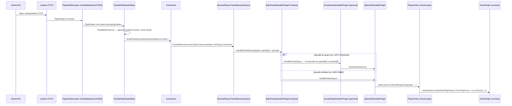
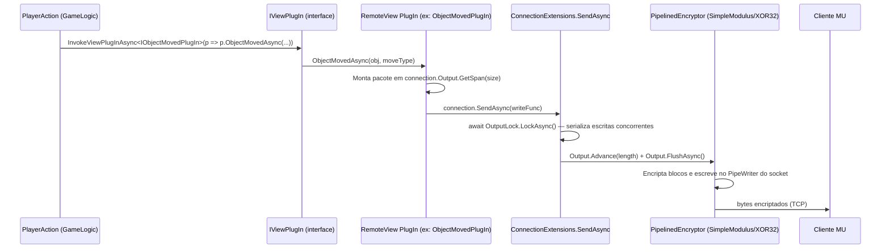

# Pipeline de Comunicação de Rede — OpenMU

## Índice

1. [Visão geral da arquitetura](#1-visão-geral-da-arquitetura)
2. [Fluxo completo de um pacote](#2-fluxo-completo-de-um-pacote)
   - 2.1 [Cliente → Servidor (C→S)](#21-cliente--servidor-cs)
   - 2.2 [Servidor → Cliente (S→C)](#22-servidor--cliente-sc)
3. [Camadas envolvidas](#3-camadas-envolvidas)
   - 3.1 [Network: Listener e Connection](#31-network-listener-e-connection)
   - 3.2 [Criptografia: SimpleModulus e XOR](#32-criptografia-simplemodulus-e-xor)
   - 3.3 [Obfuscação: PacketTwister](#33-obfuscação-packettwister)
   - 3.4 [Dispatcher: MainPacketHandlerPlugInContainer](#34-dispatcher-mainpackethandlerplugincontainer)
   - 3.5 [Handlers: MessageHandler PlugIns](#35-handlers-messagehandler-plugins)
   - 3.6 [Lógica: PlayerActions e GameLogic](#36-lógica-playeractions-e-gamelogic)
   - 3.7 [Contrato: Views / IViewPlugIn](#37-contrato-views--iviewplugin)
   - 3.8 [Saída: RemoteView PlugIns](#38-saída-remoteview-plugins)
4. [Padrão View/Handler — desacoplamento do protocolo](#4-padrão-viewhandler--desacoplamento-do-protocolo)
5. [Versionamento de pacotes](#5-versionamento-de-pacotes)
6. [Tabela de arquivos-chave](#6-tabela-de-arquivos-chave)
7. [Pontos de extensão para client customizado](#7-pontos-de-extensão-para-client-customizado)

---

## 1. Visão geral da arquitetura

O OpenMU separa em três camadas ortogonais:

```
┌─────────────────────────────────────────────────────────────┐
│  PROTOCOLO (Network + GameServer)                           │
│  Criptografia, framing, dispatcher de pacotes, RemoteView   │
├─────────────────────────────────────────────────────────────┤
│  CONTRATO (GameLogic/Views)                                 │
│  Interfaces puras: IObjectMovedPlugIn, IShowLoginResultPlugIn│
├─────────────────────────────────────────────────────────────┤
│  LÓGICA DE JOGO (GameLogic)                                 │
│  PlayerActions, GameMap, Walker, Skills — sem rede          │
└─────────────────────────────────────────────────────────────┘
```

A **GameLogic nunca importa nenhum tipo de rede**. Ela só conhece as interfaces de `IViewPlugIn`. Implementações concretas (que enviam bytes pelo TCP) vivem no `GameServer/RemoteView/`. Isso é o que torna possível trocar o protocolo sem tocar na lógica de jogo.

---

## 2. Fluxo completo de um pacote

### 2.1 Cliente → Servidor (C→S)



**Passo a passo em prosa:**

1. **Listener.OnAccept** aceita o socket TCP. Cria um `SocketConnection` (da lib `Pipelines.Sockets.Unofficial`), instancia o `PipelinedDecryptor` e `PipelinedEncryptor` e os passa ao `Connection`.

2. **Connection** é construído com `Source = decryptor.Reader` (se houver decryptor) ou `duplexPipe.Input` (sem criptografia). O `Output` escreve para `encryptor.Writer` ou `duplexPipe.Output`.

3. **PipelinedSimpleModulusDecryptor** é ele próprio um `PacketPipeReaderBase`: lê os blocos criptografados do `PipeReader` do socket, descriptografa cada bloco (8→11 bytes invertido: 11 criptografados → 8 plaintext), e escreve o plaintext num segundo `Pipe` interno. A `Connection` lê do lado da leitura desse segundo `Pipe`.

4. **PacketPipeReaderBase.ReadBufferAsync** lê do `Source` (que já é plaintext). Faz peek dos 3 primeiros bytes para calcular o tamanho do pacote (`GetPacketSize`), aguarda até ter bytes suficientes, e entrega o segmento via `ReadPacketAsync`.

5. **Connection.ReadPacketAsync** dispara o evento `PacketReceived`.

6. **RemotePlayer.PacketReceivedAsync** copia o `ReadOnlySequence<byte>` para um buffer local e chama `MainPacketHandler.HandlePacketAsync(player, buffer)`.

7. **MainPacketHandlerPlugInContainer** usa `packet[1]` (segundo byte, o opcode principal em pacotes C1/C3) para encontrar o plugin registrado com aquele `Key`.

8. Se o opcode aponta para um **GroupPacketHandlerPlugIn** (e.g. `0xF3` para Character Management), o grupo lê o subcode em `packet[3]` (C1) ou `packet[4]` (C2) e delega ao sub-handler correto.

9. O **HandlerPlugIn** específico desserializa o pacote para uma struct (gerada em `Network/Packets/ClientToServer/`) e chama a **PlayerAction** correspondente na GameLogic.

10. A **PlayerAction** executa a lógica e notifica observers via `player.InvokeViewPlugInAsync<IXxxPlugIn>(...)`.

---

### 2.2 Servidor → Cliente (S→C)



**Passo a passo:**

1. A `PlayerAction` chama `player.InvokeViewPlugInAsync<IXxxPlugIn>(p => p.XxxAsync(...))`. O `Player` não sabe se está falando com um cliente TCP ou uma outra implementação — ele só conhece a interface.

2. O `ViewPlugInContainer` resolve qual implementação concreta de `IXxxPlugIn` está ativa para a versão do cliente e delega.

3. O **RemoteView PlugIn** concreto acessa `this._player.Connection.Output` (que é um `PipeWriter`), reserva espaço com `GetSpan(size)`, preenche o span com os bytes do pacote usando as structs geradas de `Network/Packets/ServerToClient/`, e chama `connection.SendAsync(writeFunc)`.

4. **ConnectionExtensions.SendAsync** adquire o `OutputLock` (um `AsyncLock`) para garantir que duas tasks não escrevam ao mesmo tempo no mesmo pipe, avança o writer pelo tamanho do pacote e chama `FlushAsync`.

5. **PipelinedSimpleModulusEncryptor** (ou XOR32) está entre o writer do `RemoteView` e o socket real. Ao receber o flush, encripta os dados e os escreve no `PipeWriter` subjacente do socket.

---

## 3. Camadas envolvidas

### 3.1 Network: Listener e Connection

**`Listener`** (`src/Network/Listener.cs`)

- Wrapper de `TcpListener` que aceita sockets de forma assíncrona.
- Ao aceitar um socket, cria um `SocketConnection` (pipeline de I/O sem alocação do Pipelines.Sockets.Unofficial), chama os factory delegates `_decryptorCreator` e `_encryptorCreator` para montar as camadas de cripto, e instancia um `Connection`.
- Dispara os eventos `ClientAccepting` (cancelamento possível) e `ClientAccepted`.

**`Connection`** (`src/Network/Connection.cs`)

- Herda de `PacketPipeReaderBase` e implementa `IConnection`.
- Propriedade `Source`: o `PipeReader` de onde os pacotes são lidos — é o `decryptionPipe.Reader` quando há criptografia, ou o `duplexPipe.Input` direto.
- Propriedade `Output`: o `PipeWriter` para onde pacotes de saída são enviados — é `encryptionPipe.Writer` quando há criptografia, ou `duplexPipe.Output` direto.
- Evento `PacketReceived`: disparado a cada pacote completo recebido.
- `BeginReceiveAsync()`: inicia o loop de leitura.

**`PacketPipeReaderBase`** (`src/Network/PacketPipeReaderBase.cs`)

- Loop de leitura sobre um `PipeReader`.
- Faz peek de 3 bytes para determinar o tipo e tamanho do pacote (MU Online usa `C1`, `C2`, `C3`, `C4` como bytes iniciais com lógica específica de tamanho).
- Entrega um `ReadOnlySequence<byte>` exato ao `ReadPacketAsync` — sem bytes extras, sem fragmentação.

**Formato do header de pacote MU Online:**

```
C1 xx yy ...   → C1 = tipo curto,  xx = length em bytes,  yy = opcode
C2 xx xx yy .. → C2 = tipo longo,  xx xx = length (2 bytes big-endian),  yy = opcode
C3 xx yy ...   → C3 = C1 criptografado
C4 xx xx yy .. → C4 = C2 criptografado
```

Os bytes `C3`/`C4` indicam que o conteúdo foi criptografado com SimpleModulus. O decryptor transforma C3→C1 e C4→C2 na camada de pipeline antes de o `Connection` ver qualquer byte.

---

### 3.2 Criptografia: SimpleModulus e XOR

**SimpleModulus** — criptografia de bloco, variante proprietária do MU Online.

Arquivos: `src/Network/SimpleModulus/`

| Classe | Papel |
|---|---|
| `PipelinedSimpleModulusDecryptor` | Lê blocos de 11 bytes (variante New) ou 38 bytes (variante Old), descriptografa para 8 ou 32 bytes de plaintext, escreve num Pipe interno |
| `PipelinedSimpleModulusEncryptor` | Lê plaintext em blocos, encripta e escreve blocos maiores no Pipe do socket |
| `PipelinedSimpleModulusBase` | Base comum: define tamanhos de bloco, implementa o loop `ReadSourceAsync` |
| `SimpleModulusKeys` | Pares de chaves (encrypt/decrypt) derivados de 12 valores `uint` |
| `SimpleModulusKeyGenerator` | Geração de novos pares de chaves |

**Variantes:**
- **New** (padrão, versões ≥ 0.97): bloco decriptado = 8 bytes, criptografado = 11 bytes. Inclui um contador sequencial para detectar replay.
- **Old** (versões ≤ 0.75): bloco decriptado = 32 bytes, criptografado = 38 bytes. Sem contador.

**Chaves padrão** (hardcoded, mas configuráveis via `INetworkEncryptionFactoryPlugIn`):
- Servidor descriptografa C→S com `DefaultServerKey`
- Servidor encripta S→C com `DefaultClientKey` (que o cliente usa para descriptografar)

**XOR** — criptografia leve, usada *dentro* de pacotes específicos (não no pipeline).

Arquivos: `src/Network/Xor/`

| Classe | Uso |
|---|---|
| `PipelinedXor32Decryptor/Encryptor` | Alternativa de pipeline ao SimpleModulus (versões antigas) |
| `Xor3Decryptor/Encryptor` | Aplicado ao campo `Password` no pacote de login (opcode `0xF1 0x01`) — chave XOR de 3 bytes |

O `LogInHandlerPlugIn` usa `Xor3Decryptor(0)` explicitamente no campo de senha:

```csharp
private readonly ISpanDecryptor _decryptor = new Xor3Decryptor(0);
// ...
this.Decrypt(message.Password)  // aplica XOR-3 sobre o span do campo
```

---

### 3.3 Obfuscação: PacketTwister

**Arquivos:** `src/Network/PacketTwister/`

O **PacketTwister** é uma camada de obfuscação *adicional* à criptografia SimpleModulus, específica por opcode. Ele embaralha bytes dentro do payload de determinados pacotes segundo uma tabela fixa de permutações.

**`PacketTwistRunner`** é o ponto de entrada: implementa `ISpanDecryptor` e `ISpanEncryptor`. Mantém um dicionário `opcode → IPacketTwister`. Para descriptografar:

```csharp
public void Decrypt(Span<byte> packet)
{
    var packetType = packet.GetPacketType(); // packet[1] para C1/C3, packet[2] para C2/C4
    var data = packet.Slice(packet.GetPacketHeaderSize() + 1);
    if (this._twisters.TryGetValue(packetType, out var twister))
        twister.Correct(data);  // desfaz o embaralhamento
}
```

Cada `IPacketTwister` implementa `Twist` (encrypt) e `Correct` (decrypt) — permutações inversas de bytes em posições fixas do payload.

**Onde é aplicado:** O `PacketTwistRunner` é usado dentro dos `PipelinedSimpleModulusDecryptor/Encryptor` na variante "New" — ele é chamado sobre o plaintext *após* descriptografar o bloco SimpleModulus, ou *antes* de encriptá-lo.

**Opcodes com twister registrado** (seleção relevante):

| Opcode | PacketTwister |
|---|---|
| `0xF1` | LoginLogout |
| `0xF3` | CharacterManagement |
| `0x10/0x11` | Walk/Move (não listados, sem twister) |
| `0x19` | Skill |
| `0x18` | Animation |
| `0x22` | ItemPickup |
| `0x23` | ItemDrop |
| `0x24` | ItemMove |
| `0x26` | ItemConsume |
| `0x00` | Chat |
| `0x40/0x41/0x42/0x43` | Party |
| `0x50` a `0x55` | Guild |

---

### 3.4 Dispatcher: MainPacketHandlerPlugInContainer

**Arquivos:** `src/GameServer/MessageHandler/MainPacketHandlerPlugInContainer.cs`

Herda de `PacketHandlerPlugInContainer<IPacketHandlerPlugIn>`. É criado por cada `RemotePlayer` e mantém um dicionário de handlers indexados pelo **byte de opcode**.

Seleção de plugin: usa `IClientVersionProvider` (o próprio `RemotePlayer`) e o atributo `[MinimumClient(season, episode, language)]` para escolher a implementação mais recente compatível com a versão do cliente conectado.

```
MainPacketHandlerPlugInContainer
├── Key=0x0D → CharacterWalkHandlerPlugIn  [MinimumClient(1,0)]
│                (substituído por CharacterWalkHandlerPlugIn075 para v0.75)
├── Key=0xF1 → LogInOutGroup (GroupPacketHandlerPlugIn)
│   ├── SubKey=0x01 → LogInHandlerPlugIn
│   └── SubKey=0x02 → LogOutHandlerPlugIn
├── Key=0xF3 → CharacterGroupHandlerPlugIn
│   ├── SubKey=0x00 → CharacterListRequestPacketHandlerPlugIn
│   ├── SubKey=0x01 → CharacterFocusPacketHandlerPlugIn
│   └── SubKey=0x03 → CharacterCreatePacketHandlerPlugIn
│   └── ...
└── Key=0x19 → TargetedSkillHandlerPlugIn
```

**Subgrupos:** `GroupPacketHandlerPlugIn` lida com opcodes que têm sub-opcodes. O subcode é lido em `packet[3]` para C1 e `packet[4]` para C2 (pois C2 usa 2 bytes de tamanho).

---

### 3.5 Handlers: MessageHandler PlugIns

**Diretório:** `src/GameServer/MessageHandler/`

Cada handler implementa `IPacketHandlerPlugIn` (ou `ISubPacketHandlerPlugIn`):

```csharp
public interface IPacketHandlerPlugInBase : IStrategyPlugIn<byte>
{
    bool IsEncryptionExpected { get; }
    ValueTask HandlePacketAsync(Player player, Memory<byte> packet);
}
```

- `Key` (`byte`): o opcode que este handler trata.
- `IsEncryptionExpected`: indica se o pacote deve ser criptografado (usado para validação).
- `HandlePacketAsync`: recebe o pacote já descriptografado como `Memory<byte>` e o `Player` correspondente.

**Padrão de implementação** (exemplo: `CharacterWalkBaseHandlerPlugIn`):

```csharp
public async ValueTask HandlePacketAsync(Player player, Memory<byte> packet)
{
    WalkRequest request = packet;  // cast implícito para struct gerada
    await player.WalkToAsync(target, steps);  // delega à GameLogic
}
```

Os handlers **não sabem nada sobre a connection**. Eles só enxergam o `Player` (da GameLogic) e os dados desserializados do pacote.

---

### 3.6 Lógica: PlayerActions e GameLogic

**Diretório:** `src/GameLogic/PlayerActions/`

As `PlayerActions` são classes simples sem estado que implementam a lógica de jogo. Exemplos:

- `LoginAction.LoginAsync(player, username, password)`
- `CreateCharacterAction.CreateCharacterAsync(player, name, class)`
- `WalkToAsync(target, steps)` (método direto em `Player`)
- `AreaSkillAttackAction.AttackAsync(player, targetId, skill)`

Ao final de cada ação, a lógica notifica outros jogadores/observers através de:

```csharp
// Notifica o próprio jogador:
await player.InvokeViewPlugInAsync<IShowLoginResultPlugIn>(p => p.ShowLoginResultAsync(LoginResult.Ok));

// Notifica todos os observadores do mapa que enxergam este objeto:
await player.ForEachWorldObserverAsync<IObjectMovedPlugIn>(p => p.ObjectMovedAsync(player, MoveType.Walk), true);
```

---

### 3.7 Contrato: Views / IViewPlugIn

**Diretório:** `src/GameLogic/Views/`

Cada interface de view define **um evento de jogo** que precisa ser comunicado ao cliente. Exemplos:

```csharp
// Movimento:
public interface IObjectMovedPlugIn : IViewPlugIn
{
    ValueTask ObjectMovedAsync(ILocateable movedObject, MoveType moveType);
}

// Login:
public interface IShowLoginResultPlugIn : IViewPlugIn
{
    ValueTask ShowLoginResultAsync(LoginResult loginResult);
}

// Skill:
public interface IShowSkillAnimationPlugIn : IViewPlugIn
{
    ValueTask ShowSkillAnimationAsync(Player attackingPlayer, IAttackable target, ushort skillId, bool effectFlag);
}
```

Todos herdam de `IViewPlugIn` (interface marcadora). Não há nenhuma referência a `byte[]`, `IConnection`, ou qualquer tipo de rede.

**`ViewPlugInContainer`** (`src/GameServer/RemoteView/ViewPlugInContainer.cs`): o container que resolve qual implementação concreta de `IViewPlugIn` usar para a versão do cliente. Lógica de seleção:

1. Filtra todos os plugins de `IViewPlugIn` registrados no `PlugInManager`.
2. Mantém apenas os com `[MinimumClient]` ≤ versão do cliente conectado.
3. Quando há múltiplas opções, escolhe a de **maior versão** que ainda é ≤ versão do cliente.
4. Quando o `ClientVersion` do `RemotePlayer` muda (após login bem-sucedido), reinicializa o container.

---

### 3.8 Saída: RemoteView PlugIns

**Diretório:** `src/GameServer/RemoteView/`

Cada RemoteView PlugIn implementa uma `IXxxPlugIn` e traduz a chamada em bytes de rede:

```csharp
[PlugIn]
[MinimumClient(1, 0, ClientLanguage.Invariant)]
public class ObjectMovedPlugIn : IObjectMovedPlugIn
{
    private readonly RemotePlayer _player;

    public async ValueTask ObjectMovedAsync(ILocateable obj, MoveType type)
    {
        var connection = this._player.Connection;
        // ...monta o pacote usando structs de Network/Packets/ServerToClient/...
        int Write()
        {
            var span = connection.Output.GetSpan(size)[..size];
            var packet = new ObjectWalkedRef(span) { ... };
            return size;
        }
        await connection.SendAsync(Write);
    }
}
```

**Variantes por versão** — para o mesmo `IObjectMovedPlugIn`:
- `ObjectMovedPlugIn` `[MinimumClient(1,0)]` — formato Season 6+
- `ObjectMovedPlugIn075` `[MinimumClient(0,75)]` — formato Season 0.75
- `ObjectMovedPlugInExtended` — formato estendido (stats 32-bit)

O `ViewPlugInContainer` seleciona automaticamente a variante correta.

---

## 4. Padrão View/Handler — desacoplamento do protocolo

A separação é rigorosa e intencional:

```
GameLogic  ──────── só conhece ────────►  IViewPlugIn (interface)
                                                │
                                    implementada por
                                                │
GameServer/RemoteView  ◄─────────────  XxxPlugIn : IViewPlugIn
     │ acessa
     ▼
IConnection.Output  →  PipeWriter  →  Encryptor  →  TCP
```

**Para implementar um protocolo customizado**, o único contrato a seguir são as interfaces em `src/GameLogic/Views/`. Não é necessário tocar em nada dentro de `src/GameLogic/`.

**Exemplo concreto — substituindo o protocolo de movimento:**

```csharp
// Novo plugin para protocolo customizado (ex: WebSocket + JSON)
[PlugIn]
[MinimumClient(100, 0, ClientLanguage.Invariant)] // versão "customizada"
public class CustomObjectMovedPlugIn : IObjectMovedPlugIn
{
    private readonly ICustomConnection _connection;

    public async ValueTask ObjectMovedAsync(ILocateable obj, MoveType type)
    {
        var msg = new { id = obj.Id, x = obj.Position.X, y = obj.Position.Y, type = type.ToString() };
        await _connection.SendJsonAsync(msg);
    }
}
```

Registrar no `PlugInManager` e configurar o `ViewPlugInContainer` para usar a versão 100 — nenhum outro código muda.

---

## 5. Versionamento de pacotes

### ClientVersion

```csharp
public record ClientVersion(byte Season, byte Episode, ClientLanguage Language);
```

- **Season 0**: versão 0.75 (protocolo mais antigo)
- **Season 1–5**: versões intermediárias
- **Season 6**: versão padrão (maioria dos servidores)
- **Language**: inglês, japonês, coreano, chinês, tailandês, filipino, vietnamita — afeta **opcodes diferentes para o mesmo evento**.

### ClientVersionResolver

`src/GameServer/ClientVersionResolver.cs`

Converte os 5 bytes de versão enviados pelo cliente no pacote de login (`LoginLongPassword.ClientVersion`) para um `ClientVersion` estruturado:

```csharp
// Chave = 4 bytes little-endian + 1 byte
long key = CalculateVersionValue(versionBytes);
Versions[key] = clientVersion;
```

Versões são registradas durante o startup. Após o login, o `LogInHandlerPlugIn` chama:

```csharp
remotePlayer.ClientVersion = ClientVersionResolver.Resolve(message.ClientVersion);
```

Isso dispara `ClientVersionChanged` no `RemotePlayer`, que causa a reinicialização do `ViewPlugInContainer` e do `MainPacketHandlerPlugInContainer` — passando a usar os plugins corretos para a versão identificada.

### Atributos de versão nos PlugIns

```csharp
[MinimumClient(season, episode, language)]
```

- Nos **MessageHandler PlugIns**: `PacketHandlerPlugInContainer` seleciona o handler com `[MinimumClient]` mais alto que ainda seja ≤ versão do cliente.
- Nos **RemoteView PlugIns**: `ViewPlugInContainer` aplica a mesma lógica — escolhe a implementação mais recente compatível.

**Efeito prático do `Language` nos opcodes de saída:**

O `ObjectMovedPlugIn` usa o `Language` para escolher o opcode correto de walk:

```csharp
protected byte GetWalkCode()
{
    if (this._player.ClientVersion.Season == 0) return 0x10;
    return this._player.ClientVersion.Language switch
    {
        ClientLanguage.English    => 0xD4,
        ClientLanguage.Japanese   => 0x1D,
        ClientLanguage.Chinese    => 0xD9,
        ClientLanguage.Vietnamese => 0xD9,
        ClientLanguage.Filipino   => 0xDD,
        ClientLanguage.Korean     => 0xD3,
        ClientLanguage.Thai       => 0xD7,
        _                         => (byte)PacketType.Walk,
    };
}
```

Ou seja: mesmo que o formato do payload seja idêntico, o **opcode varia por idioma do cliente**.

---

## 6. Tabela de arquivos-chave

### Camada Network

| Arquivo | Classe | Responsabilidade |
|---|---|---|
| `src/Network/Listener.cs` | `Listener` | Aceita conexões TCP, instancia `Connection` com factories de cripto |
| `src/Network/Connection.cs` | `Connection` | Gerencia o duplex pipe, dispara `PacketReceived`, expõe `Output` |
| `src/Network/PacketPipeReaderBase.cs` | `PacketPipeReaderBase` | Loop de leitura, framing de pacotes MU Online |
| `src/Network/IConnection.cs` | `IConnection` | Contrato de conexão: `PacketReceived`, `Output`, `OutputLock`, `BeginReceiveAsync` |
| `src/Network/ConnectionExtensions.cs` | `ConnectionExtensions` | `SendAsync(Func<int>)` — serializa escritas com `OutputLock` |

### Criptografia

| Arquivo | Classe | Responsabilidade |
|---|---|---|
| `src/Network/SimpleModulus/PipelinedSimpleModulusDecryptor.cs` | `PipelinedSimpleModulusDecryptor` | Descriptografa blocos SimpleModulus do socket, escreve plaintext num Pipe interno |
| `src/Network/SimpleModulus/PipelinedSimpleModulusEncryptor.cs` | `PipelinedSimpleModulusEncryptor` | Encripta plaintext em blocos e escreve no socket |
| `src/Network/SimpleModulus/PipelinedSimpleModulusBase.cs` | `PipelinedSimpleModulusBase` | Base: tamanho de bloco, lógica de XOR do checksum e size |
| `src/Network/SimpleModulus/SimpleModulusKeys.cs` | `SimpleModulusKeys` | Pares de chaves derivados de 12 valores uint |
| `src/Network/Xor/Xor3Decryptor.cs` | `Xor3Decryptor` | XOR-3 aplicado ao campo de senha no pacote de login |
| `src/Network/Xor/PipelinedXor32Decryptor.cs` | `PipelinedXor32Decryptor` | Alternativa XOR-32 de pipeline (versões antigas) |

### Obfuscação

| Arquivo | Classe | Responsabilidade |
|---|---|---|
| `src/Network/PacketTwister/PacketTwistRunner.cs` | `PacketTwistRunner` | Dispatcher de twisters por opcode — implementa `ISpanDecryptor/Encryptor` |
| `src/Network/PacketTwister/IPacketTwister.cs` | `IPacketTwister` | Contrato: `Twist(Span<byte>)` e `Correct(Span<byte>)` |
| `src/Network/PacketTwister/PacketTwister*.cs` | (múltiplos) | Permutações específicas por opcode |

### Dispatcher e Handlers

| Arquivo | Classe | Responsabilidade |
|---|---|---|
| `src/GameServer/RemoteView/RemotePlayer.cs` | `RemotePlayer` | Conecta `Connection.PacketReceived` ao `MainPacketHandler`; mantém `ClientVersion` |
| `src/GameServer/MessageHandler/MainPacketHandlerPlugInContainer.cs` | `MainPacketHandlerPlugInContainer` | Container de todos os `IPacketHandlerPlugIn`, indexados por opcode |
| `src/GameServer/MessageHandler/GroupPacketHandlerPlugIn.cs` | `GroupPacketHandlerPlugIn` | Handler de opcodes com sub-opcodes; delega para `ISubPacketHandlerPlugIn` |
| `src/GameServer/MessageHandler/IPacketHandlerPlugIn.cs` | `IPacketHandlerPlugIn` | Interface marcadora do container de handlers |
| `src/GameServer/MessageHandler/IPacketHandlerPlugInBase.cs` | `IPacketHandlerPlugInBase` | Contrato: `Key`, `IsEncryptionExpected`, `HandlePacketAsync` |
| `src/GameServer/ClientVersionResolver.cs` | `ClientVersionResolver` | Converte bytes de versão do cliente em `ClientVersion` |
| `src/GameServer/DefaultTcpGameServerListener.cs` | `DefaultTcpGameServerListener` | Cria `RemotePlayer` para cada cliente aceito; configura cripto via `INetworkEncryptionFactoryPlugIn` |

### Views e RemoteView

| Arquivo | Classe | Responsabilidade |
|---|---|---|
| `src/GameLogic/Views/IViewPlugIn.cs` | `IViewPlugIn` | Interface marcadora base de todos os contratos de view |
| `src/GameLogic/Views/World/IObjectMovedPlugIn.cs` | `IObjectMovedPlugIn` | Contrato: objeto moveu no mapa |
| `src/GameLogic/Views/Login/IShowLoginResultPlugIn.cs` | `IShowLoginResultPlugIn` | Contrato: resultado do login |
| `src/GameLogic/Views/Character/ISkillListViewPlugIn.cs` | `ISkillListViewPlugIn` | Contrato: envia lista de skills |
| `src/GameServer/RemoteView/ViewPlugInContainer.cs` | `ViewPlugInContainer` | Seleciona a implementação de `IViewPlugIn` mais recente compatível com o cliente |
| `src/GameServer/RemoteView/World/ObjectMovedPlugIn.cs` | `ObjectMovedPlugIn` | Serializa movimento para bytes MU Online (Season 6+) |
| `src/GameServer/RemoteView/World/ObjectMovedPlugIn075.cs` | `ObjectMovedPlugIn075` | Serializa movimento para formato 0.75 |
| `src/GameServer/RemoteView/Login/ShowLoginResultPlugIn.cs` | `ShowLoginResultPlugIn` | Envia resultado de login ao cliente |
| `src/GameServer/RemoteView/Character/SkillListViewPlugIn.cs` | `SkillListViewPlugIn` | Envia lista de skills ao cliente |

### Definições de Pacotes

| Arquivo | Conteúdo |
|---|---|
| `src/Network/Packets/ClientToServer/ClientToServerPackets.cs` | Structs geradas de todos os pacotes C→S (acesso via cast `WalkRequest request = packet;`) |
| `src/Network/Packets/ServerToClient/ServerToClientPackets.cs` | Structs geradas de todos os pacotes S→C (acesso via `ObjectWalkedRef`) |
| `src/Network/Packets/PacketHeaders.cs` | Constantes de header de pacote |

---

## 7. Pontos de extensão para client customizado

Para substituir o protocolo (ex: WebSocket, JSON, Protobuf, protocolo próprio) sem alterar a GameLogic, há **quatro pontos de extensão**:

---

### 7.1 Novo `IConnection` / transporte

**Por quê:** Substitui TCP por outro transporte (WebSocket, UDP, Unix socket, etc).

**O que implementar:** `IConnection` em `src/Network/IConnection.cs`.

```csharp
public class WebSocketConnection : IConnection
{
    public event AsyncEventHandler<ReadOnlySequence<byte>>? PacketReceived;
    public PipeWriter Output { get; }
    public AsyncLock OutputLock { get; } = new();
    // ...
}
```

**Onde plugar:** No `IGameServerListener` customizado (análogo a `DefaultTcpGameServerListener`), instanciar `RemotePlayer` com o novo `IConnection`.

---

### 7.2 Novos `INetworkEncryptionFactoryPlugIn` / sem criptografia

**Por quê:** Trocar ou desabilitar SimpleModulus.

**O que implementar:** `INetworkEncryptionFactoryPlugIn` (em `src/Network/PlugIns/`).

```csharp
[PlugIn]
[MinimumClient(100, 0, ClientLanguage.Invariant)]
public class NoEncryptionFactoryPlugIn : INetworkEncryptionFactoryPlugIn
{
    public IPipelinedDecryptor? CreateDecryptor(PipeReader reader, DataDirection direction) => null;
    public IPipelinedEncryptor? CreateEncryptor(PipeWriter writer, DataDirection direction) => null;
}
```

O `DefaultTcpGameServerListener` já busca este plugin via `PlugInManager.GetStrategy<ClientVersion, INetworkEncryptionFactoryPlugIn>`.

---

### 7.3 Novos `IPacketHandlerPlugIn` — receber pacotes do client customizado

**Por quê:** Protocolo customizado usa opcodes, formatos ou framing diferentes.

**O que implementar:** `IPacketHandlerPlugIn` com o opcode do novo protocolo.

```csharp
[PlugIn]
[MinimumClient(100, 0, ClientLanguage.Invariant)]
public class CustomWalkHandlerPlugIn : IPacketHandlerPlugIn
{
    public byte Key => 0xAA; // novo opcode de walk
    public bool IsEncryptionExpected => false;

    public async ValueTask HandlePacketAsync(Player player, Memory<byte> packet)
    {
        // Desserializa formato customizado
        var (targetX, targetY) = CustomProtocol.ParseWalk(packet.Span);
        await player.WalkToAsync(new Point(targetX, targetY), Memory<WalkingStep>.Empty);
    }
}
```

Registrar no `PlugInManager` — o `MainPacketHandlerPlugInContainer` o inclui automaticamente.

---

### 7.4 Novos `IViewPlugIn` — enviar pacotes para o client customizado

**Por quê:** Protocolo customizado serializa eventos do jogo de forma diferente.

**O que implementar:** A interface `IXxxPlugIn` correspondente ao evento.

```csharp
[PlugIn]
[MinimumClient(100, 0, ClientLanguage.Invariant)]
public class CustomObjectMovedPlugIn : IObjectMovedPlugIn
{
    private readonly RemotePlayer _player;

    public CustomObjectMovedPlugIn(RemotePlayer player) => _player = player;

    public async ValueTask ObjectMovedAsync(ILocateable obj, MoveType type)
    {
        if (_player.Connection is not { } conn) return;
        int Write()
        {
            var span = conn.Output.GetSpan(9)[..9];
            // escreve formato customizado nos bytes
            CustomProtocol.WriteMove(span, obj.Id, obj.Position.X, obj.Position.Y, (byte)type);
            return 9;
        }
        await conn.SendAsync(Write);
    }
}
```

O `ViewPlugInContainer` seleciona automaticamente este plugin para clientes com versão ≥ 100.

---

### Resumo dos pontos de extensão

| O que trocar | Interface/Classe a implementar | Onde registrar |
|---|---|---|
| Transporte (TCP→WS) | `IConnection` + `IGameServerListener` | Configuração do `GameServer` |
| Criptografia | `INetworkEncryptionFactoryPlugIn` | `PlugInManager` |
| Receber pacotes (C→S) | `IPacketHandlerPlugIn` ou `ISubPacketHandlerPlugIn` | `PlugInManager` (auto-descoberta via `[PlugIn]`) |
| Enviar pacotes (S→C) | `IXxxPlugIn` (qualquer interface de `GameLogic/Views/`) | `PlugInManager` (auto-descoberta via `[PlugIn]`) |
| Versão customizada | `[MinimumClient(season, episode, language)]` | Atributo na classe do plugin |

> **Regra de ouro:** tudo que tem `[PlugIn]` é auto-descoberto pelo `PlugInManager` via reflection. Implementar a interface + adicionar o atributo + referenciar o assembly é suficiente para o plugin ser ativado.
