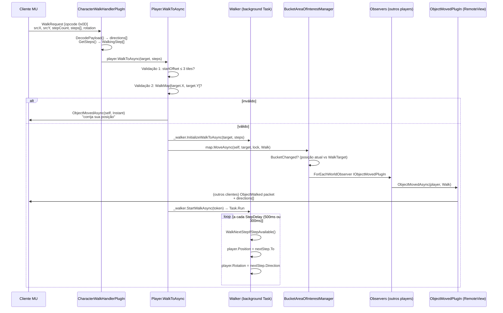
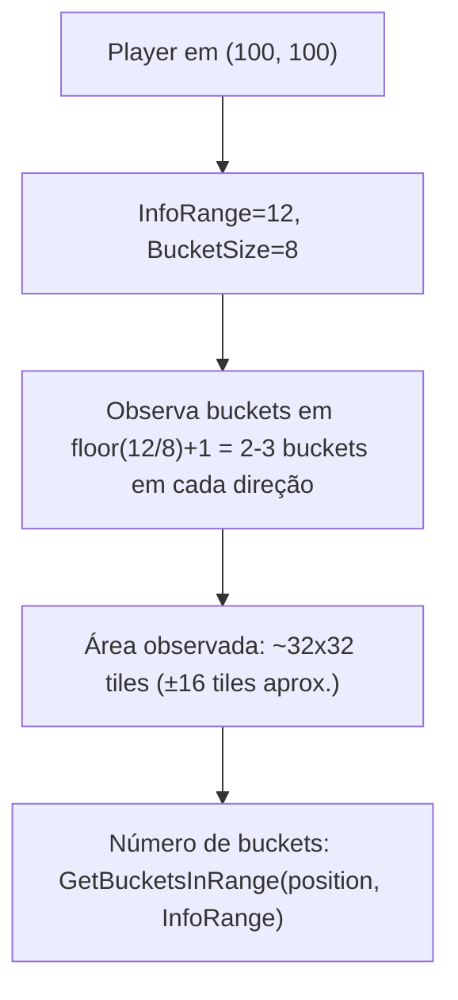
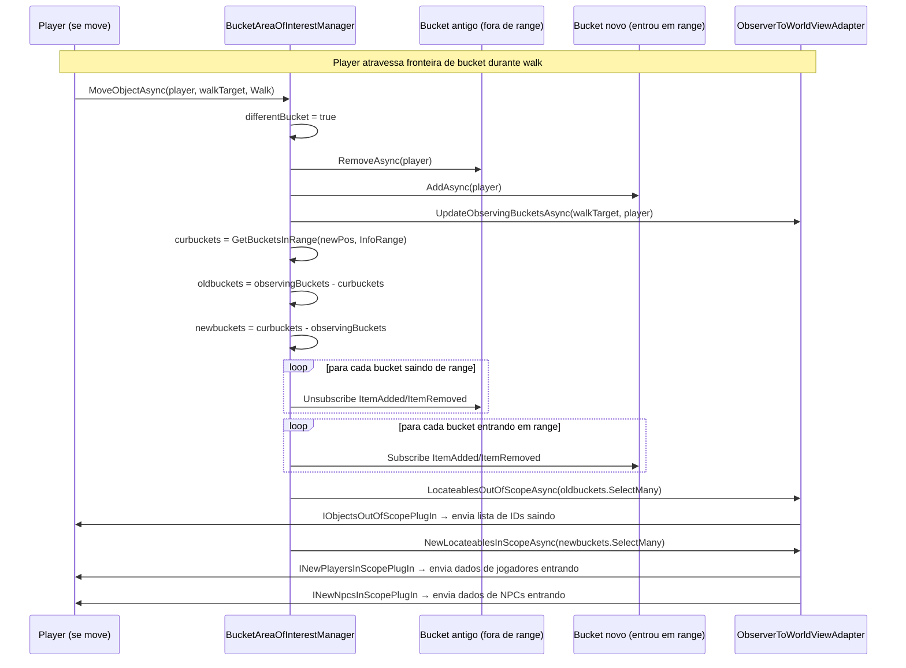

# Sistema de Movimento — OpenMU

## Índice

1. [Visão geral e tipos de movimento](#1-visão-geral-e-tipos-de-movimento)
2. [Sistema de coordenadas tile-based](#2-sistema-de-coordenadas-tile-based)
3. [Fluxo completo de movimento — Walk](#3-fluxo-completo-de-movimento--walk)
   - 3.1 [Pacote do cliente](#31-pacote-do-cliente)
   - 3.2 [Handler e validação](#32-handler-e-validação)
   - 3.3 [Walker: loop de passos em background](#33-walker-loop-de-passos-em-background)
   - 3.4 [Broadcast para observadores](#34-broadcast-para-observadores)
4. [InstantMove e Teleport](#4-instantmove-e-teleport)
5. [Sistema de viewport e BucketMap](#5-sistema-de-viewport-e-bucketmap)
6. [Timing e step delay](#6-timing-e-step-delay)
7. [Pathfinding server-side](#7-pathfinding-server-side)
8. [Movimento de NPCs](#8-movimento-de-npcs)
9. [Tabela de arquivos-chave](#9-tabela-de-arquivos-chave)
10. [Pontos de refatoração para movimento fluido](#10-pontos-de-refatoração-para-movimento-fluido)

---

## 1. Visão geral e tipos de movimento

O OpenMU suporta três tipos de movimento, definidos em `MoveType`:

```csharp
public enum MoveType
{
    Walk,      // movimento passo-a-passo, com animação e interpolação no cliente
    Instant,   // teleporte de posição sem animação (snap)
    Teleport,  // skill de teleporte (Wizard) ou gate warp, com animação de efeito
}
```

**Walk** é o movimento principal durante o gameplay. O cliente envia a lista de direções de passos; o servidor valida e executa cada passo em background em um timer, notificando todos os jogadores que enxergam o objeto a cada mudança de bucket.

**Instant** é usado internamente: o servidor reposiciona o objeto sem animação (ex: correção de dessincronização, respawn, skill de blink). O handler de cliente para `InstantMove` está deliberadamente restrito por conta de exploits.

**Teleport** é o resultado de skills de teleporte (Feiticeiro) ou warp por gate. O servidor executa, anima via `IObjectMovedPlugIn` ou `ITeleportPlugIn`, e envia `MapChanged` ao próprio jogador.

---

## 2. Sistema de coordenadas tile-based

### Tipo `Point`

```csharp
// src/Pathfinding/Point.cs
[StructLayout(LayoutKind.Sequential, Pack = 1, Size = 2)]
public record struct Point(byte X, byte Y);
```

- Coordenadas são **bytes** (0–255): o mapa tem 256×256 tiles.
- **Sem ponto flutuante.** Posição é sempre discreta — um objeto ocupa exatamente um tile por vez.
- Diagonal é suportada: 8 direções (N, S, E, W, NE, NW, SE, SW).

### Terrain: `GameMapTerrain`

`src/GameLogic/GameMapTerrain.cs` mantém três grids 256×256:

| Grid | Tipo | Uso |
|---|---|---|
| `WalkMap[x,y]` | `bool[,]` | `true` = tile caminhável para players/NPCs |
| `SafezoneMap[x,y]` | `bool[,]` | `true` = safezone (sem PvP, regen aumentado) |
| `AIgrid[x,y]` | `byte[,]` | Codificação compacta de WalkMap+SafezoneMap para pathfinding de NPCs |

**Decodificação do terrain data:**

```csharp
private void ReadTerrainData(ReadOnlySpan<byte> data)
{
    for (int i = 0; i < data.Length; i++)
    {
        byte x = (byte)(i & 0xFF);
        byte y = (byte)((i >> 8) & 0xFF);
        byte value = data[i];
        this.WalkMap[x, y]     = value == 0 || value == 1;  // 0=walk, 1=walk+safe
        this.SafezoneMap[x, y] = value == 1;
    }
}
```

Os dados de terrain vêm da `GameMapDefinition.TerrainData` — um `byte[]` de 65.535 bytes armazenado no banco de dados.

### Direções

```csharp
// src/GameLogic/DirectionExtensions.cs
Direction.North    → X-1, Y+1
Direction.South    → X+1, Y-1
Direction.East     → X+1, Y+1
Direction.West     → X-1, Y-1
Direction.NorthEast → X,   Y+1
Direction.NorthWest → X-1, Y
Direction.SouthEast → X+1, Y
Direction.SouthWest → X,   Y-1
```

As direções são encodadas no pacote de walk como **nibbles** (4 bits cada, 2 por byte):

```
payload[i/2] >> 4  → direção de índice par
payload[i/2] & 0x0F → direção de índice ímpar
```

---

## 3. Fluxo completo de movimento — Walk

### Diagrama completo



---

### 3.1 Pacote do cliente

**Opcode:** `0x0D` (Walk — Season 6+), `0x10` (Walk075 — 0.75)

**Struct** (`src/Network/Packets/ClientToServer/ClientToServerPackets.cs`):

```
C1 [length] 0D [srcX] [srcY] [stepCount|rotation] [directions...]
```

- `srcX`, `srcY`: posição atual do personagem segundo o cliente
- `StepCount` (4 bits altos): número de passos
- `TargetRotation` (4 bits baixos): direção final após walk
- `Directions[]`: array de nibbles, 2 direções por byte, máximo 16 passos

**Handlers registrados:**

| Classe | Opcode (Key) | `[MinimumClient]` |
|---|---|---|
| `CharacterWalkHandlerPlugIn` | `WalkRequest.Code = 0x0D` | `(1, 0, Invariant)` |
| `CharacterWalkHandlerPlugIn075` | `WalkRequest075.Code = 0x10` | `(0, 75, Invariant)` |

---

### 3.2 Handler e validação

**`CharacterWalkBaseHandlerPlugIn.HandlePacketAsync`** (`src/GameServer/MessageHandler/CharacterWalkBaseHandlerPlugIn.cs`):

```csharp
public async ValueTask HandlePacketAsync(Player player, Memory<byte> packet)
{
    WalkRequest request = packet;
    var directions = DecodePayload(request, out _);  // nibbles → Direction[]
    var steps      = GetSteps(sourcePoint, directions); // Direction[] → WalkingStep[]
    var target     = GetTarget(steps.Span, sourcePoint);
    await player.WalkToAsync(target, steps);
}
```

**`Player.WalkToAsync`** (`src/GameLogic/Player.cs`):

```csharp
public async ValueTask WalkToAsync(Point target, Memory<WalkingStep> steps)
{
    // Validação 1: offset de início
    var startOffset = steps.Span[0].From.EuclideanDistanceTo(this.Position);
    if (startOffset > 3)
    {
        // Manda posição atual de volta — cliente re-sincroniza
        await InvokeViewPlugInAsync<IObjectMovedPlugIn>(p => p.ObjectMovedAsync(this, MoveType.Instant));
        return;
    }

    // Validação 2: destino caminhável
    if (!currentMap.Terrain.WalkMap[target.X, target.Y])
    {
        await InvokeViewPlugInAsync<IObjectMovedPlugIn>(p => p.ObjectMovedAsync(this, MoveType.Instant));
        return;
    }

    await _walker.StopAsync();                                               // cancela walk anterior
    var token = await _walker.InitializeWalkToAsync(target, steps);         // enfileira passos
    await currentMap.MoveAsync(this, target, _moveLock, MoveType.Walk);     // notifica AoI
    await _walker.StartWalkAsync(token);                                     // inicia loop em background
}
```

**O que o servidor NÃO valida:**
- Cada tile intermediário contra o `WalkMap` (apenas o destino final)
- A validade geométrica de cada passo individual (confia no cliente)
- Velocidade de movimento por pacote (sem rate limiting no nível de handler)

---

### 3.3 Walker: loop de passos em background

**`Walker.WalkLoopAsync`** (`src/GameLogic/Walker.cs`):

```csharp
private async Task WalkLoopAsync(CancellationToken cancellationToken)
{
    var delay = this._stepDelay().Subtract(TimeSpan.FromMilliseconds(50));
    var lastOffset = TimeSpan.Zero;

    while (!cancellationToken.IsCancellationRequested)
    {
        var sw = Stopwatch.StartNew();
        await this.WalkStepAsync(cancellationToken);

        var nextDelay = delay - lastOffset;
        if (nextDelay > TimeSpan.Zero)
        {
            await Task.Delay(nextDelay);    // aguarda sem bloquear thread pool
            lastOffset = sw.Elapsed - delay; // compensa drift do Task.Delay
        }
        else
        {
            lastOffset = nextDelay.Negate();
        }
    }
}

private void WalkNextStepIfStepAvailable()
{
    var nextStep = this._nextSteps.Dequeue();
    this._walkSupporter.Position = nextStep.To;      // atualiza tile do jogador
    if (this._walkSupporter is IRotatable rotatable)
        rotatable.Rotation = nextStep.Direction;
}
```

**Características importantes:**
- Roda em um `Task.Run` separado — não existe game loop global. Cada objeto que caminha tem sua própria task.
- O `Walker` mantém até **16 passos** em `_nextSteps` (Queue) e cópia em `_currentWalkSteps` (Array, para `GetDirectionsAsync`).
- A atualização de `Position` acontece **a cada passo individual** no background, não durante o `MoveAsync`.
- O `MoveAsync` já registra o objeto no bucket destino antecipadamente (WalkTarget) para fins de AoI.
- Parada automática: `ShouldWalkerStop()` retorna `true` se o objeto estiver morto (`!IsActive()`) ou se não houver mais passos.

---

### 3.4 Broadcast para observadores

Quem notifica quem, e quando:

```
Player.WalkToAsync
    └─► map.MoveAsync(player, target, lock, Walk)
            └─► BucketAreaOfInterestManager.MoveObjectAsync
                    ├─► MoveObjectOnMapAsync → DetectaBucketChange
                    │       [se bucket mudou]: swap bucket membership
                    ├─► observable.ForEachWorldObserverAsync<IObjectMovedPlugIn>
                    │       ─► ObserverA.ObjectMovedPlugIn.ObjectMovedAsync(player, Walk)
                    │               └─► ObjectWalkedAsync → connection.SendAsync(walk packet)
                    │       ─► ObserverB.ObjectMovedPlugIn.ObjectMovedAsync(player, Walk)
                    │       ─► [o próprio player] ObjectMovedAsync → NÃO envia pacote a si
                    └─► [se bucket mudou] UpdateObservingBucketsAsync(target, player)
                            ├─► Desinscreve buckets fora de range → LocateablesOutOfScopeAsync
                            └─► Inscreve novos buckets → NewLocateablesInScopeAsync
```

**Comportamento especial para `Walk` no AoI:**

```csharp
// BucketAreaOfInterestManager.MoveObjectOnMapAsync
if (moveType == MoveType.Walk && obj is ISupportWalk supportWalk)
    target = supportWalk.WalkTarget;  // usa destino final, não posição atual

var differentBucket = obj.Position.X / bucketSideLength != target.X / bucketSideLength
                   || obj.Position.Y / bucketSideLength != target.Y / bucketSideLength;

if (!differentBucket)
{
    // Dentro do mesmo bucket: NÃO atualiza Position (o Walker faz isso)
    // NÃO troca membership
    return false; // differentBucket = false
}
// Bucket diferente: troca membership antecipadamente para o bucket de destino
```

Isso significa que a troca de bucket acontece no **início do walk** (quando `WalkTarget` já é conhecido), não ao longo dos passos. O servidor não fica emitindo notificações de bucket a cada tile intermediário.

---

## 4. InstantMove e Teleport

### InstantMove (`MoveType.Instant`)

**Handler:** `CharacterMoveHandlerPlugIn` / `CharacterMoveHandlerPlugIn075`  
**Opcode:** `0x15` (Season 6+), `0x11` (0.75)

```csharp
// CharacterMoveBaseHandlerPlugIn.cs
// Comentário revelador no código:
// "We don't move the player anymore by his request. This was usually requested
//  after a player performed a skill. However, it adds way for cheaters to move
//  through the map. So, we just allow it for developers when the debugger is attached."
InstantMoveRequest moveRequest = packet;
await player.MoveAsync(new Point(moveRequest.TargetX, moveRequest.TargetY));
```

`Player.MoveAsync`:
```csharp
public async ValueTask MoveAsync(Point target)
{
    await _walker.StopAsync();                                      // cancela walk ativo
    await CurrentMap!.MoveAsync(this, target, _moveLock, MoveType.Instant); // notifica AoI
}
```

Para `Instant`, o AoI atualiza `obj.Position = target` imediatamente (não é o Walker que faz isso).

### Teleport com skill (Wizard)

`WizardTeleportAction.TryTeleportWithSkillAsync`:

```
Pré-condições verificadas:
  ✓ player não está na safezone
  ✓ player está vivo (IsActive)
  ✓ player tem a skill de teleporte no skill list
  ✓ target.WalkMap[x,y] == true
  ✓ target não é safezone
  ✓ target está no range da skill
  ✓ nenhum efeito impedindo teleporte (Stone, Stun, Sleep, Freeze2, EarthBinds)
  ✓ mana suficiente (TryConsumeForSkillAsync)

→ Task.Run(() => player.TeleportAsync(target, skill))
```

`Player.TeleportAsync` (interno):
1. Envia animação `ITeleportPlugIn.ShowTeleportedAsync` (MapChanged ao próprio jogador)
2. Restaura posição anterior temporariamente (para AoI funcionar corretamente)
3. `map.MoveAsync(this, target, _moveLock, MoveType.Teleport)`

Para observadores, `ObjectMovedPlugIn.ObjectMovedAsync` com `MoveType.Teleport`:
- Se o objeto que teleportou é **outro jogador**: envia `NewPlayersInScope` + animação de skill 15 (efeito visual)
- Se é **NPC/Monster**: `NewNpcsInScope` + skill animation

### Warp por Gate

`WarpAction.WarpToAsync` → `player.WarpToAsync(gate)`:
- Valida level mínimo, custo em zen
- Remove jogador do mapa atual (`map.RemoveAsync(player)`)
- Reposiciona nas coordenadas do gate
- Adiciona ao novo mapa (`newMap.AddAsync(player)`)
- Envia `MapChanged` ao cliente

---

## 5. Sistema de viewport e BucketMap

### Arquitetura

```
GameMap
└─► BucketAreaOfInterestManager
        └─► BucketMap<ILocateable>(size=256, chunkSize=8)
                [0][0] [0][1] ... [0][31]
                [1][0] [1][1] ... [1][31]
                ...                     
                [31][0]         [31][31]
```

- O mapa 256×256 é dividido em chunks de **8×8 tiles** = **32×32 buckets**.
- Cada `Bucket<ILocateable>` é uma lista dos objetos naquele chunk.
- `InfoRange = GameConfiguration.InfoRange` (padrão: **12 tiles**).

### Viewport de um jogador



### Diagrama Mermaid do viewport



### Evento de bucket granular (por objeto individual)

Quando um **outro** objeto entra/sai de um bucket que o player observa:

```
Bucket.ItemAdded event
    → player._observerToWorldViewAdapter.LocateableAddedAsync(item)
        ├─ Player  → INewPlayersInScopePlugIn
        ├─ NPC     → INewNpcsInScopePlugIn
        └─ Item    → IShowDroppedItemsPlugIn

Bucket.ItemRemoved event
    → player._observerToWorldViewAdapter.LocateableRemovedAsync(item)
        ├─ Player/NPC → IObjectsOutOfScopePlugIn
        └─ Item       → IDroppedItemsDisappearedPlugIn
```

O `ObserverToWorldViewAdapter` também gerencia o registro bidirecional do observer no `IObservable` de cada objeto em scope — isso é o que permite que `ForEachWorldObserverAsync` funcione.

---

## 6. Timing e step delay

### Não existe game loop global

O OpenMU **não tem um tick rate global**. Cada entidade que se move tem sua própria `Task` de background. O servidor é event-driven e async.

### Step delay do player

```csharp
// Player.cs
private TimeSpan GetStepDelay()
{
    if (Inventory?.EquippedItems.Any(item => item.Definition?.ItemSlot?.ItemSlots.Contains(7) /* Wings */ ?? false))
        return TimeSpan.FromMilliseconds(300);   // com asas
    return TimeSpan.FromMilliseconds(500);        // padrão
    // TODO: Consider pets etc.
}
```

**Walk speed em tiles/segundo:**
- Normal: 1000ms / 500ms = **2 tiles/s**
- Com asas: 1000ms / 300ms ≈ **3,3 tiles/s**

O `Walker` compensa drift de `Task.Delay` usando `Stopwatch`:

```csharp
var delay = this._stepDelay().Subtract(TimeSpan.FromMilliseconds(50)); // buffer de 50ms
var lastOffset = TimeSpan.Zero;
// ...
var nextDelay = delay - lastOffset;
await Task.Delay(nextDelay);
lastOffset = sw.Elapsed - delay; // compensa imprecisão
```

### Step delay de NPCs

NPCs usam `System.Threading.Timer` com período igual a `MonsterDefinition.AttackDelay` (configurável por monstro). Não é sincronizado com players.

---

## 7. Pathfinding server-side

### Validação do player (mínima)

O servidor valida apenas dois aspectos do walk solicitado pelo cliente:

| Validação | Código | Rejeição |
|---|---|---|
| Ponto de partida próximo | `startOffset = steps[0].From.EuclideanDistanceTo(Position)` ≤ **3 tiles** | Envia posição atual de volta |
| Destino caminhável | `WalkMap[target.X, target.Y]` | Envia posição atual de volta |

**Passos intermediários NÃO são validados** contra o `WalkMap`. O servidor confia que o cliente não tentará passar por paredes (o cliente realiza sua própria validação de colisão).

### Pathfinding para NPCs (robusto)

O sistema de pathfinding real (`src/Pathfinding/`) é usado exclusivamente para **NPCs**:

| Classe | Algoritmo | Uso |
|---|---|---|
| `PathFinder` | A* com `BinaryMinHeap` | Pathfinding em tempo real para monstros |
| `PreCalculatedPathFinder` | Lookup por `PointCombination` | Caminhos pré-calculados para mapas grandes |
| `INetwork` / `BaseGridNetwork` | Grid abstrato | Representa o espaço caminhável para o A* |
| `EuclideanHeuristic` | `sqrt((Δx²+Δy²))` | Heurística padrão do A* |
| `AIgrid[x,y]` | Byte encoding | Grid de custo para NPCs (`1 = walk`, `0 = blocked`, `0x80 = safezone`) |

`PreCalculatedPathFinder` usa o resultado de `PreCalculator` (que roda o A* offline para cada combinação de pontos) e armazena `Dictionary<PointCombination, Point>` (próximo passo de qualquer A→B).

---

## 8. Movimento de NPCs

Diferente de players, NPCs têm um **timer-based AI loop**:

```csharp
// BasicMonsterIntelligence.cs
public void Start()
{
    var startDelay = Npc.Definition.AttackDelay + TimeSpan.FromMilliseconds(Rand.NextInt(0, 100));
    this._aiTimer = new Timer(_ => this.SafeTick(), null, startDelay, Npc.Definition.AttackDelay);
}
```

A cada tick:
1. Determina target (jogador em range)
2. Se em range de ataque: ataca
3. Se fora: usa `PathFinder` para calcular próximo passo em direção ao target
4. Chama `monster.MoveAsync(nextStep, MoveType.Walk)` — idêntico ao do player

NPCs não têm `StepDelay` de walker — eles se movem um tile por tick de timer.

---

## 9. Tabela de arquivos-chave

| Arquivo | Classe | Responsabilidade |
|---|---|---|
| `src/Pathfinding/Point.cs` | `Point` | Coordenada tile (byte X, byte Y) |
| `src/Pathfinding/PathFinder.cs` | `PathFinder` | A* para pathfinding de NPCs |
| `src/Pathfinding/PreCalculation/PreCalculatedPathFinder.cs` | `PreCalculatedPathFinder` | Lookup de caminhos pré-calculados |
| `src/GameLogic/GameMapTerrain.cs` | `GameMapTerrain` | WalkMap, SafezoneMap, AIgrid (256×256) |
| `src/GameLogic/DirectionExtensions.cs` | `DirectionExtensions` | `CalculateTargetPoint`, `GetDirectionTo` |
| `src/GameLogic/WalkingStep.cs` | `WalkingStep` | record struct (From, To, Direction) |
| `src/GameLogic/WalkingStepsExtensions.cs` | `WalkingStepsExtensions` | `GetStart`, `GetTarget` em Memory<WalkingStep> |
| `src/GameLogic/Walker.cs` | `Walker` | Loop assíncrono de passos, step delay, drift compensation |
| `src/GameLogic/ISupportWalk.cs` | `ISupportWalk` | Contrato: `StepDelay`, `WalkTarget`, `GetDirectionsAsync`, `StopWalkingAsync` |
| `src/GameLogic/IMovable.cs` | `IMovable` | Interface de objetos que podem se mover no mapa |
| `src/GameLogic/ILocateable.cs` | `ILocateable`, `IHasBucketInformation` | Posição no mapa, rastreamento de bucket (OldBucket/NewBucket) |
| `src/GameLogic/Player.cs` | `Player` | `WalkToAsync`, `MoveAsync`, `TeleportAsync`, `GetStepDelay` |
| `src/GameLogic/GameMap.cs` | `GameMap` | `MoveAsync` → delega ao AoI manager |
| `src/GameLogic/BucketAreaOfInterestManager.cs` | `BucketAreaOfInterestManager` | Move objeto entre buckets, detecta bucket change, notifica observers |
| `src/GameLogic/BucketMap{T}.cs` | `BucketMap<T>` | Estrutura 2D de buckets; `GetBucketsInRange` |
| `src/GameLogic/Bucket{T}.cs` | `Bucket<T>` | Lista com eventos `ItemAdded`/`ItemRemoved` |
| `src/GameLogic/ObserverToWorldViewAdapter.cs` | `ObserverToWorldViewAdapter` | Adapta eventos de bucket para chamadas de view plugin |
| `src/GameLogic/Views/World/IObjectMovedPlugIn.cs` | `IObjectMovedPlugIn` | Interface: `ObjectMovedAsync(obj, MoveType)` |
| `src/GameLogic/Views/World/MoveType.cs` | `MoveType` | Enum: Walk, Instant, Teleport |
| `src/GameLogic/PlayerActions/WarpAction.cs` | `WarpAction` | Warp por gate/NPC (valida nível, zen, mapa) |
| `src/GameLogic/PlayerActions/WizardTeleportAction.cs` | `WizardTeleportAction` | Teleporte por skill de Feiticeiro |
| `src/GameLogic/PlugIns/UpdateIsInSafezoneAfterPlayerMoved.cs` | `UpdateIsInSafezoneAfterPlayerMoved` | Atualiza atributo `IsInSafezone` após move |
| `src/GameServer/MessageHandler/CharacterWalkBaseHandlerPlugIn.cs` | `CharacterWalkBaseHandlerPlugIn` | Decodifica payload, monta WalkingStep[], chama `WalkToAsync` |
| `src/GameServer/MessageHandler/CharacterWalkHandlerPlugIn.cs` | `CharacterWalkHandlerPlugIn` | Key=0x0D, Season 6+ |
| `src/GameServer/MessageHandler/CharacterWalkHandlerPlugIn075.cs` | `CharacterWalkHandlerPlugIn075` | Key=0x10, Season 0.75 |
| `src/GameServer/MessageHandler/CharacterMoveBaseHandlerPlugIn.cs` | `CharacterMoveBaseHandlerPlugIn` | Decodifica InstantMove, chama `MoveAsync` |
| `src/GameServer/MessageHandler/CharacterMoveHandlerPlugIn.cs` | `CharacterMoveHandlerPlugIn` | Key=0x15, Season 6+ |
| `src/GameServer/RemoteView/World/ObjectMovedPlugIn.cs` | `ObjectMovedPlugIn` | Serializa walk/instant/teleport para bytes do protocolo |
| `src/GameServer/RemoteView/World/ObjectMovedPlugIn075.cs` | `ObjectMovedPlugIn075` | Variante 0.75 |
| `src/GameServer/RemoteView/World/TeleportPlugIn.cs` | `TeleportPlugIn` | Envia `MapChanged` ao próprio jogador que teleportou |
| `src/GameServer/RemoteView/World/NewPlayersInScopePlugIn.cs` | `NewPlayersInScopePlugIn` | Envia dados de jogadores que entraram no viewport |
| `src/GameServer/RemoteView/World/ObjectsOutOfScopePlugIn.cs` | `ObjectsOutOfScopePlugIn` | Envia IDs de objetos que saíram do viewport |
| `src/GameLogic/NPC/BasicMonsterIntelligence.cs` | `BasicMonsterIntelligence` | AI de monstro: timer-based, usa PathFinder |

---

## 10. Pontos de refatoração para movimento fluido

Esta seção mapeia o que precisaria mudar para sair do tile-based discreto e adotar **posicionamento contínuo com float X/Y, delta time e interpolação server-side**, no estilo MOBA.

---

### 10.1 Substituir `Point(byte, byte)` por coordenada contínua

**Arquivo:** `src/Pathfinding/Point.cs`

**Mudança:** Substituir `byte X, byte Y` por `float X, float Y` (ou um novo tipo `Vector2`).

```csharp
// Atual
public record struct Point(byte X, byte Y);

// Proposta
public record struct Vector2F(float X, float Y);

// Manter Point como alias ou converter nos pontos de interface de rede
```

**Impacto em cascata:**
- `ILocateable.Position`: muda de `Point` para `Vector2F`
- `GameMapTerrain.WalkMap[x,y]`: precisa de lookup de tile a partir de float (via floor)
- `BucketMap`: o cálculo de bucket muda de `x / chunkSize` para `(int)(x / chunkSize)`
- `WalkingStep.From/To`: precisam do novo tipo
- `DirectionExtensions.CalculateTargetPoint`: cálculo de offset passa a ser `float`
- Todos os 200+ usos de `Point` no codebase

**Abordagem recomendada:** manter `Point(byte, byte)` como coordenada de tile para colisão e buckets; adicionar `Vector2F` como posição contínua. O `ILocateable` teria os dois:

```csharp
public interface ILocateable : IIdentifiable
{
    GameMap? CurrentMap { get; }
    Point TilePosition { get; }           // para colisão/bucket (mantém lógica atual)
    Vector2F Position { get; set; }       // para sincronização de posição contínua
}
```

---

### 10.2 Substituir o `Walker` por integração com delta time

**Arquivo:** `src/GameLogic/Walker.cs`

**Problema atual:** O `Walker` usa `Task.Delay` fixo por passo — não existe conceito de tempo real entre frames.

**Para movimento fluido:**

```csharp
// Proposta: Walker driven por delta time
public class ContinuousWalker
{
    private float _speed;        // unidades por segundo
    private Vector2F _target;
    private Vector2F _direction; // vetor normalizado

    public async Task UpdateAsync(TimeSpan deltaTime)
    {
        var distance = (float)deltaTime.TotalSeconds * _speed;
        var remaining = Vector2F.Distance(Position, _target);

        if (distance >= remaining)
        {
            Position = _target;
            // chegou — para ou pega próximo waypoint
        }
        else
        {
            Position += _direction * distance;
        }
    }
}
```

**Onde conectar o game loop:**  
O OpenMU não tem game loop. Para movement fluido, precisaria de um `GameLoopService` por mapa:

```csharp
// Novo: game loop por mapa
public class MapGameLoop : IHostedService
{
    private const int TickRateMs = 50; // 20 ticks/s

    public async Task ExecuteAsync(CancellationToken ct)
    {
        while (!ct.IsCancellationRequested)
        {
            var dt = TimeSpan.FromMilliseconds(TickRateMs);
            foreach (var movingObject in _map.GetMovingObjects())
                await movingObject.UpdateMovementAsync(dt);

            await Task.Delay(TickRateMs, ct);
        }
    }
}
```

---

### 10.3 Broadcast de posição com maior frequência

**Arquivo:** `src/GameServer/RemoteView/World/ObjectMovedPlugIn.cs`

**Problema atual:** O servidor envia o walk packet **uma vez** com os steps; o cliente interpola. Se o cliente dessincronizar, não há correção até o próximo walk.

**Para movement fluido:**
- Broadcast de posição a cada tick do game loop (ou a cada N ticks para economizar banda)
- Novo pacote de `PositionUpdate` com `float X, float Y, float velocityX, float velocityY`
- Jogadores distantes recebem updates menos frequentes (LOD de rede)

**Nova interface a implementar:**

```csharp
// GameLogic/Views/World/IPositionUpdatePlugIn.cs
public interface IPositionUpdatePlugIn : IViewPlugIn
{
    ValueTask SendPositionUpdateAsync(ILocateable obj, Vector2F position, Vector2F velocity);
}
```

---

### 10.4 Validação server-side de caminho contínuo

**Arquivo:** `src/GameLogic/Player.cs` — `WalkToAsync`

**Problema atual:** O servidor só valida o tile de destino. Com movimento contínuo, precisaria validar colisão ao longo de toda a trajetória (ray casting contra o WalkMap).

```csharp
// Proposta: ray cast contra WalkMap
private bool IsPathClear(Vector2F from, Vector2F to)
{
    var steps = (int)Vector2F.Distance(from, to) + 1;
    for (int i = 0; i <= steps; i++)
    {
        var t = (float)i / steps;
        var point = Vector2F.Lerp(from, to, t);
        var tile = new Point((byte)point.X, (byte)point.Y);
        if (!_currentMap.Terrain.WalkMap[tile.X, tile.Y])
            return false;
    }
    return true;
}
```

---

### 10.5 Substituir BucketMap por update contínuo de viewport

**Arquivo:** `src/GameLogic/BucketAreaOfInterestManager.cs`

**Problema atual:** Viewport muda apenas em fronteiras de bucket (8 tiles). Com movimento contínuo em posições float, o critério de "mesmo bucket" perde sentido.

**Opção 1 — Manter buckets mas reduzir chunk size:**  
Reduzir de 8 para 2–4 tiles melhora precisão sem mudar a arquitetura.

**Opção 2 — KD-tree ou spatial hash:**  
Substituir o `BucketMap` por uma estrutura que suporte radius queries em posições float, atualizando viewport baseado em distância euclidiana real.

---

### Resumo dos pontos de mudança

| Aspecto | Arquivo(s) a modificar | Complexidade |
|---|---|---|
| Tipo de coordenada (byte→float) | `Point.cs`, `ILocateable.cs`, toda referência a `Point` | Alta — impacto em cascata |
| Walker com delta time | `Walker.cs`, `ISupportWalk.cs`, `Player.cs` | Média |
| Game loop por mapa | Novo `MapGameLoop.cs`, wiring em startup | Média |
| Broadcast de posição contínua | `ObjectMovedPlugIn.cs`, novo `IPositionUpdatePlugIn` | Baixa — novo plugin |
| Validação de caminho (ray cast) | `Player.WalkToAsync` | Baixa — adição localizada |
| Viewport por distância real | `BucketAreaOfInterestManager.cs` | Alta — substituição estrutural |
| Novos pacotes de protocolo | `Network/Packets/ServerToClient/*.cs` | Baixa — novas structs |

**Ordem sugerida de refatoração** (menor para maior impacto):
1. Adicionar game loop por mapa (não quebra nada existente)
2. Novo `IPositionUpdatePlugIn` + pacote de posição contínua (adição pura)
3. `ContinuousWalker` como alternativa ao `Walker` (pode coexistir)
4. Ray cast de validação em `WalkToAsync`
5. `Vector2F` como posição secundária em `ILocateable` (dual representation)
6. Migração de `BucketMap` para spatial hash (último, mais arriscado)
