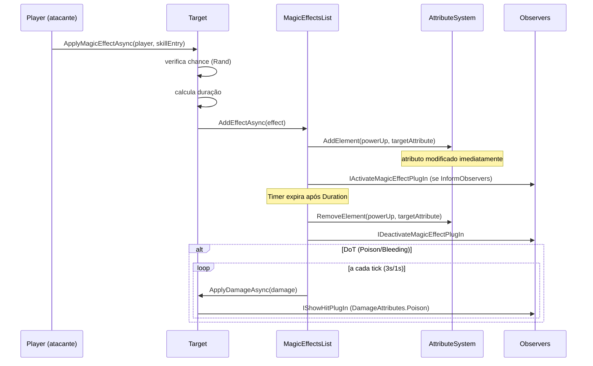
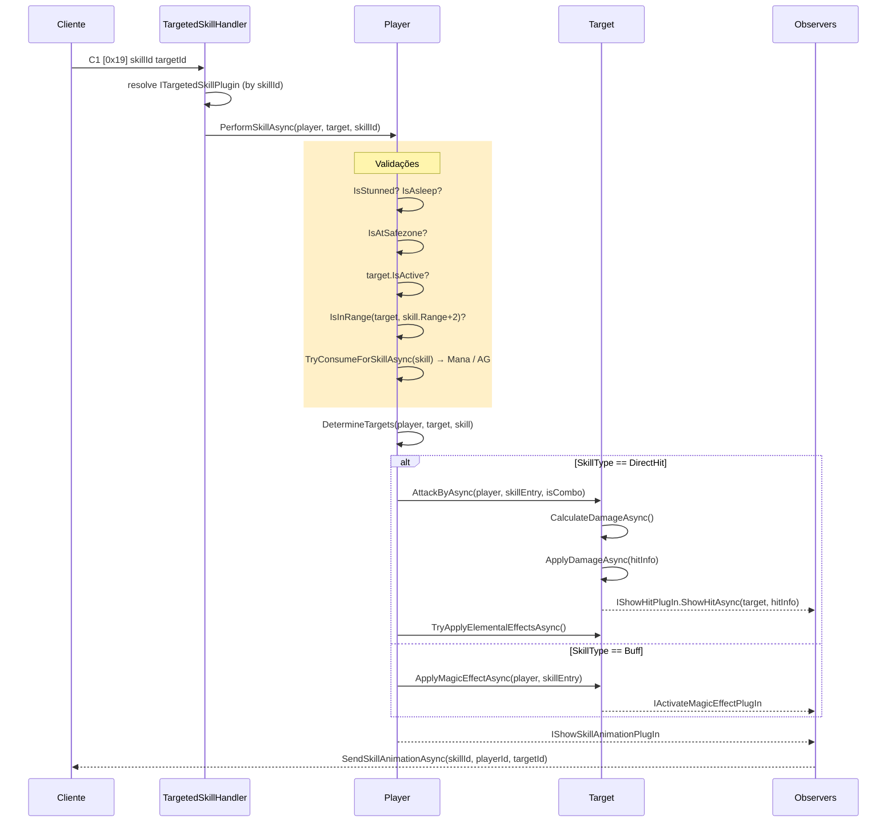
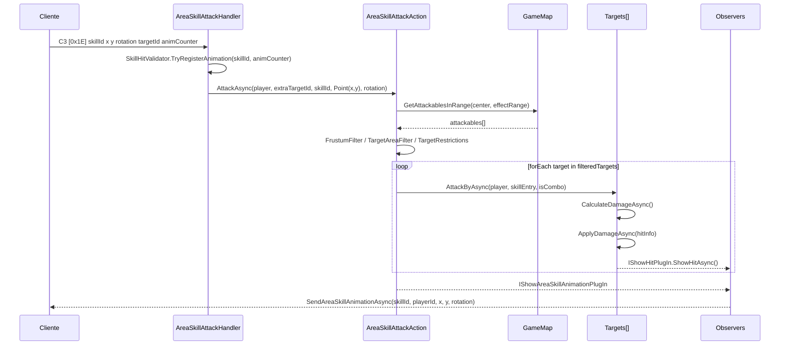
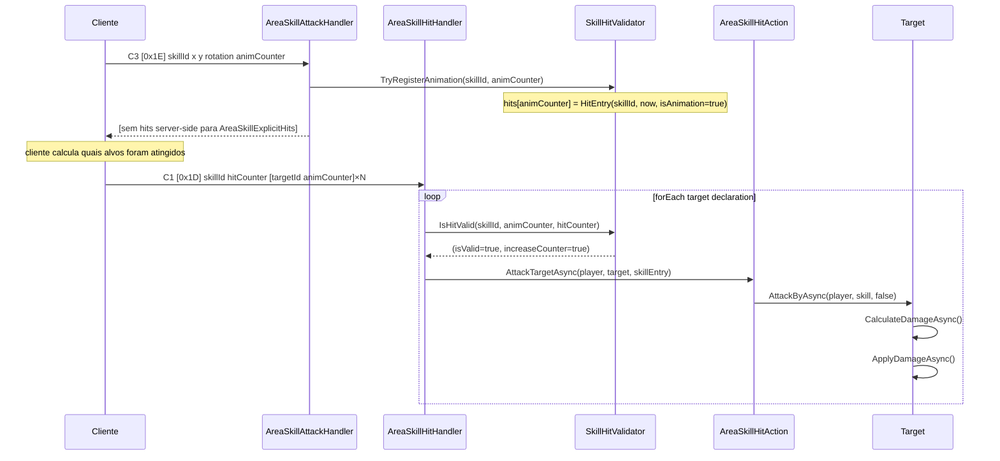

# Sistema de Skills do OpenMU

> Módulo 3 da série de documentação customizada.  
> Pré-requisito: [01-network-pipeline.md](./01-network-pipeline.md)

---

## Índice

1. [Tipos de Skill](#1-tipos-de-skill)
2. [Fluxo Completo de Uso](#2-fluxo-completo-de-uso)
3. [HitAction e Cálculo de Dano](#3-hitaction-e-cálculo-de-dano)
4. [MagicEffects — Buffs, Debuffs e DoT](#4-magiceffects--buffs-debuffs-e-dot)
5. [Pacotes de Rede](#5-pacotes-de-rede)
6. [Targeting System](#6-targeting-system)
7. [Skill Definitions — Arquitetura Data-Driven](#7-skill-definitions--arquitetura-data-driven)
8. [Cooldown](#8-cooldown)
9. [Diagrama do Fluxo Completo](#9-diagrama-do-fluxo-completo)
10. [Tabela de Arquivos](#10-tabela-de-arquivos)
11. [Pontos de Refatoração para Sistema MOBA](#11-pontos-de-refatoração-para-sistema-moba)

---

## 1. Tipos de Skill

O OpenMU categoriza skills através de dois enums complementares: **como a skill atinge alvos** (`SkillType`) e **como os alvos são determinados** (`SkillTarget`).

### SkillType

```csharp
// src/DataModel/Configuration/Skill.cs
public enum SkillType
{
    DirectHit               = 0,  // Targeted: dano direto num único alvo
    CastleSiegeSpecial      = 1,  // Apenas Castle Siege
    CastleSiegeSkill        = 2,  // Variant Castle Siege
    AreaSkillAutomaticHits  = 3,  // Área: servidor calcula todos os hits
    AreaSkillExplicitHits   = 4,  // Área: cliente declara quais alvos acertou (0x1D)
    AreaSkillExplicitTarget = 5,  // Área: cliente informa alvo principal
    Buff                    = 10, // Aplica MagicEffect (buff/debuff)
    Regeneration            = 11, // Regen periódico de HP/Mana
    PassiveBoost            = 20, // Sempre ativo (não é acionado)
    SummonMonster           = 30, // Invoca monstro aliado
    Other                   = 40, // Miscellaneous
}
```

### DamageType

```csharp
public enum DamageType
{
    None             = -1,
    Physical         = 0,  // Baseado em STR/AGI + arma
    Wizardry         = 1,  // Baseado em Energy
    Curse            = 2,  // Summoner (Energy)
    SummonedMonster  = 3,
    Fenrir           = 4,  // Pet Fenrir
    All              = 5,
}
```

### SkillTarget

```csharp
public enum SkillTarget
{
    Undefined                       = 0,
    Explicit                        = 1, // Alvo único selecionado pelo jogador
    ImplicitParty                   = 2, // Todos do grupo no range
    ImplicitPlayersInRange          = 3, // Players no range
    ImplicitNpcsInRange             = 4, // NPCs/Monstros no range
    ImplicitAllInRange              = 5, // Todos no range
    ExplicitWithImplicitInRange     = 6, // Alvo principal + outros próximos a ele
    ImplicitPlayer                  = 7, // Apenas self
}
```

### Skill × Tipo × Pacote (exemplos)

| Skill           | SkillType                | DamageType | Pacote C→S | Observação                          |
|-----------------|--------------------------|------------|-----------|-------------------------------------|
| Fireball        | DirectHit                | Wizardry   | 0x19      | Alvo único, dano mágico             |
| Twister         | AreaSkillExplicitHits    | Wizardry   | 0x1E+0x1D | Cliente declara hits                |
| Ice Arrow       | AreaSkillExplicitTarget  | Physical   | 0x1E      | Explict target + área implícita     |
| Sword Dance     | AreaSkillAutomaticHits   | Physical   | 0x1E      | Servidor calcula alvos              |
| Increase Defense| Buff                     | None       | 0x19      | Auto-buff                           |
| Evil Spirit     | AreaSkillExplicitHits    | Wizardry   | 0x1E+0x1D | Hits declarados com contador        |
| Dark Horse      | PassiveBoost             | —          | —         | Efeito passivo permanente           |

---

## 2. Fluxo Completo de Uso

### 2.1 Targeted Skill (opcode 0x19)

Caminho para skills de alvo único (`DirectHit`, `Buff`, `Regeneration`, `SummonMonster`):

```
Cliente
  └─ envia C1 [0x19, skillId(2), targetId(2)]
       ↓
TargetedSkillHandlerPlugIn.HandlePacketAsync()
  ├─ resolve strategy via PlugInManager.GetStrategy<short, ITargetedSkillPlugin>(skillId)
  │    └─ fallback: TargetedSkillDefaultPlugin (Key=0, usado para todos os não-especializados)
  └─ chama strategy.PerformSkillAsync(player, target, skillId)

TargetedSkillDefaultPlugin.PerformSkillAsync()
  ├─ [validações] IsStunned / IsAsleep → abort
  ├─ [validações] skillEntry existente, não é PassiveBoost
  ├─ [validações] IsAtSafezone (exceto buff em MiniGame)
  ├─ [validações] target.IsActive()
  ├─ [validações] target.CheckSkillTargetRestrictions()
  ├─ [validações] player.IsInRange(target.Position, skill.Range + 2)
  ├─ player.TryConsumeForSkillAsync(skill)  ← consome Mana e AG
  ├─ MovesToTarget → player.MoveAsync(target.Position)
  ├─ MovesTarget   → target.MoveRandomlyAsync()
  ├─ ApplySkillAsync() → itera DetermineTargets()
  │    ├─ DirectHit/CastleSiegeSkill
  │    │    ├─ comboState.RegisterSkillAsync() → isCombo?
  │    │    └─ target.AttackByAsync(player, skillEntry, isCombo)
  │    ├─ Buff → target.ApplyMagicEffectAsync(player, skillEntry)
  │    └─ Regeneration → target.ApplyRegenerationAsync(player, skillEntry)
  └─ ForEachWorldObserver<IShowSkillAnimationPlugIn>
       └─ SendSkillAnimationAsync(skillId, playerId, targetId)   ← S→C broadcast
```

### 2.2 Area Skill (opcode 0x1E)

Caminho para `AreaSkillAutomaticHits`, `AreaSkillExplicitTarget`:

```
Cliente
  └─ envia C3 [0x1E, skillId(2), x, y, rotation, ??, targetId(2), animCounter]
       ↓
AreaSkillAttackHandlerPlugIn.HandlePacketAsync()
  ├─ SkillHitValidator.TryRegisterAnimation(skillId, animCounter)
  └─ AreaSkillAttackAction.AttackAsync(player, extraTargetId, skillId, Point(x,y), rotation)

AreaSkillAttackAction.AttackAsync()
  ├─ [validações] IsStunned / IsAsleep / IsAtSafezone
  ├─ GetTargets() → filtra attackables in range
  │    ├─ FrustumFilter (para cone/arqueiro)
  │    ├─ TargetAreaFilter (para área circular)
  │    ├─ CheckSkillTargetRestrictions por alvo
  │    └─ excluí monstros invocados de hits implícitos
  ├─ Para AreaSkillSettings simples (null):
  │    └─ foreach target → ApplySkillAsync(player, skillEntry, target, center)
  └─ Para AreaSkillSettings complexas:
       ├─ projectileCount × attackRounds
       ├─ hitChance = HitChancePerDistanceMultiplier ^ distance
       ├─ attackDelay > 0 → Task.Run com delay
       └─ ApplySkillAsync(player, skillEntry, target, center)
  
  └─ ForEachWorldObserver<IShowAreaSkillAnimationPlugIn>
       └─ SendAreaSkillAnimationAsync(skillId, playerId, x, y, rotation)  ← broadcast
```

### 2.3 Area Skill Hit (opcode 0x1D — AreaSkillExplicitHits)

Para skills onde **o cliente declara** quais alvos foram atingidos:

```
Cliente
  └─ envia C1/C3 [0x1D, skillId(2), hitCounter, N×(targetId(2), animCounter)]
       ↓
AreaSkillHitHandlerPlugIn.HandlePacketAsync()
  └─ foreach targetInfo in message.Targets:
       ├─ SkillHitValidator.IsHitValid(skillId, animCounter, hitCounter)
       │    └─ valida que animCounter foi registrado previamente via 0x1E
       └─ se válido: AreaSkillHitAction.AttackTargetAsync(player, target, skillEntry)

AreaSkillHitAction.AttackTargetAsync()
  ├─ SkillType == AreaSkillExplicitHits?
  ├─ target.IsAlive && !IsAtSafezone
  ├─ CheckSkillTargetRestrictions
  └─ target.AttackByAsync(player, skill, false)
       + target.TryApplyElementalEffectsAsync(player, skill, hitInfo)
```

### 2.4 Melee Attack (sem skill)

```
Cliente
  └─ envia pacote de animação de ataque
       ↓
HitHandlerPlugIn → HitAction.HitAsync(player, target, animation, direction)
  ├─ [validações] IsStunned / IsAsleep / IsAtSafezone / target.IsAtSafezone
  ├─ verifica target está nos Observers do player (in scope)
  └─ target.AttackByAsync(player, null, false)   ← null = sem skill
       + ShowAnimation para observers
```

---

## 3. HitAction e Cálculo de Dano

Todo dano parte de `IAttackable.AttackByAsync()` → `AttackableExtensions.CalculateDamageAsync()`.

### 3.1 Hit Check (acerto/erro)

```csharp
// src/GameLogic/AttackableExtensions.cs : IsAttackSuccessfulTo()
float hitChance = 0.03f;  // mínimo absoluto de 3%
if (defenseRate < attackRate)
    hitChance = 1.0f - (defenseRate / attackRate);
// PvP: usa Stats.AttackRatePvp e Stats.DefenseRatePvp
// PvM: usa Stats.AttackRatePvm e Stats.DefenseRatePvm
return Rand.NextRandomBool(hitChance);
```

Se `IsAttackSuccessfulTo` retornar false → `HitInfo(0, 0, DamageAttributes.Undefined)` — miss.

### 3.2 Damage Roll

```
GetBaseDmg()
  ├─ Physical  → (MinPhysBaseDmg + skillMinDmg)  a  (MaxPhysBaseDmg + skillMaxDmg)
  ├─ Wizardry  → × WizardryAttackDamageIncrease
  ├─ Curse     → × CurseAttackDamageIncrease
  └─ Fenrir    → FenrirBaseDmg + skillDmg

Skill damage base (GetSkillDmg):
  skillMaxDmg = skillMinDmg * 1.5
  + ElementalModifierTarget bonus (resistência elemental do alvo)
  + Stats.SkillDamageBonus (itens/atributos)
  + MasterSkillTree bonuses (SkillBaseDamageBonus, SkillBaseMultiplier)
```

### 3.3 Critical e Excellent

```
isCriticalHit  = Rand.NextRandomBool(Stats.CriticalDamageChance)
isExcellentHit = Rand.NextRandomBool(Stats.ExcellentDamageChance)
isIgnoringDef  = Rand.NextRandomBool(Stats.DefenseIgnoreChance)

Physical:
  Excellent → dmg = maxDmg × 1.2 + ExcellentDamageBonus + CriticalDamageBonus
  Critical  → dmg = maxDmg + CriticalDamageBonus
  Normal    → dmg = Rand(minDmg, maxDmg)

Wizardry/Curse (base always maxDmg then substract defense):
  Excellent → (maxDmg - defense) × 1.2 + ExcellentDamageBonus
  Critical  → (maxDmg - defense) + CriticalDamageBonus
  Normal    → Rand(minDmg, maxDmg) - defense
```

### 3.4 Defense e Modificadores

```
defense = DefensePvm (ou DefensePvp para PvP) × DefenseDecrement
  → se isIgnoringDefense: defense = 0

dmg -= defense
dmg += GreaterDamageBonus
dmg  = dmg × AttackDamageIncrease
dmg  = dmg × (1 - DamageReceiveDecrement)   ← redução do defensor
dmg  = dmg × SkillMultiplier (× damageFactor para AreaSkillSettings)
dmg += FinalDamageBonus

// PvP extra:
dmg += FinalDamageIncreasePvp
// Mínimo por nível do atacante:
minLevelDmg = max(1, attackerLevel / 10)
```

Outros modificadores relevantes:

| Atributo              | Efeito                                                |
|-----------------------|-------------------------------------------------------|
| `DoubleDamageChance`  | Dobra o dano final (flag `Double`)                    |
| `ComboBonus`          | Bônus quando skill é parte de combo de 3              |
| `TwoHandedWeaponDmgIncrease` | Bônus para armas de duas mãos                  |
| `HasDoubleWield`      | Skill dmg ÷2, mas executado 2× (resultado = ×1)       |
| `BerserkerMinPhysDmgBonus` | Bônus Berserker (Dark Knight)                   |
| `SoulBarrierManaTollPerHit` | Reduz dano recebido, consome mana do defensor  |

### 3.5 Shield vs Health Split

```csharp
// GetHitInfo()
if (shieldBypass || CurrentShield < 1)
    return HitInfo(damage, 0, ...);  // 100% health

shieldRatio = 0.90
shieldRatio -= attacker.ShieldDecreaseRateIncrease
shieldRatio += defender.ShieldRateIncrease
shieldRatio = Clamp(0, 1)

healthDamage = damage × (1 - shieldRatio)   // default: 10%
shieldDamage = damage × shieldRatio          // default: 90%
```

### 3.6 DamageAttributes (flags de cor no cliente)

```csharp
[Flags]
public enum DamageAttributes
{
    Undefined                = 0,
    Critical                 = 1,    // Azul
    Excellent                = 2,    // Verde claro
    IgnoreDefense            = 4,    // Ciano
    Poison                   = 8,    // Verde escuro
    Double                   = 16,   // × 2
    Triple                   = 32,   // × 3
    Reflected                = 64,   // Rosa claro
    Combo                    = 128,  // Bônus de combo
    RageFighterStreakHit      = 256,  // Multi-hit não-final
    RageFighterStreakFinalHit = 512,  // Multi-hit final
}
```

Esses flags determinam a cor do número de dano exibido no cliente e o tipo visual enviado em `SendObjectHitAsync`.

---

## 4. MagicEffects — Buffs, Debuffs e DoT

### 4.1 Estrutura

```
MagicEffectDefinition (configuração, no banco)
  ├─ Number (short)             ← ID do efeito
  ├─ Name
  ├─ SubType (byte)             ← efeitos do mesmo SubType não se acumulam
  ├─ InformObservers (bool)     ← visível para outros jogadores?
  ├─ StopByDeath (bool)
  ├─ Duration / DurationPvp     ← PowerUpDefinitionValue (calculado por atributos)
  ├─ Chance / ChancePvp         ← probabilidade de aplicação
  └─ PowerUpDefinitions[]       ← lista de atributos modificados + valor

MagicEffect (instância viva, em memória)
  ├─ Id = Definition.Number
  ├─ Duration (TimeSpan)
  ├─ PowerUpElements[]          ← IElement vinculados ao AttributeSystem do alvo
  └─ Timer (System.Threading.Timer) → OnTimerTimeout → Dispose
```

### 4.2 Aplicação de Buff

```csharp
// AttackableExtensions.ApplyMagicEffectAsync()
// 1. Calcular power-ups para o player atual (lazy, cached em SkillEntry)
player.CreateMagicEffectPowerUp(skillEntry);

// 2. Verificar chance
float chance = isPvp ? skillEntry.PowerUpChancePvp!.Value : skillEntry.PowerUpChance!.Value;
if (!Rand.NextRandomBool(chance)) return;

// 3. Calcular duração (pode depender do nível do alvo)
if (definition.DurationDependsOnTargetLevel)
    finalDuration -= targetLevel / divisor;

// 4. Instanciar MagicEffect correto
MagicEffect effect = definition.IsPoisoned   → new PoisonMagicEffect(...)
                   | definition.IsBleeding   → new BleedingMagicEffect(...)
                   | else                    → new MagicEffect(...)

// 5. Adicionar à lista
await target.MagicEffectList.AddEffectAsync(effect);
```

### 4.3 MagicEffectsList — Gerenciamento

```csharp
// src/GameLogic/MagicEffectsList.cs
AddEffectAsync(effect):
  se já existe efeito com mesmo Id:
    UpdateEffect()  ← renova duração, mas não faz downgrade de valor
  senão:
    ActiveEffects[effect.Id] = effect
    foreach powerUp in effect.PowerUpElements:
      owner.Attributes.AddElement(powerUp.Element, powerUp.Target)  ← buff ativo!

  se InformObservers:
    broadcast IActivateMagicEffectPlugIn → cliente vê animação de buff

RemoveEffectAsync(effect) [via DisposeAsyncCore]:
  foreach powerUp in effect.PowerUpElements:
    owner.Attributes.RemoveElement(powerUp.Element, powerUp.Target)  ← buff removido!
  broadcast IDeactivateMagicEffectPlugIn
```

Os `PowerUpElements` são `IElement` diretamente registrados no `AttributeSystem` do alvo — enquanto o efeito está ativo, o valor do atributo já está alterado em todas as fórmulas de dano/defesa.

### 4.4 DoT — Dano ao Longo do Tempo

#### Poison

```csharp
// src/GameLogic/PoisonMagicEffect.cs
Timer tick = 3000ms

OnDamageTimerElapsed():
  damage = owner.CurrentHealth × attacker.PoisonDamageMultiplier
  await owner.ApplyPoisonDamageAsync(attacker, (uint)damage)
```

#### Bleeding

```csharp
// src/GameLogic/BleedingMagicEffect.cs
Timer tick = 1000ms

OnDamageTimerElapsed():
  damage = _damage (valor fixo calculado na aplicação)
  await owner.ApplyBleedingDamageAsync(attacker, (uint)_damage)
```

Ambos herdam `MagicEffect` e adicionam um segundo `System.Timers.Timer` além do timer de expiração.

### 4.5 Diagrama de Aplicação de Efeito



---

## 5. Pacotes de Rede

### 5.1 C→S: TargetedSkill (0x19)

```
C1 [len] 19 [skillId_hi] [skillId_lo] [targetId_hi] [targetId_lo]
```

| Offset | Tamanho | Campo    | Descrição                                |
|--------|---------|----------|------------------------------------------|
| 0      | 1       | Type     | 0xC1                                     |
| 1      | 1       | Length   | 0x07                                     |
| 2      | 1       | Code     | 0x19                                     |
| 3–4    | 2       | SkillId  | Big-endian ushort                        |
| 5–6    | 2       | TargetId | ID do alvo (de-referenciado do mapa)     |

### 5.2 C→S: AreaSkill (0x1E)

```
C3 [len_hi] [len_lo] 1E [skillId_hi] [skillId_lo] [x] [y] [rotation] [??] [??] [targetId_hi] [targetId_lo] [animCounter]
```

| Offset | Tamanho | Campo         | Descrição                                           |
|--------|---------|---------------|-----------------------------------------------------|
| 0–3    | 4       | Header C3     | Type+Length(2 bytes)+Code                           |
| 4–5    | 2       | SkillId       | Big-endian ushort                                   |
| 6      | 1       | TargetX       | Coordenada X do centro da área                      |
| 7      | 1       | TargetY       | Coordenada Y do centro da área                      |
| 8      | 1       | Rotation      | 0–255 (→ 0–360°)                                    |
| 9–10   | 2       | Unknown       | Ignorado pelo servidor                              |
| 11–12  | 2       | ExtraTargetId | Alvo explícito (0xFFFF = nenhum)                    |
| 13     | 1       | AnimCounter   | Contador de animação para correlação com 0x1D       |

### 5.3 C→S: AreaSkillHit (0x1D)

```
C1 [len] 1D [skillId_hi] [skillId_lo] [hitCounter] [N × (targetId_hi targetId_lo animCounter ??  ??)]
```

| Offset | Tamanho | Campo      | Descrição                                              |
|--------|---------|------------|--------------------------------------------------------|
| 0–2    | 3       | Header C1  |                                                        |
| 3–4    | 2       | SkillId    | 0 = usar LastRegisteredSkillId                         |
| 5      | 1       | HitCounter | Contador global de hits (incrementado por hit válido)  |
| 6+     | 5×N     | Targets    | N entradas de 5 bytes: targetId(2) + animCounter(1) + 2 bytes |

### 5.4 S→C: Skill Animation

```
C1 09 19 [skillId_hi] [skillId_lo] [attackerId_hi] [attackerId_lo] [targetId_hi] [targetId_lo]
```

Enviado a todos os observers do atacante via `IShowSkillAnimationPlugIn.ShowSkillAnimationAsync`.

### 5.5 S→C: Area Skill Animation

```
C1 0A 1E [skillId_hi] [skillId_lo] [attackerId_hi] [attackerId_lo] [x] [y] [rotation]
```

### 5.6 S→C: Object Hit (Hit Result)

Opcode varia por idioma/season:

| Idioma    | Opcode |
|-----------|--------|
| English   | 0x11   |
| Japanese  | 0xD6   |
| Vietnamese| 0xDC   |
| Filipino/Korean | 0xDF |
| Chinese   | 0xD0   |
| Thai      | 0xD2   |
| Season < 1| 0x15   |

Payload:

```
[opcode] [targetId_hi] [targetId_lo] [healthDmg_hi] [healthDmg_lo] [damageKind] [flags] [shieldDmg_hi] [shieldDmg_lo]
```

`damageKind` mapeia `DamageAttributes` para cor no cliente:

| DamageAttributes | DamageKind            | Cor           |
|------------------|-----------------------|---------------|
| Normal           | NormalRed             | Vermelho      |
| Critical         | CriticalBlue          | Azul          |
| Excellent        | ExcellentLightGreen   | Verde claro   |
| IgnoreDefense    | IgnoreDefenseCyan     | Ciano         |
| Reflected        | ReflectedLightPink    | Rosa          |
| Poison           | PoisonDarkGreen       | Verde escuro  |

Se o dano excede 65535 (0xFFFF), o servidor **envia múltiplos pacotes** consecutivos com o overflow.

### 5.7 S→C: Activate/Deactivate MagicEffect

```
// Activate (buff visível):
C1 [len] [opcode] [playerId_hi] [playerId_lo] [effectId] [duration?]

// Deactivate:
C1 [len] [opcode] [playerId_hi] [playerId_lo] [effectId]
```

---

## 6. Targeting System

### 6.1 Range Check (Targeted Skills)

```csharp
// TargetedSkillDefaultPlugin — tolerância de +2 tiles
if (!player.IsInRange(target.Position, skill.Range + 2))
{
    // se target não está andando, re-sincroniza posição no cliente
    if (!(target is ISupportWalk { IsWalking: true }))
        InvokeViewPlugIn<IObjectMovedPlugIn>(p => p.ObjectMovedAsync(target, Instant));
    return;
}
```

O `+2` de tolerância existe porque cliente e servidor podem ter posições ligeiramente dessincronizadas durante o walk.

### 6.2 Target Restrictions

```csharp
// CheckSkillTargetRestrictions(player, skill)
// src/GameLogic/SkillTargetRestriction.cs
public enum SkillTargetRestriction
{
    Undefined       = 0,  // sem restrição
    Player          = 1,  // só players
    Monster         = 2,  // só monstros/NPCs
    Characters      = 3,  // players e NPCs (não monstros hostis)
}
```

Além do tipo, `AreaSkillExplicitHits` verifica se o alvo está in scope (`Observers.Contains(player)` implicitamente via bucket AoI).

### 6.3 Safezone

```csharp
// Atacante em safezone → não pode atacar (exceto buffs em MiniGame)
if (player.IsAtSafezone()) return;

// Alvo em safezone → não pode ser atacado
if (target.IsAtSafezone()) return;
```

Safezone é determinada por `GameMapTerrain.SafezoneMap[x, y]`.

### 6.4 Area Skill Target Filtering

Para `AreaSkillAutomaticHits` e `AreaSkillExplicitTarget`, o servidor usa `BucketAreaOfInterestManager.GetAttackablesInRange()` e aplica filtros adicionais:

```
FrustumFilter (cone):
  ├─ FrustumStartWidth  ← largura na origem do jogador
  ├─ FrustumEndWidth    ← largura na extremidade do alcance
  ├─ FrustumDistance    ← comprimento do cone
  └─ ProjectileCount    ← nº de projeteis (divide o cone em colunas)

TargetAreaFilter (círculo):
  └─ distância(target, center) < TargetAreaDiameter * 0.5
```

### 6.5 SkillHitValidator — Validação para AreaSkillExplicitHits

O `SkillHitValidator` mantém um contador compartilhado entre o pacote de animação (0x1E) e os hits declarados (0x1D):

```csharp
// 0x1E registra a animação:
TryRegisterAnimation(skillId, animCounter):
  hits[animCounter] = new HitEntry(skillId, DateTime.UtcNow, isAnimation=true, hitCount=0)
  counter.Increase()

// 0x1D valida o hit:
IsHitValid(skillId, animCounter, hitCounter):
  se hits[animCounter] existe → (IsValid=true, IncreaseCounter=true)
  senão → log warning "missing animation" → (false, false)
```

> **Atenção:** A maior parte do código de validação rigorosa (verificação de counter, timestamp máximo de 10s, verificação de skill ID correto) está **comentada no código atual**. O servidor aceita hits declarados desde que a animação tenha sido registrada, mas não valida contra cheats com precisão.

---

## 7. Skill Definitions — Arquitetura Data-Driven

### 7.1 Onde as Skills são Definidas

Skills são **completamente data-driven** — definidas no banco de dados (via Entity Framework / `IContext.CreateNew<Skill>()`), não hardcoded no código de gameplay.

O banco é populado pelos inicializadores:

```
src/Persistence/Initialization/VersionSeasonSix/SkillsInitializer.cs
  └─ herda SkillsInitializerBase.CreateSkill(
       number, name, characterClasses, damageType, damage, distance,
       abilityConsumption, manaConsumption, levelRequirement,
       energyRequirement, leadershipRequirement, elementalModifier,
       skillType, skillTarget, implicitTargetRange, targetRestriction,
       movesToTarget, movesTarget, cooldownMinutes, hitsPerAttack)
```

### 7.2 SkillEntry — Instância no Personagem

Cada personagem tem um `SkillList` com `SkillEntry` por skill aprendida:

```csharp
// src/DataModel/Entities/SkillEntry.cs
public class SkillEntry
{
    public virtual Skill? Skill { get; set; }   // referência à definição
    public int Level { get; set; }              // nível (relevante para master skills)

    // Power-ups pré-calculados (lazy, invalidados ao mudar atributos)
    [Transient]
    public (AttributeDefinition Target, IElement BuffPowerUp)[]? PowerUps { get; set; }
    public IElement? PowerUpDuration { get; set; }
    public IElement? PowerUpChance { get; set; }
    // versões PvP equivalentes...

    // Atributos extras do master skill tree
    [Transient]
    public IAttributeSystem? Attributes { get; set; }
}
```

### 7.3 AttributeRelationships — Dano Dinâmico

Skills podem ter `AttributeRelationships` que criam fórmulas de dano baseadas em atributos do personagem. Isso é como o dano cresce com a progressão:

```
Skill.AttributeRelationships[] → InputAttribute × Multiplier → TargetAttribute (SkillDamageBonus)
Exemplo: Fireball → Energy × 0.02 → SkillDamageBonus
```

### 7.4 MasterSkillDefinition — Master Skill Tree

Skills do Master Skill Tree têm `MasterSkillDefinition` com:
- `Rank` (posição na árvore)
- `TargetAttribute` (qual stat boostar)
- `MinLevelRequirement`, `MaxLevel`
- `ValueFormula` (expressão calculada por nível da master skill)

Os valores calculados ficam no `SkillEntry.Attributes` — um `AttributeSystem` separado só para essa skill.

### 7.5 AreaSkillSettings — Configuração de Área

```csharp
// src/DataModel/Configuration/AreaSkillSettings.cs
public class AreaSkillSettings
{
    // Filtros de área
    bool UseFrustumFilter;          // cone direcional
    float FrustumStartWidth;
    float FrustumEndWidth;
    float FrustumDistance;
    bool UseTargetAreaFilter;       // círculo ao redor do ponto
    float TargetAreaDiameter;

    // Projeteis
    int ProjectileCount;            // quantos projetéis são disparados
    int EffectRange;                // override do skill.Range para área

    // Timing de hits
    bool UseDeferredHits;
    TimeSpan DelayPerOneDistance;   // delay proporcional à distância
    TimeSpan DelayBetweenHits;

    // Múltiplos hits por alvo
    int MinimumNumberOfHitsPerTarget;
    int MaximumNumberOfHitsPerTarget;

    // Rounds de ataque
    int MinimumNumberOfHitsPerAttack;
    int MaximumNumberOfHitsPerAttack;

    // Redução de chance por distância
    float HitChancePerDistanceMultiplier;  // ex: 0.9 → 90% por tile de distância
}
```

### 7.6 Combo System

O OpenMU implementa um combo de 3 skills (ex: Twisting Slash → Rageful Blow → Death Stab para Dark Knight):

```csharp
// TargetedSkillDefaultPlugin.ApplySkillAsync()
if (skill.SkillType is DirectHit or CastleSiegeSkill)
{
    isCombo = await comboState.RegisterSkillAsync(skill);
}
// se isCombo == true:
// - dano recebe ComboBonus
// - DamageAttributes.Combo é setado
// - ShowComboAnimationAsync() → envia skill 59 (ComboSkillId) para observers
```

---

## 8. Cooldown

O campo `cooldownMinutes` existe na definição de skill mas **não é aplicado server-side para skills regulares**. O cooldown de habilidades comuns é apenas client-side — o servidor não bloqueia spam de skills pelo jogador.

Exceções onde cooldown existe server-side:
- **Poções**: `PotionCooldownUntil` no `Player` (0,5s por padrão)
- **Offline AI**: `CombatHandler.SkillCooldownTicks` para NPCs e o modo Mu Helper
- **Castle Siege skills**: controles específicos de timing

Para skills de Castle Siege (`cooldownMinutes > 0`), o valor é armazenado, mas a aplicação depende de lógica especializada fora do fluxo principal.

---

## 9. Diagrama do Fluxo Completo

### 9.1 Targeted Skill (0x19)



### 9.2 Area Skill Automática (0x1E)



### 9.3 Area Skill com Hits Explícitos (0x1E + 0x1D)



---

## 10. Tabela de Arquivos

| Caminho | Classe | Responsabilidade |
|---------|--------|------------------|
| `src/DataModel/Configuration/Skill.cs` | `Skill` | Definição completa de uma skill (tipo, dano, range, efeitos) |
| `src/DataModel/Configuration/MagicEffectDefinition.cs` | `MagicEffectDefinition` | Configuração de buff/debuff (duração, chance, atributos afetados) |
| `src/DataModel/Configuration/AreaSkillSettings.cs` | `AreaSkillSettings` | Parâmetros de área, projeteis, timing e filtros |
| `src/DataModel/Entities/SkillEntry.cs` | `SkillEntry` | Instância de skill no personagem com level e power-ups calculados |
| `src/GameLogic/AttackableExtensions.cs` | — | `CalculateDamageAsync`, `GetHitInfo`, `GetBaseDmg`, `IsAttackSuccessfulTo`, `ApplyMagicEffectAsync` |
| `src/GameLogic/HitInfo.cs` | `HitInfo` | Record com HealthDamage, ShieldDamage, DamageAttributes, ManaToll |
| `src/GameLogic/DamageAttributes.cs` | `DamageAttributes` | Flags de tipo de dano (Critical, Excellent, Poison, etc.) |
| `src/GameLogic/MagicEffectsList.cs` | `MagicEffectsList` | Gerencia efeitos ativos: AddEffect, UpdateEffect, RemoveEffect |
| `src/GameLogic/MagicEffect.cs` | `MagicEffect` | Instância de efeito com timer de expiração e IElements |
| `src/GameLogic/PoisonMagicEffect.cs` | `PoisonMagicEffect` | DoT: 3% HP atual a cada 3 segundos |
| `src/GameLogic/BleedingMagicEffect.cs` | `BleedingMagicEffect` | DoT: dano fixo a cada 1 segundo |
| `src/GameLogic/SkillHitValidator.cs` | `SkillHitValidator` | Valida correlação animCounter(0x1E) ↔ hit(0x1D) |
| `src/GameLogic/PlayerActions/HitAction.cs` | `HitAction` | Ataque melee sem skill |
| `src/GameLogic/PlayerActions/Skills/TargetedSkillPluginBase.cs` | `TargetedSkillPluginBase` | Interface base para plugins de skill targeted |
| `src/GameLogic/PlayerActions/Skills/TargetedSkillDefaultPlugin.cs` | `TargetedSkillDefaultPlugin` | Implementação padrão (DirectHit, Buff, Regen, Summon) |
| `src/GameLogic/PlayerActions/Skills/AreaSkillAttackAction.cs` | `AreaSkillAttackAction` | Processa 0x1E para area skills automáticas |
| `src/GameLogic/PlayerActions/Skills/AreaSkillHitAction.cs` | `AreaSkillHitAction` | Processa hits declarados via 0x1D |
| `src/GameLogic/PlayerActions/Skills/FrustumBasedTargetFilter.cs` | `FrustumBasedTargetFilter` | Filtro de cone para skills direcionais |
| `src/GameLogic/Views/World/IShowSkillAnimationPlugIn.cs` | `IShowSkillAnimationPlugIn` | Interface S→C: animação de targeted skill |
| `src/GameLogic/Views/World/IShowAreaSkillAnimationPlugIn.cs` | `IShowAreaSkillAnimationPlugIn` | Interface S→C: animação de área |
| `src/GameLogic/Views/World/IShowHitPlugIn.cs` | `IShowHitPlugIn` | Interface S→C: resultado do hit (dano) |
| `src/GameLogic/Views/World/IActivateMagicEffectPlugIn.cs` | `IActivateMagicEffectPlugIn` | Interface S→C: buff ativado |
| `src/GameLogic/Views/World/IDeactivateMagicEffectPlugIn.cs` | `IDeactivateMagicEffectPlugIn` | Interface S→C: buff expirado |
| `src/GameServer/MessageHandler/TargetedSkillHandlerPlugIn.cs` | `TargetedSkillHandlerPlugIn` | Handler C→S opcode 0x19 |
| `src/GameServer/MessageHandler/AreaSkillAttackHandlerPlugIn.cs` | `AreaSkillAttackHandlerPlugIn` | Handler C→S opcode 0x1E |
| `src/GameServer/MessageHandler/AreaSkillHitHandlerPlugIn.cs` | `AreaSkillHitHandlerPlugIn` | Handler C→S opcode 0x1D |
| `src/GameServer/RemoteView/World/ShowSkillAnimationPlugIn.cs` | `ShowSkillAnimationPlugIn` | Implementa `IShowSkillAnimationPlugIn`, serializa pacote |
| `src/GameServer/RemoteView/World/ShowAreaSkillAnimationPlugIn.cs` | `ShowAreaSkillAnimationPlugIn` | Implementa `IShowAreaSkillAnimationPlugIn` |
| `src/GameServer/RemoteView/World/ShowHitPlugIn.cs` | `ShowHitPlugIn` | Implementa `IShowHitPlugIn`, determina opcode por idioma |
| `src/Persistence/Initialization/Skills/SkillsInitializerBase.cs` | `SkillsInitializerBase` | Popula banco com definições de skills |

---

## 11. Pontos de Refatoração para Sistema MOBA

### Resumo do estado atual

| Característica   | Implementação atual                                  |
|------------------|------------------------------------------------------|
| Cooldown         | Client-side apenas (não enforçado pelo servidor)     |
| Targeting        | Tile-based, range em tiles inteiros                  |
| Area shape       | Retângulo (frustum) ou círculo discreto              |
| Cast time        | Inexistente — instantâneo no servidor                |
| Projectiles      | Lógica de delay via `Task.Run + Task.Delay`, sem trajetória real |
| Skill queue      | Inexistente                                          |

### 11.1 Cooldown Server-Side

**O que mudar:**

Adicionar campo `LastUsed` no `SkillEntry` e verificação no início de `PerformSkillAsync`:

```csharp
// SkillEntry.cs — adicionar:
[Transient]
public DateTime LastUsed { get; set; } = DateTime.MinValue;

// TargetedSkillDefaultPlugin — adicionar validação:
var cooldown = TimeSpan.FromMinutes(skill.CooldownMinutes);
if (DateTime.UtcNow - skillEntry.LastUsed < cooldown)
{
    await player.InvokeViewPlugInAsync<ISkillOnCooldownPlugIn>(...);
    return;
}
skillEntry.LastUsed = DateTime.UtcNow;
```

Equivalente para area skills em `AreaSkillAttackAction.AttackAsync`.

**Complexidade:** Baixa — estrutura já existe (campo `cooldownMinutes`), só falta enforcement.

### 11.2 Cast Time (Tempo de Conjuração)

**O que mudar:**

Adicionar `CastTime` na `AreaSkillSettings` (ou em `Skill`). Modificar o handler para:
1. Receber pacote de início de cast
2. Validar posição/alvo/mana imediatamente
3. Bloquear movimento do player durante cast (ou não, dependendo do design)
4. Após `CastTime`, executar o dano

```csharp
// Novo enum
public enum CastState { None, Casting, Channeling }

// Player.cs — adicionar:
public CastState CurrentCastState { get; private set; }
public SkillEntry? CurrentCastSkill { get; private set; }
private CancellationTokenSource? _castCts;

// AreaSkillAttackAction — modificar:
if (skill.AreaSkillSettings?.CastTime > TimeSpan.Zero)
{
    player.BeginCast(skillEntry);
    _ = Task.Run(async () => {
        await Task.Delay(skill.AreaSkillSettings.CastTime);
        // re-validar range e mana
        await ExecuteAreaSkillAsync(player, skillEntry, center, rotation);
    }, player._castCts.Token);
}
else
{
    await ExecuteAreaSkillAsync(player, skillEntry, center, rotation);
}
```

**Complexidade:** Média — requer novo estado de player, cancelamento no dano recebido, novo pacote S→C de "começou a conjurar".

### 11.3 Skillshots — Projeteis com Trajetória

**O que mudar:**

Atualmente `AreaSkillSettings.DelayPerOneDistance` simula trajetória apenas com delays, sem posição real do projétil. Para skillshots reais:

1. Criar entidade `Projectile : ILocateable` que se move por `Walker`-like loop
2. No tick de movimento, verificar colisão com `GetAttackablesInRange(projectile.Position, radius)`
3. Na colisão: executar hit e destruir projetil
4. Broadcast de posição do projetil a cada tick via novo `IShowProjectilePlugIn`

```csharp
// Novo tipo:
public class Projectile : ILocateable
{
    public Point Position { get; set; }
    public Direction Direction { get; }
    public Player Attacker { get; }
    public SkillEntry Skill { get; }
    public float Speed { get; }  // tiles/segundo

    public async Task MoveAsync(CancellationToken ct)
    {
        while (!ct.IsCancellationRequested)
        {
            await Task.Delay(50, ct);  // 20 Hz
            this.Position = NextPosition();
            var hit = this.CurrentMap!.GetAttackablesInRange(this.Position, 1).FirstOrDefault();
            if (hit != null)
            {
                await hit.AttackByAsync(this.Attacker, this.Skill, false);
                await this.CurrentMap.RemoveAsync(this);
                return;
            }
        }
    }
}
```

**Complexidade:** Alta — requer novo tipo de entidade, loop de movimento, sincronização com AoI, novos pacotes.

### 11.4 Posicionamento Contínuo para Área de Efeito

**O que mudar:**

`FrustumBasedTargetFilter` e `TargetAreaFilter` já usam `float` internamente, mas `Point` é `byte X, byte Y`. Para coordenadas contínuas (float):

1. Criar `PointF(float X, float Y)` para posições de skills
2. No `AreaSkillAttackAction.GetTargets()`, aceitar `PointF center` em vez de `Point`
3. Verificar distância com `float` Euclidean, não tiles

Isso permite áreas de efeito com raio fracionário (ex: 2,5 tiles) e melhor precisão em skills.

**Complexidade:** Média — impacta `GetAttackablesInRange`, `FrustumBasedTargetFilter`, `BucketAreaOfInterestManager`.

### 11.5 Interrupt / Cancel de Skills

Para MOBA-style onde dano interrompe cast:

```csharp
// Quando player recebe dano:
if (player.CurrentCastState == CastState.Casting
    && player.CurrentCastSkill?.Skill?.CanBeInterrupted == true)
{
    player._castCts.Cancel();
    player.CurrentCastState = CastState.None;
    await player.InvokeViewPlugInAsync<ISkillInterruptedPlugIn>(...);
}
```

Requer `CanBeInterrupted` na `Skill.AreaSkillSettings`.

**Complexidade:** Baixa dado cast time implementado — é apenas cancelar o CancellationToken.

### 11.6 Skill Queue

Para permitir que o jogador enfileire a próxima skill enquanto outra está em cast:

```csharp
// Player.cs — adicionar:
public (IAttackable? Target, ushort SkillId)? QueuedSkill { get; private set; }

// No final de ExecuteAreaSkillAsync:
if (QueuedSkill is { } next)
{
    QueuedSkill = null;
    await PerformSkillAsync(player, next.Target, next.SkillId);
}
```

**Complexidade:** Baixa, mas requer cuidado com validação de alvo obsoleto.

### 11.7 Validação de Caminho para Skillshots (Line of Sight)

Atualmente o servidor não verifica Line of Sight — qualquer alvo in range é atingível. Para skillshots com física:

```csharp
// Usar GameMapTerrain.WalkMap como mapa de colisão:
private static bool HasLineOfSight(Point from, Point to, GameMap map)
{
    // Bresenham's line algorithm
    foreach (var point in BresenhamLine(from, to))
    {
        if (!map.Terrain.WalkMap[point.X, point.Y])
            return false;
    }
    return true;
}
```

O `WalkMap` já existe e representa obstáculos — é a mesma grid usada para colisão de movimento.

**Complexidade:** Baixa — algoritmo simples, grid já disponível.

### 11.8 Resumo das Mudanças

| Feature                     | Complexidade | Pontos de Extensão                                      |
|-----------------------------|-------------|----------------------------------------------------------|
| Cooldown server-side        | Baixa       | `SkillEntry` + `TargetedSkillDefaultPlugin` / `AreaSkillAttackAction` |
| Cast time                   | Média       | `Skill`, `AreaSkillSettings`, `Player` + novo IViewPlugIn |
| Cancel por dano             | Baixa*      | `AttackableExtensions.ApplyDamageAsync` + CancellationToken |
| Skillshots com trajetória   | Alta        | Nova entidade `Projectile`, novo loop de movimento       |
| Área contínua (float)       | Média       | `PointF` + `GetAttackablesInRange` + `FrustumFilter`     |
| Line of Sight               | Baixa       | `WalkMap` + Bresenham em `AreaSkillAttackAction`         |
| Skill queue                 | Baixa       | `Player` + handlers                                      |

\* Requer cast time implementado primeiro.

O ponto de entrada mais seguro para a refatoração é **cooldown server-side** seguido de **Line of Sight**, ambos autocontidos sem quebrar o protocolo existente.
