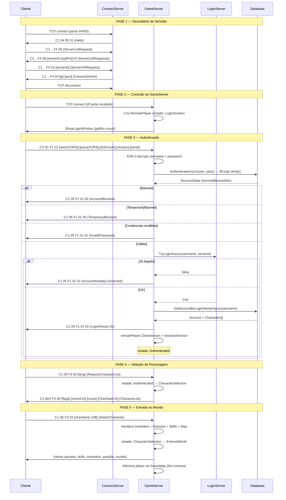

# Fluxo de Autenticação do OpenMU

> Módulo 4 da série de documentação customizada.  
> Pré-requisito: [01-network-pipeline.md](./01-network-pipeline.md)

---

## Índice

1. [Arquitetura de Servidores](#1-arquitetura-de-servidores)
2. [Fluxo Completo de Login](#2-fluxo-completo-de-login)
3. [Pacotes de Autenticação](#3-pacotes-de-autenticação)
4. [Segurança Atual](#4-segurança-atual)
5. [Seleção de Servidor](#5-seleção-de-servidor)
6. [Ciclo de Vida do RemotePlayer](#6-ciclo-de-vida-do-remoteplayer)
7. [Tratamento de Erros](#7-tratamento-de-erros)
8. [Diagrama do Fluxo Completo](#8-diagrama-do-fluxo-completo)
9. [Tabela de Arquivos](#9-tabela-de-arquivos)
10. [Análise de Segurança](#10-análise-de-segurança)
11. [Gargalos Técnicos](#11-gargalos-técnicos)
12. [Roadmap de Modernização](#12-roadmap-de-modernização)

---

## 1. Arquitetura de Servidores

O OpenMU divide a responsabilidade de autenticação e conexão em três processos/componentes:

```
┌──────────────────────────────────────────────────────────────────────┐
│  Cliente MU Online                                                   │
│  Conecta-se sequencialmente: ConnectServer → GameServer              │
└──────────┬──────────────────────────────────────────────────────────┘
           │ TCP
           ▼
┌──────────────────────┐         ┌──────────────────────┐
│   ConnectServer      │◄───────►│  GameServer(es)       │
│                      │ register│  (1..N instâncias)    │
│  - Lista servidores  │ /update │                       │
│  - Informa IP:porta  │         │  - Recebe login       │
│  - Rate limiting     │         │  - Autentica conta    │
│  - TCP timeout       │         │  - Entra no mundo     │
└──────────────────────┘         └──────────────────────┘
                                          │
                                          │ ILoginServer
                                          ▼
                               ┌──────────────────────┐
                               │   LoginServer         │
                               │                       │
                               │  - Dictionary<string, │
                               │    byte> em memória   │
                               │  - Previne login duplo│
                               └──────────────────────┘
```

### Responsabilidades por componente

| Componente | Responsabilidade | Implementação |
|------------|-----------------|---------------|
| **ConnectServer** | Diretório de GameServers; informa ao cliente qual IP:porta usar | `src/ConnectServer/ConnectServer.cs` |
| **GameServer** | Aceita conexão TCP, gerencia sessão, autentica, coloca player no mundo | `src/GameServer/` |
| **LoginServer** | Mantém registro de contas conectadas para impedir sessão dupla | `src/LoginServer/LoginServer.cs` |

### Comunicação entre componentes

O ConnectServer e o GameServer se comunicam pela interface `IConnectServer`:

```csharp
// src/Interfaces/IConnectServer.cs (interface)
void RegisterGameServer(ServerInfo gameServer, IPEndPoint publicEndPoint);
void UnregisterGameServer(ushort gameServerId);
void CurrentConnectionsChanged(ushort serverId, int currentConnections);
```

No modo **all-in-one** (processo único, padrão de desenvolvimento): a chamada é in-process, sem rede.  
No modo **distribuído**: implementado via gRPC ou outro mecanismo de IPC (dependente de hosting).

O LoginServer é acessado pelo GameServer via interface `ILoginServer`:

```csharp
// src/Interfaces/ILoginServer.cs
Task<bool> TryLoginAsync(string accountName, byte serverId);
ValueTask LogOffAsync(string accountName, byte serverId);
ValueTask<Dictionary<string, byte>> GetSnapshotAsync();
```

Implementação padrão:

```csharp
// src/LoginServer/LoginServer.cs
public class LoginServer : ILoginServer
{
    private readonly Dictionary<string, byte> _connectedAccounts = new();
    private readonly AsyncLock _syncRoot = new();

    public async Task<bool> TryLoginAsync(string accountName, byte serverId)
    {
        using var l = await this._syncRoot.LockAsync();
        if (this._connectedAccounts.ContainsKey(accountName))
            return false;
        this._connectedAccounts.Add(accountName, serverId);
        return true;
    }

    public async ValueTask LogOffAsync(string accountName, byte serverId)
    {
        using var l = await this._syncRoot.LockAsync();
        this._connectedAccounts.Remove(accountName);
    }
}
```

> **Crítico:** O LoginServer é um dicionário em memória. Se o processo reiniciar, todo o estado de "quem está conectado" se perde — o mecanismo de prevenção de login duplo falha silenciosamente.

---

## 2. Fluxo Completo de Login

### Fase 1 — Cliente conecta ao ConnectServer

```
1. Cliente abre TCP para ConnectServer (porta configurável, ex: 44405)
2. ConnectServer aceita: OnClientAcceptedAsync()
   ├─ Instancia Client (com timer de timeout de 20s)
   └─ Envia pacote Hello (C1 04 00 01)
3. Cliente recebe Hello → envia pedido de lista de servidores
4. ConnectServer responde com ServerList (IDs + load %)
5. Cliente escolhe servidor → envia ServerInfoRequest(serverId)
6. ConnectServer responde com ConnectionInfo (IP:porta do GameServer)
7. Cliente fecha conexão com ConnectServer
```

### Fase 2 — Cliente conecta ao GameServer

```
8.  Cliente abre TCP para GameServer (IP:porta recebido na fase 1)
9.  DefaultTcpGameServerListener.OnClientAcceptingAsync()
    └─ Rejeita se servidor lotado (playerCount >= maxPlayers)
10. DefaultTcpGameServerListener.OnClientAcceptedAsync()
    ├─ Cria RemotePlayer (estado inicial: LoginScreen)
    ├─ Configura pipeline de criptografia (SimpleModulus)
    └─ Envia ShowLoginWindow (gatilho para cliente mostrar tela)
```

### Fase 3 — Login

```
11. Cliente preenche usuário/senha → envia LoginLongPassword (C3 3C F1 01 ...)
12. LogInHandlerPlugIn.HandlePacketAsync():
    ├─ Detecta formato pelo tamanho do pacote (LongPwd/ShortPwd/075)
    └─ XOR-3 decrypt nos campos Username e Password
13. LoginAction.LoginAsync(player, username, password):
    ├─ AuthenticateAsync() → PersistenceContext.AuthenticateAsync()
    │   └─ BCrypt.Verify(password, account.PasswordHash)
    ├─ ValidateAccountStateAsync() → verifica ban
    ├─ TryEstablishSessionAsync():
    │   ├─ PlayerState.TryBeginAdvanceToAsync(Authenticated)
    │   ├─ LoginServer.TryLoginAsync(username, serverId)
    │   └─ PersistenceContext.GetAccountByLoginNameAsync(username)
    └─ FinishLoginAsync():
        ├─ player.Account = account
        └─ IShowLoginResultPlugIn → LoginResult.Ok
14. remotePlayer.ClientVersion = resolvedVersion
```

### Fase 4 — Seleção de personagem

```
15. Cliente envia RequestCharacterList (C1 05 F3 00 [language])
16. Servidor transiciona estado: Authenticated → CharacterSelection
17. IShowCharacterListPlugIn → CharacterList packet (até 5 chars)
18. Cliente exibe tela de seleção
```

### Fase 5 — Entrar no mundo

```
19. Cliente envia SelectCharacter (C1 0E F3 03 [nome 10 bytes])
20. SelectCharacterAction.SelectCharacterAsync():
    ├─ Localiza personagem no Account.Characters por nome
    ├─ player.SetSelectedCharacterAsync(character)
    │   ├─ Inicializa inventário
    │   ├─ Inicializa atributos (ItemAwareAttributeSystem)
    │   ├─ Inicializa SkillList
    │   ├─ Inicializa MagicEffectsList
    │   └─ Define mapa atual (CurrentMap ou HomeMap)
    └─ Estado: CharacterSelection → EnteredWorld
21. Servidor: ICharacterFocusedPlugIn, ISkillListViewPlugIn, etc.
22. Player é adicionado ao GameMap → AoI broadcasting começa
```

---

## 3. Pacotes de Autenticação

### 3.1 S→C: Hello (ConnectServer → Cliente)

```
C1 04 00 01
```

| Offset | Valor | Descrição |
|--------|-------|-----------|
| 0      | 0xC1  | Tipo do pacote |
| 1      | 0x04  | Tamanho |
| 2      | 0x00  | Opcode |
| 3      | 0x01  | Sub-opcode (Hello identifier) |

Enviado imediatamente após aceitar a conexão TCP. O cliente usa este pacote para saber que está falando com um ConnectServer MU.

### 3.2 C→S: ServerListRequest (Cliente → ConnectServer)

```
C1 [len] F4 06    ← season > 0
C1 [len] F4 02    ← season = 0 (legacy)
```

| Offset | Campo   | Descrição |
|--------|---------|-----------|
| 2      | 0xF4    | Opcode |
| 3      | 0x06/02 | Sub-opcode |

Rate limit: `MaxServerListRequests` — excede → desconecta cliente.

### 3.3 S→C: ServerListResponse (ConnectServer → Cliente)

**Season > 0:**

```
C2 [len_hi] [len_lo] F4 06 [count_hi] [count_lo] [N × (serverId_hi serverId_lo loadPct)]
```

**Season = 0 (legacy):**

```
C2 [len_hi] [len_lo] F4 06 [count] [N × (serverId loadPct)]
```

| Campo        | Tipo   | Descrição |
|--------------|--------|-----------|
| ServerCount  | ushort | Quantidade de servidores |
| ServerId     | ushort (ou byte em old) | ID do GameServer |
| LoadPercentage | byte | 0–100% de ocupação |

O servidor serializa e **cacheia** o resultado em `ServerList.Cache` até que um GameServer se registre/desregistre.

### 3.4 C→S: ServerInfoRequest (Cliente → ConnectServer)

```
C1 [len] F4 03 [serverId_hi] [serverId_lo]     ← season > 0
C1 [len] F4 03 [serverId]                       ← 075 (1 byte)
```

O cliente envia após escolher um servidor na lista.  
Rate limit: `MaxIpRequests` — excede → desconecta cliente.

### 3.5 S→C: ConnectionInfo (ConnectServer → Cliente)

```
C1 [len] F4 03 [ip como string ASCII, null-terminated] [port_hi] [port_lo]
```

IP enviado como string ASCII (ex: `"192.168.1.10\0"`). Porta como big-endian ushort.

> Lógica especial: Se o GameServer está na mesma máquina que o ConnectServer e o cliente conectou em IP diferente, o servidor envia o IP de `localEndPoint` em vez do registrado — para evitar problemas de NAT.

### 3.6 C→S: LoginLongPassword (Cliente → GameServer) — Opcode 0xF1/0x01

```
C3 3C F1 01 [username 10B] [password 20B] [tickCount 4B] [clientVersion 5B] [clientSerial 16B]
```

| Offset | Tamanho | Campo | Descrição |
|--------|---------|-------|-----------|
| 0 | 1 | Type | 0xC3 (encrypted) |
| 1 | 1 | Length | 0x3C (60 bytes) |
| 2 | 1 | Code | 0xF1 |
| 3 | 1 | SubCode | 0x01 |
| 4–13 | 10 | Username | XOR-3 encrypted |
| 14–33 | 20 | Password | XOR-3 encrypted |
| 34–37 | 4 | TickCount | uint big-endian (cliente: GetTickCount()) |
| 38–42 | 5 | ClientVersion | 5 bytes (resolução: season/episode/language/patch) |
| 43–58 | 16 | ClientSerial | Serial do executável do cliente |

**LoginShortPassword** (42 bytes): senha de 10 bytes em vez de 20.  
**Login075** (48 bytes): versão de 3 bytes, serial de 16 bytes.

### 3.7 S→C: LoginResult

```
C1 05 F1 01 [result]
```

| result | Significado |
|--------|------------|
| 0x00 | Ok — login bem-sucedido |
| 0x01 | InvalidPassword — credenciais inválidas |
| 0x02 | AccountAlreadyConnected — já logado em outro servidor |
| 0x03 | AccountBlocked — conta banida |
| 0x04 | ConnectionError — erro interno |
| 0x05 | TemporaryBlocked — banimento temporário |

### 3.8 C→S: RequestCharacterList — Opcode 0xF3/0x00

```
C1 05 F3 00 [language]
```

### 3.9 S→C: CharacterList — Opcode 0xF3/0x00

```
C1 [len] F3 00 [unlockFlags] [moveCnt] [charCount] [isVaultExtended] [N × CharacterData(34B)]
```

Cada `CharacterData` (34 bytes):

| Offset | Campo | Descrição |
|--------|-------|-----------|
| 0 | SlotIndex | 0–4 |
| 1–10 | Name | 10 bytes UTF-8 |
| 11 | Class | CharacterClass enum |
| 12 | Level | 1 byte |
| 13–14 | Experience | uint16 |
| 15–20 | Location | mapa + coordenadas |
| 21–33 | Appearance | dados de equipamento visual |

### 3.10 C→S: SelectCharacter — Opcode 0xF3/0x03

```
C1 0E F3 03 [nome 10 bytes UTF-8]
```

---

## 4. Segurança Atual

### 4.1 Senhas em trânsito — XOR-3

O campo de senha no pacote de login é "protegido" por XOR circular com chave de 3 bytes:

```csharp
// src/Network/Xor/Xor3Decryptor.cs
// Chave padrão: { 0xFC, 0xCF, 0xAB }  (DefaultKeys.Xor3Keys)
public void Decrypt(Span<byte> data)
{
    for (int i = 0; i < data.Length; i++)
        data[i] ^= _key[i % 3];
}
```

XOR com chave fixa pública é **ofuscação**, não criptografia. O pacote inteiro já viaja dentro do SimpleModulus (camada de transporte), mas o SimpleModulus também usa chave pública conhecida. Na prática, qualquer um com acesso à rede pode recuperar a senha em texto claro após decode.

### 4.2 Senhas em repouso — BCrypt

```csharp
// src/Persistence/EntityFramework/AccountRepository.cs
if (accountInfo is not null && BCrypt.Verify(password, accountInfo.PasswordHash))
    return accountInfo.State;
```

**Positivo:** As senhas no banco de dados são armazenadas com BCrypt — uma escolha moderna e segura. Mesmo acesso direto ao banco não expõe senhas em claro.

### 4.3 Sessão entre servidores — sem token

Não há token de sessão entre ConnectServer e GameServer. O fluxo é:

1. ConnectServer diz "conecte-se ao GameServer X"
2. Cliente conecta ao GameServer X e envia credenciais (usuário/senha)
3. GameServer valida credenciais diretamente no banco

Não existe handshake servidor-a-servidor. Um cliente malicioso pode conectar diretamente ao GameServer sem passar pelo ConnectServer, com qualquer IP.

### 4.4 Estado de sessão — LoginServer in-memory

```csharp
private readonly Dictionary<string, byte> _connectedAccounts = new();
```

O registro de "quem está conectado" vive somente em memória no processo do LoginServer. Consequências:
- Restart do LoginServer → todos os jogadores podem logar novamente em duplicata
- Não escala horizontalmente (cada instância teria estado diferente)
- Não é persistido — crash silencioso deixa contas "travadas" ou libera todas

---

## 5. Seleção de Servidor

### Processo de registro de GameServer

Quando um GameServer inicia, ele se registra no ConnectServer:

```csharp
// ConnectServer.RegisterGameServer()
var serverListItem = new ServerListItem(this._serverList)
{
    ServerId = gameServer.Id,
    EndPoint = publicEndPoint,      // IP:porta público do GameServer
    MaximumConnections = gameServer.MaximumConnections,
    CurrentConnections = gameServer.CurrentConnections,
};
this.ConnectInfos.TryAdd(serverListItem.ServerId, serverListItem.ConnectInfo);
this._serverList.Add(serverListItem);
```

O `ConnectInfo` é o payload pré-serializado do `ConnectionInfo` response — para evitar serialização a cada request.

### Atualização de load

Quando o número de jogadores muda, o GameServer notifica:

```csharp
// IConnectServer
void CurrentConnectionsChanged(ushort serverId, int currentConnections);
```

O ConnectServer atualiza `ServerListItem.CurrentConnections` e invalida o cache da `ServerList`.

### Seleção de IP ao responder ServerInfoRequest

```csharp
// ServerInfoRequestHandler — lógica de IP resolve
var isGameServerOnSameMachineAsConnectServer = serverItem?.EndPoint.Address.IsOnSameHost();
var isClientConnectedOnNonRegisteredAddress  = serverItem?.EndPoint.Address != localIpEndPoint?.Address;

if (isGameServerOnSameMachineAsConnectServer && !isRunningOnDocker && isClientConnectedOnNonRegisteredAddress)
{
    // Usa IP que o cliente usou para conectar ao ConnectServer
    // → funciona melhor para clientes externos quando ConnectServer e GameServer estão no mesmo host
    IpAddress = localIpEndPoint.Address.ToString();
    Port = serverItem.EndPoint.Port;
}
else
{
    // Usa o ConnectInfo pré-cacheado (IP registrado pelo GameServer)
}
```

Há detecção de Docker (`DOTNET_RUNNING_IN_CONTAINER`) para evitar o override de IP quando rodando em container.

---

## 6. Ciclo de Vida do RemotePlayer

### Máquina de estados completa

```
Initial
  └─▶ LoginScreen          (TCP aceito, Hello enviado)
        ├─▶ Disconnected    (timeout / erro)
        └─▶ Authenticated   (login OK + TryLoginAsync OK)
              ├─▶ Disconnected
              └─▶ CharacterSelection  (RequestCharacterList)
                    ├─▶ Disconnected
                    └─▶ EnteredWorld  (SelectCharacter)
                          ├─▶ Disconnected
                          ├─▶ Dead
                          ├─▶ ChangingMap
                          ├─▶ CharacterSelection  (voltar ao menu)
                          ├─▶ NpcDialogOpened
                          ├─▶ TradeRequested
                          ├─▶ TradeOpened
                          └─▶ TradeButtonPressed

Disconnected
  └─▶ Finished  (sessão salva no banco)
```

### Transição Disconnected → Finished

Ao desconectar, o OpenMU salva o estado do personagem:
- Posição atual
- HP/Mana/Shield atuais
- Inventário
- Experiência

Apenas após o save completo o estado muda para `Finished` e o objeto `RemotePlayer` pode ser coletado pelo GC.

### LogOff do LoginServer

Quando o RemotePlayer transiciona para `Disconnected`, o GameServer chama:

```csharp
await gameServerContext.LoginServer.LogOffAsync(username, gameServerContext.Id);
```

Isso libera a conta no dicionário em memória do LoginServer.

### Criação do RemotePlayer

```csharp
// DefaultTcpGameServerListener.OnClientAcceptedAsync()
var player = new RemotePlayer(gameContext, connection, clientVersion);
// connection já tem pipeline de criptografia configurado
// player.PlayerState == LoginScreen
await player.InvokeViewPlugInAsync<IShowLoginWindowPlugIn>(p => p.ShowLoginWindowAsync());
```

A criptografia (SimpleModulus) é configurada **antes** de qualquer byte de aplicação ser trocado. O GameServer usa o plugin `INetworkEncryptionFactoryPlugIn` para criar decryptor/encryptor. Se nenhum plugin de versão específica existir, usa `PipelinedDecryptor/PipelinedEncryptor` como fallback (sem criptografia real).

---

## 7. Tratamento de Erros

| Condição | LoginResult enviado | Ação do servidor |
|----------|--------------------|--------------------|
| Credenciais inválidas (usuário/senha errada) | `InvalidPassword` (0x01) | Log de info, desconecta após envio |
| Conta banida permanente | `AccountBlocked` (0x03) | — |
| Conta banida temporariamente | `TemporaryBlocked` (0x05) | — |
| Conta já conectada em outro servidor | `AccountAlreadyConnected` (0x02) | Publica evento `PlayerAlreadyLoggedInAsync` |
| Conta já conectada no mesmo player (estado duplicado) | `AccountAlreadyConnected` (0x02) | — |
| Erro de banco de dados | `ConnectionError` (0x04) | Log de error |
| Sessão offline ativa (MuHelper) | — (transparente) | Para sessão offline, recarrega conta |
| Servidor lotado | Rejeição no TCP accept | `OnClientAcceptingAsync` retorna false |
| Personagem não encontrado | Disconnect | `SelectCharacterAsync` chama `DisconnectAsync()` |

### Lógica de sessão offline (Mu Helper)

Se o jogador tinha uma sessão offline ativa (`OfflinePlayerManager.TryGetPlayer(username)`), o servidor:
1. Para a sessão offline: `OfflinePlayerManager.StopAsync(username)`
2. Recarrega a conta do banco: `GetAccountByLoginNameAsync(username)`
3. Continua o login normalmente

Se a conta offline era um template (para demos/testes), o `TryLoginAsync` é pulado.

---

## 8. Diagrama do Fluxo Completo



---

## 9. Tabela de Arquivos

| Caminho | Classe | Responsabilidade |
|---------|--------|------------------|
| `src/ConnectServer/ConnectServer.cs` | `ConnectServer` | Coordena ServerList, ClientListener, registro de GameServers |
| `src/ConnectServer/ClientListener.cs` | `ClientListener` | TCP listener do ConnectServer; aceita conexões de clientes |
| `src/ConnectServer/Client.cs` | `Client` | Representa cliente conectado ao ConnectServer; timeout timer, rate limit counters |
| `src/ConnectServer/ServerList.cs` | `ServerList` | Coleção de GameServers com cache de serialização |
| `src/ConnectServer/ServerListItem.cs` | `ServerListItem` | Dados de um GameServer: ID, endpoint, carga atual/máxima |
| `src/ConnectServer/PacketHandler/ClientPacketHandler.cs` | `ClientPacketHandler` | Dispatcher de pacotes no ConnectServer (0x05, 0xF4) |
| `src/ConnectServer/PacketHandler/ServerListRequestHandler.cs` | `ServerListRequestHandler` | Handler 0xF4/06: envia lista de servidores |
| `src/ConnectServer/PacketHandler/ServerInfoRequestHandler.cs` | `ServerInfoRequestHandler` | Handler 0xF4/03: envia IP:porta do GameServer escolhido |
| `src/LoginServer/LoginServer.cs` | `LoginServer` | Dicionário em memória de contas conectadas; TryLogin/LogOff |
| `src/Interfaces/ILoginServer.cs` | `ILoginServer` | Interface do LoginServer usada pelo GameServer |
| `src/Interfaces/IConnectServer.cs` | `IConnectServer` | Interface de registro de GameServer no ConnectServer |
| `src/GameServer/DefaultTcpGameServerListener.cs` | `DefaultTcpGameServerListener` | TCP listener do GameServer; cria RemotePlayer; verifica capacidade |
| `src/GameServer/RemoteView/RemotePlayer.cs` | `RemotePlayer` | Objeto do jogador com conexão ativa; bridge entre rede e lógica |
| `src/GameServer/MessageHandler/Login/LogInHandlerPlugIn.cs` | `LogInHandlerPlugIn` | Handler 0xF1/01; detecta formato, XOR-3 decrypt, chama LoginAction |
| `src/GameLogic/PlayerActions/LoginAction.cs` | `LoginAction` | Orquestra AuthenticateAsync → ValidateState → TryEstablishSession → FinishLogin |
| `src/GameLogic/PlayerState.cs` | `PlayerState` | Máquina de estados: Initial→LoginScreen→Authenticated→CharacterSelection→EnteredWorld |
| `src/GameLogic/PlayerActions/Character/SelectCharacterAction.cs` | `SelectCharacterAction` | Carrega personagem, inicializa inventário/atributos/skills, entra no mapa |
| `src/Persistence/EntityFramework/AccountRepository.cs` | `AccountRepository` | `AuthenticateAsync`: BCrypt.Verify + retorno de AccountState |
| `src/Persistence/EntityFramework/PlayerContext.cs` | `PlayerContext` | `GetAccountByLoginNameAsync`: carrega conta completa do banco |
| `src/Network/Xor/Xor3Decryptor.cs` | `Xor3Decryptor` | XOR circular com chave de 3 bytes para username/password |
| `src/Network/Packets/ConnectServer/` | vários | Structs de pacotes do ConnectServer (Hello, ServerList, ConnectionInfo) |
| `src/Network/Packets/ClientToServer/` | vários | `LoginLongPassword`, `LoginShortPassword`, `Login075`, `RequestCharacterList`, `SelectCharacter` |
| `src/Network/Packets/ServerToClient/` | vários | `LoginResponse`, `CharacterList` |

---

## 10. Análise de Segurança

### Tabela de vulnerabilidades

| # | Problema | Severidade | Vetor de Ataque | Proposta de Solução |
|---|----------|-----------|-----------------|---------------------|
| **S1** | XOR-3 na senha em trânsito | Alta | Captura de rede → decode trivial com chave pública | TLS no transporte (substituir SimpleModulus por TLS 1.3) |
| **S2** | SimpleModulus com chave pública | Alta | Chave do protocolo MU é pública; qualquer um pode decriptar tráfego | TLS 1.3 substituindo toda a camada |
| **S3** | Sem rate limit em login no GameServer | Alta | Brute force de senha: envio ilimitado de pacotes 0xF1/01 | Rate limit por IP + lockout temporário após N falhas |
| **S4** | TickCount não validado | Média | Replay attack: reenvio de pacote de login capturado | Validar janela de tempo (ex: ≤ 30s); nonce único por sessão |
| **S5** | Sem token C→GS (skip ConnectServer) | Média | Cliente se conecta direto ao GameServer sem passar pelo ConnectServer | Token de sessão assinado emitido pelo ConnectServer e validado pelo GameServer |
| **S6** | LoginServer state em memória | Média | Restart do LoginServer libera sessões; login duplo possível após crash | Redis/banco de dados para estado de sessão |
| **S7** | ClientSerial não validado | Baixa | Cliente pode enviar qualquer serial — não há verificação server-side | Whitelist de serials válidos (se necessário para o projeto) |
| **S8** | Sem autenticação entre GameServer e ConnectServer | Baixa | GameServer malicioso pode se registrar no ConnectServer | Shared secret ou mTLS entre componentes |
| **S9** | Sem proteção de reconexão | Baixa | Man-in-the-middle pode injetar pacotes após conexão estabelecida | HMAC por pacote ou TLS (resolve tudo) |

### Análise detalhada das principais vulnerabilidades

#### S1 + S2: Criptografia em trânsito

O fluxo atual:
```
senha_texto → XOR-3 → SimpleModulus (chave pública) → TCP
```

Qualquer ferramenta de análise de rede com os parâmetros do SimpleModulus recupera a senha original em milissegundos. O XOR-3 não adiciona segurança alguma porque a chave é pública e fixada no código-fonte.

Para um client customizado, isso é uma oportunidade: **substituir toda a camada de transporte por TLS 1.3** resolve S1, S2 e S9 de uma vez, sem mudança na lógica de negócio.

#### S3: Brute force

O GameServer não tem nenhum mecanismo server-side de rate limiting para tentativas de login. Um atacante pode enviar pacotes 0xF1/01 em loop. O ConnectServer tem rate limit, mas apenas para requests da server list — e pode ser contornado conectando diretamente ao GameServer.

#### S4: Replay attack

O `TickCount` no pacote de login é enviado pelo cliente como `GetTickCount()` (milissegundos desde o boot do Windows). O servidor loga este valor mas **não verifica** se está dentro de uma janela de tempo razoável. Um pacote de login capturado pode ser reenviado horas depois.

#### S5: Skip do ConnectServer

O ConnectServer apenas redireciona o cliente — não há handshake de autorização. Um cliente pode conectar diretamente ao GameServer (se souber o IP/porta) e autenticar com credenciais válidas. Isso não é necessariamente um risco se o GameServer não for acessível externamente, mas o design não impede.

---

## 11. Gargalos Técnicos

### Tabela de gargalos

| # | Problema | Impacto | Proposta de Solução |
|---|----------|---------|---------------------|
| **G1** | LoginServer em memória (single process) | Não escala horizontalmente; SPOF se separado do GameServer | Redis + TTL para estado de sessão |
| **G2** | `GetAccountByLoginNameAsync` carrega conta inteira no login | Query pesada a cada login (personagens + inventário + skills) | Separar autenticação (leve) do carregamento completo (lazy) |
| **G3** | ConnectServer é SPOF para descoberta de servidor | Se ConnectServer cair, clientes não conseguem novo IP de GameServer | DNS-based discovery ou múltiplos ConnectServers |
| **G4** | ServerList serializa e cacheia — invalida ao mudar qualquer GameServer | Alta frequência de mudança de load invalida cache | Throttle de invalidação (ex: reserializa no máximo a cada 1s) |
| **G5** | Registro de GameServer sem autenticação no ConnectServer | Qualquer processo pode registrar um GameServer falso | Shared secret ou mTLS |
| **G6** | `PlayerState.TryBeginAdvanceToAsync` é bloqueante por lock | Em cenário de reconexão rápida, pode haver contention | Sem impacto prático em carga normal; relevante apenas em stress |

### Análise detalhada

#### G1: LoginServer — single point of failure

```csharp
// LoginServer atual: 100% in-memory
private readonly Dictionary<string, byte> _connectedAccounts = new();
```

Em modo all-in-one (processo único), o LoginServer está no mesmo processo que o GameServer — sem risco de crash independente.

Em modo distribuído (múltiplos GameServers), o LoginServer é um serviço separado. Se ele reiniciar:
- `_connectedAccounts` é zerado
- Todos os jogadores podem fazer login simultâneo de duas sessões
- A segunda sessão sobrepõe a primeira sem aviso

#### G2: Carregamento de conta no login

```csharp
// Dois round-trips ao banco por login bem-sucedido:
var state = await context.AuthenticateAsync(username, password);  // 1: auth check (leve)
var account = await context.GetAccountByLoginNameAsync(username);  // 2: load completo (pesado)
```

`GetAccountByLoginNameAsync` carrega a conta com todos os personagens, que por sua vez carregam inventário, habilidades, estado de quests. Em banco com muitas entidades por personagem, esta query pode ser lenta.

#### G3: ConnectServer como SPOF

Não há mecanismo de failover do ConnectServer. Se ele cair:
- Clientes existentes (já conectados ao GameServer) não são afetados
- Novos clientes não conseguem descobrir o IP do GameServer
- Reconexões falham

---

## 12. Roadmap de Modernização

Ordem sugerida: do menor impacto no código existente ao maior.

### Etapa 1 — Rate Limiting de Login (Impacto: muito baixo)

**Onde:** `LogInHandlerPlugIn.HandlePacketAsync()`  
**Mudança:** contador por IP, lockout temporário após N falhas

```csharp
// Adicionar ao GameServer ou RemotePlayer:
private static readonly ConcurrentDictionary<IPAddress, (int Count, DateTime Until)> _loginAttempts = new();

// Em LogInHandlerPlugIn:
var ip = (player as RemotePlayer)?.Connection.RemoteEndPoint as IPEndPoint;
if (IsLockedOut(ip))
{
    await player.InvokeViewPlugInAsync<IShowLoginResultPlugIn>(
        p => p.ShowLoginResultAsync(LoginResult.TemporaryBlocked));
    return;
}
```

**Resolve:** S3 (brute force).  
**Dependências:** Nenhuma.

---

### Etapa 2 — Persistência de Sessão com Redis (Impacto: baixo)

**Onde:** `LoginServer.cs`  
**Mudança:** trocar `Dictionary<string, byte>` por StackExchange.Redis com TTL

```csharp
// Novo LoginServer (substituição de implementação, interface não muda):
public class RedisLoginServer : ILoginServer
{
    private readonly IDatabase _redis;
    private readonly TimeSpan _sessionTtl = TimeSpan.FromHours(24);

    public async Task<bool> TryLoginAsync(string account, byte serverId)
    {
        var key = $"session:{account}";
        return await _redis.StringSetAsync(key, serverId, _sessionTtl, When.NotExists);
    }

    public async ValueTask LogOffAsync(string account, byte serverId)
        => await _redis.KeyDeleteAsync($"session:{account}");
}
```

**Resolve:** G1 (LoginServer SPOF), G6 (estado persistente entre restarts).  
**Dependências:** Redis instance; StackExchange.Redis NuGet.

---

### Etapa 3 — Throttle de ServerList Cache (Impacto: mínimo)

**Onde:** `ServerList.InvalidateCache()`  
**Mudança:** serialização no máximo a cada 1 segundo, não por evento individual

```csharp
private DateTime _lastInvalidation = DateTime.MinValue;
private readonly TimeSpan _invalidationThrottle = TimeSpan.FromSeconds(1);

private void InvalidateCache()
{
    if (DateTime.UtcNow - _lastInvalidation < _invalidationThrottle)
        return;
    _lastInvalidation = DateTime.UtcNow;
    this.Cache = null;
}
```

**Resolve:** G4 (cache invalidação frequente).  
**Dependências:** Nenhuma.

---

### Etapa 4 — Token de Sessão ConnectServer → GameServer (Impacto: médio)

**Onde:** ConnectServer, GameServer, novo IConnectServer  
**Mudança:** ConnectServer emite token assinado (HMAC-SHA256) ao enviar ConnectionInfo; GameServer valida no primeiro pacote após conexão

```
ConnectServer:
  ConnectionInfo += [sessionToken: HMAC(serverId + clientIp + timestamp, sharedSecret)]

GameServer:
  Antes de aceitar login, valida sessionToken:
  ├─ Verifica HMAC com sharedSecret compartilhado
  ├─ Verifica timestamp (não mais velho que 60s)
  └─ Verifica clientIp (opcional, para redes sem NAT)
```

**Resolve:** S5 (skip do ConnectServer), S8 (sem autenticação inter-servidor).  
**Dependências:** Shared secret configurável; novo campo no pacote ConnectionInfo (ou handshake separado).

---

### Etapa 5 — Janela de Tempo para TickCount (Impacto: baixo)

**Onde:** `LogInHandlerPlugIn.HandleLoginAsync()`  
**Mudança:** rejeitar login se `|serverTickCount - clientTickCount| > 30000` (30s)

```csharp
private async ValueTask HandleLoginAsync(Player player, string username, string password,
    uint tickCount, ClientVersion version)
{
    var serverTickCount = (uint)Environment.TickCount;
    var diff = Math.Abs((long)serverTickCount - tickCount);
    if (diff > 30_000)
    {
        await player.InvokeViewPlugInAsync<IShowLoginResultPlugIn>(
            p => p.ShowLoginResultAsync(LoginResult.ConnectionError));
        return;
    }
    // ...
}
```

**Resolve:** S4 (replay attack parcial).  
**Dependências:** Nenhuma. Nota: não previne replay em janela de 30s — apenas limita a janela.

---

### Etapa 6 — TLS 1.3 no Transporte (Impacto: alto)

**Onde:** `DefaultTcpGameServerListener`, `ClientListener`, pipeline de rede  
**Mudança:** substituir SimpleModulus + PacketTwister por TLS 1.3 com certificado do servidor

Para o client customizado, esta é a mudança mais impactante mas que resolve tudo de uma vez:

```csharp
// DefaultTcpGameServerListener — substituir:
// var decryptor = new PipelinedDecryptor(connection)
// var encryptor = new PipelinedEncryptor(connection)

// Por:
var sslStream = new SslStream(networkStream, false);
await sslStream.AuthenticateAsServerAsync(serverCertificate);
// SslStream já fornece: confidencialidade, integridade, autenticação de servidor
```

O campo de senha pode continuar com XOR-3 para compatibilidade (o XOR-3 torna-se irrelevante com TLS mas não causa problema).

**Resolve:** S1, S2, S9 (confidencialidade + integridade em trânsito).  
**Dependências:** Certificado TLS; client customizado deve suportar TLS; rompe compatibilidade com client original.

---

### Etapa 7 — Lazy Loading de Conta (Impacto: médio)

**Onde:** `LoginAction.TryEstablishSessionAsync()`, `PlayerContext`  
**Mudança:** carregar apenas dados mínimos no login; carregar personagens/inventário só ao `SelectCharacter`

```csharp
// Fase 3 (Login): apenas Account header
var account = await context.GetAccountHeaderByLoginNameAsync(username);
// → só: Id, LoginName, State, IsTemplate, Characters.Select(c => new { c.Id, c.Name, c.Class, c.Level })

// Fase 5 (SelectCharacter): carregamento completo
var character = await context.GetCharacterByIdAsync(selectedCharId);
// → inventário, skills, quests, etc.
```

**Resolve:** G2 (query pesada no login).  
**Dependências:** Nova query no repositório; separação de Character (light) vs Character (full).

---

### Sumário do Roadmap

| Etapa | Feature | Complexidade | Resolve |
|-------|---------|-------------|---------|
| 1 | Rate limiting de login | Muito baixa | S3 |
| 2 | Redis para LoginServer | Baixa | G1 |
| 3 | Throttle de cache da ServerList | Mínima | G4 |
| 4 | Token de sessão C→GS | Média | S5, S8 |
| 5 | Janela de tempo TickCount | Baixa | S4 (parcial) |
| 6 | TLS 1.3 no transporte | Alta | S1, S2, S9 |
| 7 | Lazy loading de conta | Média | G2 |

**Prioridade para client customizado:** Etapa 6 (TLS) é o prerequisito mais estratégico — ao criar um client próprio, eliminar o SimpleModulus e adotar TLS resolve o maior vetor de risco com uma única mudança arquitetural.
