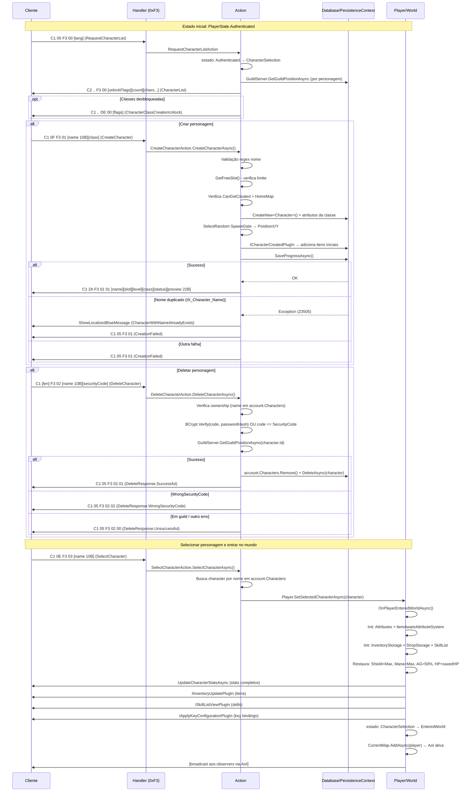

# Sistema de Criação e Seleção de Personagens do OpenMU

> Módulo 5 da série de documentação customizada.  
> Pré-requisito: [04-login-auth.md](./04-login-auth.md)

---

## Índice

1. [Fluxo Completo](#1-fluxo-completo)
2. [Validações de Criação](#2-validações-de-criação)
3. [Inicialização do Personagem](#3-inicialização-do-personagem)
4. [Lista de Personagens](#4-lista-de-personagens)
5. [Seleção de Personagem e Entrada no Mundo](#5-seleção-de-personagem-e-entrada-no-mundo)
6. [Exclusão de Personagem](#6-exclusão-de-personagem)
7. [Pacotes Envolvidos](#7-pacotes-envolvidos)
8. [Diagrama do Fluxo Completo](#8-diagrama-do-fluxo-completo)
9. [Tabela de Arquivos](#9-tabela-de-arquivos)
10. [Falhas e Riscos](#10-falhas-e-riscos)
11. [Gargalos Técnicos](#11-gargalos-técnicos)
12. [Propostas de Modernização](#12-propostas-de-modernização)
13. [Pontos de Atenção para Client Customizado](#13-pontos-de-atenção-para-client-customizado)

---

## 1. Fluxo Completo

```
Estado inicial: PlayerState.Authenticated
                    │
                    ▼
            RequestCharacterList  ──► [S→C] CharacterList
                    │
           ┌────────┴────────┐
           │                 │
    CreateCharacter    SelectCharacter
           │                 │
    [validações]      [init completo]
           │                 │
    [S→C] Created      PlayerState.EnteredWorld
           │
    DeleteCharacter
           │
    [S→C] DeleteResponse
```

Todos os pacotes do fluxo de personagens usam o opcode de grupo **0xF3** com sub-opcodes 0x00–0x03.

---

## 2. Validações de Criação

### Código principal

```csharp
// src/GameLogic/PlayerActions/Character/CreateCharacterAction.cs
public async ValueTask CreateCharacterAsync(Player player, string characterName, int characterClassId)
```

### Sequência de validações (em ordem de execução)

```
1. PlayerState.CurrentState == CharacterSelection?
   └─ Não → retorna sem resposta (log de error)

2. characterClass = Configuration.CharacterClasses.FirstOrDefault(c => c.Number == characterClassId)
   └─ Não encontrado → ShowCharacterCreationFailed

3. GameConfiguration.CharacterNameRegex aplicado a characterName
   └─ Regex configurável (pode ser null → aceita qualquer nome)
   └─ Não bate → ShowCharacterCreationFailed

4. GetFreeSlot(player)
   └─ Slots usados = account.Characters.Select(c => c.CharacterSlot)
   └─ FreeSlots = Range(0, MaximumCharactersPerAccount).Except(usedSlots)
   └─ Nenhum slot livre → ShowCharacterCreationFailed

5. characterClass.CanGetCreated == true
   └─ false → ShowCharacterCreationFailed

6. characterClass.HomeMap != null
   └─ null → ShowCharacterCreationFailed

7. SaveProgressAsync()  ← persiste no banco
   └─ Exceção com "IX_Character_Name" ou código 23505 (constraint única)
      → ShowLocalizedBlueMessage(CharacterWithNameAlreadyExists)
      → account.Characters.Remove(character) + PersistenceContext.Detach(character)
      → ShowCharacterCreationFailed implícito (retorno null)
```

### Regex padrão de nome

O `CharacterNameRegex` é configurável por `GameConfiguration`. Se vazio/null, qualquer nome passa. Instalações típicas usam algo como `^[a-zA-Z0-9]{4,10}$` — mas isso depende da configuração do servidor, não é hardcoded.

### Limite de personagens por conta

```csharp
// GetFreeSlot():
var freeSlots = Enumerable.Range(0, player.GameContext.Configuration.MaximumCharactersPerAccount)
                          .Except(usedSlots).ToList();
```

`MaximumCharactersPerAccount` é configurável em `GameConfiguration` — o padrão é 5.

### Unicidade de nome

A constraint `IX_Character_Name` no banco de dados indexa `(AccountId, Name)`. Isso significa:
- Nomes são únicos **por conta**, não globalmente
- Dois jogadores de contas diferentes podem ter personagens com o mesmo nome
- Isso é comportamento intencional do MU Online original

### Classes disponíveis

Uma classe só aparece na UI se `CanGetCreated = true`. Classes avançadas (ex: Blade Knight, Soul Master) têm `CanGetCreated = false` — são obtidas via evolução, não criação direta.

Classes com `LevelRequirementByCreation > 0` exigem um personagem de certo nível na conta para serem desbloqueadas (ex: DarkLord exige level 250 em outro personagem).

Classes especiais (Summoner, DarkLord, MagicGladiator, RageFighter) têm `CreationAllowedFlag` que é enviado no pacote `CharacterClassCreationUnlock` (opcode 0xDE/0x00) para informar ao cliente quais botões habilitar na tela de criação.

---

## 3. Inicialização do Personagem

### 3.1 Atributos iniciais — data-driven via CharacterClass.StatAttributes

```csharp
// CreateCharacterAction.cs — linha 80
var attributes = character.CharacterClass.StatAttributes
    .Select(a => player.PersistenceContext.CreateNew<StatAttribute>(a.Attribute, a.BaseValue))
    .ToList();
attributes.ForEach(character.Attributes.Add);
```

Os atributos de base são definidos em `CharacterClass.StatAttributes`, populados no inicializador de configuração:

```csharp
// Exemplo: DarkKnight (src/Persistence/Initialization/CharacterClasses/)
// Stats iniciais armazenados como StatAttributeDefinition:
// Attribute            BaseValue   CanBeIncreased
// Stats.Level              1           false
// Stats.PointsPerLevelUp   5           false
// Stats.BaseStrength        28          true
// Stats.BaseAgility         20          true
// Stats.BaseVitality        25          true
// Stats.BaseEnergy          10          true
// Stats.CurrentHealth       110         false  (recalculado na entrada)
// Stats.CurrentMana         20          false  (recalculado na entrada)
// Stats.CurrentAbility      1           false  (recalculado na entrada)
// Stats.CurrentShield       1           false  (recalculado ao máximo na entrada)
```

| Classe        | STR | AGI | VIT | ENE | HP  | Mana |
|---------------|-----|-----|-----|-----|-----|------|
| Dark Knight   | 28  | 20  | 25  | 10  | 110 | 20   |
| Dark Wizard   | 18  | 18  | 15  | 30  | 60  | 40   |
| Fairy Elf     | 22  | 25  | 20  | 15  | 80  | 30   |
| Magic Gladiator | 26 | 26 | 26 | 16 | 110 | 40  |
| Dark Lord     | 26  | 20  | 36  | 10  | 150 | 20   |
| Summoner      | 18  | 20  | 16  | 35  | 70  | 50   |
| Rage Fighter  | 38  | 30  | 38  | 10  | 200 | 20   |

### 3.2 Equipamento inicial — plugins ICharacterCreatedPlugIn

```csharp
// CreateCharacterAction.cs — linha 92
player.GameContext.PlugInManager.GetPlugInPoint<ICharacterCreatedPlugIn>()?.CharacterCreated(player, character);
```

O sistema usa o padrão plugin para adicionar itens iniciais de forma modular e extensível:

```csharp
// AddInitialItemPlugInBase.cs — base de todos os plugins de item inicial
public void CharacterCreated(Player player, Character createdCharacter)
{
    // 1. Verifica se a classe bate com o plugin (via _characterClassNumber)
    if (this._characterClassNumber != createdCharacter.CharacterClass?.Number) return;

    // 2. Verifica se o slot já está ocupado (safety check)
    if (createdCharacter.Inventory!.Items.FirstOrDefault(i => i.ItemSlot == this._itemSlot) is { })
    {
        player.Logger.LogError("Item slot already contains an item.");
        return;
    }

    // 3. Cria o item pela combinação (group, number) do GameConfiguration.Items
    var item = player.PersistenceContext.CreateNew<Item>();
    item.Definition = itemDefinition;
    item.Durability = item.Definition.Durability;  // durabilidade máxima
    item.ItemSlot = this._itemSlot;
    item.Level = this._itemLevel;  // geralmente 0
    createdCharacter.Inventory!.Items.Add(item);
}
```

Plugins registrados por classe:

| Classe | Plugin | Item | Slot |
|--------|--------|------|------|
| DarkKnight | `AddSmallAxeForDarkKnight` | Small Axe (group 2, item 0) | 0 |
| DarkKnight | `AddCrescentMoonSlashForDarkKnight` | Skill Crescent Moon Slash | SkillList |
| DarkWizard | `AddEnergyBallForDarkWizard` | Skill Energy Ball | SkillList |
| FairyElf | `AddShortBowForFairyElf` | Short Bow (group 4, item 0) | 0 |
| FairyElf | `AddArrowsForFairyElf` | Arrows | Quiver slot |
| FairyElf | `AddStarfallForFairyElf` | Skill Starfall | SkillList |
| MagicGladiator | `AddShortSwordForMagicGladiator` | Short Sword | 0 |
| MagicGladiator | `AddSmallShieldForMagicGladiator` | Small Shield | 1 |
| MagicGladiator | `AddSpiralSlashForMagicGladiator` | Skill | SkillList |
| MagicGladiator | `AddManaRaysForMagicGladiator` | Skill | SkillList |
| DarkLord | `AddShortSwordForDarkLord` | Short Sword | 0 |
| DarkLord | `AddSmallShieldForDarkLord` | Small Shield | 1 |
| DarkLord | `AddForceForDarkLord` | Skill Force | SkillList |
| DarkLord | `AddFireBlastForDarkLord` | Skill Fire Blast | SkillList |
| Summoner | `AddLanceForSummoner` | Lance | 0 |
| RageFighter | `AddChargeForRageFighter` | Skill Charge | SkillList |

Plugins adicionais globais (sem restrição de classe):
- `AddRingOfWarriorLevel40ForNewCharacters` — ring para personagens em contas com char level ≥ 40
- `AddRingOfWarriorLevel80ForNewCharacters` — ring para contas com char level ≥ 80

### 3.3 Posição inicial — aleatória dentro do spawn gate

```csharp
// CreateCharacterAction.cs — linha 83
var randomSpawnGate = character.CurrentMap!.ExitGates.Where(g => g.IsSpawnGate).SelectRandom();
if (randomSpawnGate is not null)
{
    character.PositionX = (byte)Rand.NextInt(randomSpawnGate.X1, randomSpawnGate.X2);
    character.PositionY = (byte)Rand.NextInt(randomSpawnGate.Y1, randomSpawnGate.Y2);
}
// fallback: (0, 0) se não há spawn gate definido
```

O mapa inicial é `characterClass.HomeMap`:

| Classe | HomeMap |
|--------|---------|
| DarkKnight | Lorencia (index 0) |
| DarkWizard | Lorencia (index 0) |
| FairyElf | Noria (index 3) |
| MagicGladiator | Lorencia (index 0) |
| DarkLord | Lorencia (index 0) |
| Summoner | Elvenland (index 51) |
| RageFighter | Lorencia (index 0) |

### 3.4 Dados salvos na criação

```csharp
var character = PersistenceContext.CreateNew<Character>();
character.CharacterClass = characterClass;          // FK
character.Name = name;                              // indexed, unique per account
character.CharacterSlot = freeSlot.Value;           // 0..MaximumCharactersPerAccount-1
character.CreateDate = DateTime.UtcNow;
character.KeyConfiguration = new byte[30];          // key bindings zerados
character.CurrentMap = characterClass.HomeMap;      // FK
character.PositionX = ...;                          // byte
character.PositionY = ...;                          // byte
character.Inventory = new ItemStorage();            // vazio (itens adicionados pelos plugins)
// Attributes: coleção StatAttribute gerada dos StatAttributeDefinitions da classe
```

### 3.5 Resposta ao cliente após criação bem-sucedida

O `PreviewData` (22 bytes) é preenchido com `0xFF` — aparência vazia. O cliente não exibe preview de equipamento para um personagem recém-criado (todos os bytes 0xFF = sem item em nenhum slot de aparência).

---

## 4. Lista de Personagens

### Handler e ação

```
C→S: C1 05 F3 00 [lang]  (RequestCharacterList)
     └─ CharacterListRequestPacketHandlerPlugIn
          └─ RequestCharacterListAction.RequestCharacterListAsync(player)
               └─ PlayerState: Authenticated → CharacterSelection
                    └─ IShowCharacterListPlugIn.ShowCharacterListAsync()
```

### Construção da resposta (ShowCharacterListPlugIn)

```csharp
// Passo 1: guild positions — consulta N vezes o GuildServer
foreach (var character in account.Characters)
    guildPositions[i] = await GuildServer.GetGuildPositionAsync(character.Id);

// Passo 2: serialização do pacote
var packet = new CharacterListRef(span)
{
    UnlockFlags = CreateUnlockFlags(account),  // bitfield de classes desbloqueadas
    CharacterCount = (byte)account.Characters.Count,
    IsVaultExtended = account.IsVaultExtended,
};

// Passo 3: dados por personagem (ordenados por CharacterSlot)
foreach (var character in account.Characters.OrderBy(c => c.CharacterSlot))
{
    characterData.SlotIndex = character.CharacterSlot;
    characterData.Name = character.Name;
    characterData.Level = character.Attributes[Stats.Level];
    characterData.Status = character.CharacterStatus.Convert();       // Normal/GM/Banned
    characterData.GuildPosition = guildPositions[j].Convert();
    appearanceSerializer.WriteAppearanceData(characterData.Appearance,
        new CharacterAppearanceDataAdapter(character), false);
}

// Passo 4: se há classes desbloqueadas, envia unlock packet separado
if (unlockFlags > CharacterCreationUnlockFlags.None)
    await connection.SendCharacterClassCreationUnlockAsync(unlockFlags);
```

### Appearance encoding (CharacterAppearanceDataAdapter)

O visual do personagem na tela de seleção é serializado pelo `AppearanceSerializer`. O adapter coleta:
- `CharacterClass` → determina sprite base
- `CharacterStatus` → se GM, exibe ícone especial
- `FullAncientSetEquipped` → para visual de set antigo
- Itens equipados (slots 0 a `LastEquippableItemSlotIndex`) → cada item contribui com group, number, level, craft

Os itens de aparência são os que estão nos slots de equipamento (arma, armadura, elmo, calça, luvas, botas, asas, pet). Itens no inventário (não equipados) **não** aparecem no preview.

### UnlockFlags para classes especiais

```csharp
// CharacterCreationUnlockFlags (bitfield)
None            = 0,
Summoner        = 1,   // CreationAllowedFlag = 1
DarkLord        = 2,   // CreationAllowedFlag = 2
MagicGladiator  = 4,   // CreationAllowedFlag = 4
RageFighter     = 8,   // CreationAllowedFlag = 8
```

Agregado de `Account.UnlockedCharacterClasses`:

```csharp
byte aggregatedFlags = 0;
foreach (var class in account.UnlockedCharacterClasses)
    aggregatedFlags |= class.CreationAllowedFlag;
```

Se o player não tem nenhuma classe desbloqueada, o unlock packet não é enviado.

---

## 5. Seleção de Personagem e Entrada no Mundo

### SelectCharacterAction (simples)

```csharp
// SelectCharacterAction.cs
public async ValueTask SelectCharacterAsync(Player player, string characterName)
{
    if (player.PlayerState.CurrentState != PlayerState.CharacterSelection)
    {
        await player.DisconnectAsync();
        return;
    }

    await player.SetSelectedCharacterAsync(
        player.Account?.Characters.FirstOrDefault(c => c.Name.Equals(characterName)));

    if (player.SelectedCharacter is null)
        await player.DisconnectAsync();  // personagem não encontrado → kick
}
```

### SetSelectedCharacterAsync / OnPlayerEnteredWorldAsync (Player.cs)

A lógica real está em `Player.SetSelectedCharacterAsync` e `OnPlayerEnteredWorldAsync`:

```
SetSelectedCharacterAsync(character):
  ├─ _selectedCharacter = character
  ├─ OnPlayerEnteredWorldAsync()
  └─ Dispara evento PlayerEnteredWorld

OnPlayerEnteredWorldAsync():
  ├─ 1. INVENTÁRIO
  │    ├─ Se Inventory == null: cria via ICharacterCreatedPlugIn
  │    └─ Valida definições dos itens existentes
  │
  ├─ 2. MAPA
  │    └─ character.CurrentMap ??= character.CharacterClass?.HomeMap
  │
  ├─ 3. ATTRIBUTE SYSTEM
  │    ├─ Attributes = new ItemAwareAttributeSystem(account, character, gameConfiguration)
  │    ├─ Attributes[Stats.NearbyPartyMemberCount] = 0
  │    └─ AddMissingStatAttributes()  ← adiciona stats ausentes da definição da classe
  │
  ├─ 4. STORAGES
  │    ├─ InventoryStorage (com extensões de inventário)
  │    ├─ ShopStorage (vitrine de loja de jogador)
  │    └─ TemporaryStorage (InventoryConstants.TemporaryStorageSize)
  │    (Vault é carregado on-demand ao abrir NPC)
  │
  ├─ 5. SKILL LIST
  │    └─ new SkillList(character.LearnedSkills, ...)
  │
  ├─ 6. COMBO SYSTEM
  │    └─ DetermineComboDefinition() → se classe tem combo, cria ComboStateMachine
  │
  ├─ 7. RESTAURAÇÃO DE ATRIBUTOS DINÂMICOS
  │    ├─ CurrentShield = MaximumShield        ← escudo sempre restaurado ao máximo
  │    ├─ CurrentMana = MaximumMana            ← mana restaurada ao máximo
  │    ├─ CurrentAbility = MaximumAbility / 2  ← AG em 50%
  │    └─ CurrentHealth = min(savedHealth, MaximumHealth)  ← HP salvo (pode ser menor)
  │
  ├─ 8. VIEW PLUGIN CASCADE (S→C)
  │    ├─ IUpdateCharacterStatsPlugIn   → envia todos os stats ao cliente
  │    ├─ IInventoryUpdatePlugIn        → envia lista de itens
  │    ├─ ISkillListViewPlugIn          → envia skills aprendidas
  │    ├─ IApplyKeyConfigurationPlugIn  → envia key bindings
  │    └─ IShowQuestStatePlugIn + IShowActiveQuestsPlugIn
  │
  ├─ 9. ENTRADA NO MAPA
  │    ├─ ClientReadyAfterMapChangeAsync()
  │    ├─ Carrega mapa do GameContext
  │    ├─ PlayerState: CharacterSelection → EnteredWorld
  │    ├─ IsAlive = true
  │    ├─ CurrentMap.AddAsync(this)    ← AoI inicia aqui
  │    └─ Valida terreno walkable, warp para safezone se inválido
  │
  ├─ 10. CASOS ESPECIAIS
  │    ├─ CharacterStatus == GameMaster → aplica efeito GM (infinito)
  │    ├─ Store reopen (se PlayerStore estava aberta antes)
  │    └─ MuHelper: reenvia configuração salva se presente
  │
  └─ Summon: se player.Summon != null, adiciona ao mapa também
```

---

## 6. Exclusão de Personagem

### Código

```csharp
// DeleteCharacterAction.cs
public async ValueTask DeleteCharacterAsync(Player player, string characterName, string securityCode)
```

### Sequência de validações

```
1. PlayerState == CharacterSelection
   └─ Não → Unsuccessful (sem log de hack desta vez)

2. character = account.Characters.FirstOrDefault(c => c.Name == characterName)
   └─ Null → Unsuccessful + log de SECURITY WARNING
     "Hacker maybe tried to delete other players character!"

3. Verificação de Security Code:
   ├─ Se Account.SecurityCode == "" ou null:
   │    └─ BCrypt.Verify(securityCode, account.PasswordHash)
   │         → usa a própria senha como código de segurança
   └─ Senão:
        └─ securityCode == account.SecurityCode  ← comparação de string plaintext!
   Falha → WrongSecurityCode

4. GuildServer.GetGuildPositionAsync(character.Id) != Undefined
   └─ Está em guild → Unsuccessful + mensagem CantDeleteGuildMember
```

### Deleção no banco

```csharp
account.Characters.Remove(character);
PlugInManager.GetPlugInPoint<ICharacterDeletedPlugIn>()?.CharacterDeleted(player, character);
await player.PersistenceContext.DeleteAsync(character);
// cascade deletes: Inventory + Items, StatAttributes, LearnedSkills, QuestStates, etc.
```

**Não há período de carência (grace period)**. A deleção é imediata e permanente.

### Resultado possíveis

| Valor | Significado |
|-------|-------------|
| 0 (`Unsuccessful`) | Qualquer erro de validação sem código específico |
| 1 (`Successful`) | Deleção bem-sucedida |
| 2 (`WrongSecurityCode`) | Security code incorreto |

---

## 7. Pacotes Envolvidos

### 7.1 C→S: RequestCharacterList — 0xF3/0x00

```
C1 05 F3 00 [language]
```

| Offset | Tamanho | Campo | Descrição |
|--------|---------|-------|-----------|
| 0 | 1 | Type | 0xC1 |
| 1 | 1 | Length | 0x05 |
| 2 | 1 | Code | 0xF3 |
| 3 | 1 | SubCode | 0x00 |
| 4 | 1 | Language | Idioma do cliente |

### 7.2 S→C: CharacterList — 0xF3/0x00

```
C2 [len_hi] [len_lo] F3 00 [unlockFlags] [moveCnt] [charCount] [isVaultExtended] [chars...]
```

| Offset | Tamanho | Campo | Descrição |
|--------|---------|-------|-----------|
| 0–3 | 4 | Header C2 | Type + Length(2B) + Code |
| 4 | 1 | SubCode | 0x00 |
| 5 | 1 | UnlockFlags | Bitfield de classes desbloqueadas |
| 6 | 1 | MoveCnt | Reservado (não usado atualmente) |
| 7 | 1 | CharacterCount | Número de personagens (0–max) |
| 8 | 1 | IsVaultExtended | bool |
| 9+ | var | Characters[] | Array ordenado por CharacterSlot |

**Por personagem:**

| Offset | Tamanho | Campo | Descrição |
|--------|---------|-------|-----------|
| 0 | 1 | SlotIndex | 0–(MaxChars-1) |
| 1–10 | 10 | Name | UTF-8, null-padded |
| 11–12 | 2 | Level | uint16 LE |
| 13 | 1 | Status | 0=Normal, 1=Banned, 32=GameMaster |
| 14 | 1 | GuildPosition | GuildPosition enum |
| 15+ | var | Appearance | Serialização de equipamento |

### 7.3 S→C: CharacterClassCreationUnlock — 0xDE/0x00

```
C1 [len] DE 00 [flags]
```

Enviado separadamente após CharacterList se o player tem classes desbloqueadas.

### 7.4 C→S: CreateCharacter — 0xF3/0x01

```
C1 0F F3 01 [name 10B] [class]
```

| Offset | Tamanho | Campo | Descrição |
|--------|---------|-------|-----------|
| 0–2 | 3 | Header C1 | |
| 3 | 1 | SubCode | 0x01 |
| 4–13 | 10 | Name | UTF-8, null-padded |
| 14 | 1 | Class | Número da classe (CharacterClassNumber) |

Total: 15 bytes.

### 7.5 S→C: CharacterCreationSuccessful — 0xF3/0x01

```
C1 2A F3 01 01 [name 10B] [slot] [level 2B] [class] [status] [previewData 22B]
```

| Offset | Tamanho | Campo | Descrição |
|--------|---------|-------|-----------|
| 0–2 | 3 | Header C1 | |
| 3 | 1 | SubCode | 0x01 |
| 4 | 1 | Success | 0x01 = true |
| 5–14 | 10 | CharacterName | UTF-8 |
| 15 | 1 | CharacterSlot | 0–4 |
| 16–17 | 2 | Level | uint16 LE (= 1) |
| 18 | 1 | Class | CharacterClassNumber |
| 19 | 1 | CharacterStatus | 0=Normal |
| 20–41 | 22 | PreviewData | Aparência (preenchido 0xFF para novo char) |

Total: 42 bytes (0x2A).

### 7.6 S→C: CharacterCreationFailed — 0xF3/0x01

```
C1 05 F3 01 [sem success byte / tamanho menor]
```

5 bytes — o cliente distingue sucesso/falha pelo tamanho do pacote (42 vs 5 bytes).

### 7.7 C→S: DeleteCharacter — 0xF3/0x02

```
C1 [len] F3 02 [name 10B] [securityCode var]
```

| Offset | Tamanho | Campo | Descrição |
|--------|---------|-------|-----------|
| 0–2 | 3 | Header C1 | |
| 3 | 1 | SubCode | 0x02 |
| 4–13 | 10 | Name | Nome do personagem a deletar |
| 14+ | var | SecurityCode | String variável (senha ou código de segurança) |

### 7.8 S→C: CharacterDeleteResponse — 0xF3/0x02

```
C1 05 F3 02 [result]
```

| Offset | Tamanho | Campo | Descrição |
|--------|---------|-------|-----------|
| 0–2 | 3 | Header C1 | |
| 3 | 1 | SubCode | 0x02 |
| 4 | 1 | Result | 0=Unsuccessful, 1=Successful, 2=WrongSecurityCode |

### 7.9 C→S: SelectCharacter — 0xF3/0x03

```
C1 0E F3 03 [name 10B]
```

| Offset | Tamanho | Campo | Descrição |
|--------|---------|-------|-----------|
| 0–2 | 3 | Header C1 | |
| 3 | 1 | SubCode | 0x03 |
| 4–13 | 10 | Name | Nome do personagem a selecionar |

Total: 14 bytes (0x0E).

---

## 8. Diagrama do Fluxo Completo



---

## 9. Tabela de Arquivos

| Caminho | Classe | Responsabilidade |
|---------|--------|------------------|
| `src/GameLogic/PlayerActions/Character/CreateCharacterAction.cs` | `CreateCharacterAction` | Validações + criação + persistência de novo personagem |
| `src/GameLogic/PlayerActions/Character/SelectCharacterAction.cs` | `SelectCharacterAction` | Seleção de personagem e disparo de entrada no mundo |
| `src/GameLogic/PlayerActions/Character/DeleteCharacterAction.cs` | `DeleteCharacterAction` | Validação de security code + deleção permanente |
| `src/GameLogic/PlayerActions/Character/RequestCharacterListAction.cs` | `RequestCharacterListAction` | Transição de estado + disparo de ShowCharacterList |
| `src/GameLogic/Player.cs` | `Player` | `SetSelectedCharacterAsync` + `OnPlayerEnteredWorldAsync` — inicialização completa |
| `src/GameServer/MessageHandler/Character/CharacterCreatePacketHandlerPlugIn.cs` | `CharacterCreatePacketHandlerPlugIn` | Handler 0xF3/01 C→S |
| `src/GameServer/MessageHandler/Character/CharacterSelectPacketHandlerPlugIn.cs` | `CharacterSelectPacketHandlerPlugIn` | Handler 0xF3/03 C→S |
| `src/GameServer/MessageHandler/Character/CharacterDeletePacketHandlerPlugIn.cs` | `CharacterDeletePacketHandlerPlugIn` | Handler 0xF3/02 C→S |
| `src/GameServer/MessageHandler/Character/CharacterListRequestPacketHandlerPlugIn.cs` | `CharacterListRequestPacketHandlerPlugIn` | Handler 0xF3/00 C→S |
| `src/GameServer/RemoteView/Character/ShowCharacterListPlugIn.cs` | `ShowCharacterListPlugIn` | Serializa CharacterList (season ≥ 5) |
| `src/GameServer/RemoteView/Character/ShowCharacterListPlugIn075.cs` | `ShowCharacterListPlugIn075` | Versão legada (0.75) |
| `src/GameServer/RemoteView/Character/ShowCharacterListExtendedPlugIn.cs` | `ShowCharacterListExtendedPlugIn` | Variante estendida (Extended packet) |
| `src/GameServer/RemoteView/Character/ShowCreatedCharacterPlugIn.cs` | `ShowCreatedCharacterPlugIn` | Serializa CharacterCreationSuccessful |
| `src/GameServer/RemoteView/Character/ShowCharacterCreationFailedPlugIn.cs` | `ShowCharacterCreationFailedPlugIn` | Serializa CharacterCreationFailed |
| `src/GameServer/RemoteView/Character/ShowCharacterDeleteResponsePlugIn.cs` | `ShowCharacterDeleteResponsePlugIn` | Serializa CharacterDeleteResponse |
| `src/GameServer/RemoteView/Character/CharacterAppearanceDataAdapter.cs` | `CharacterAppearanceDataAdapter` | Adapta Character para IAppearanceData (para serialização de aparência) |
| `src/DataModel/Configuration/CharacterClass.cs` | `CharacterClass` | Definição completa de uma classe: stats, HomeMap, CanGetCreated, UnlockFlag |
| `src/DataModel/Entities/Character.cs` | `Character` | Entidade de personagem: slots, posição, atributos, inventário |
| `src/Persistence/Initialization/CharacterClasses/CharacterClassInitialization.cs` | `CharacterClassInitialization` | Popula banco com definições de classes e stats iniciais |
| `src/Persistence/Initialization/PlugIns/CharacterCreated/AddInitialItemPlugInBase.cs` | `AddInitialItemPlugInBase` | Base para plugins de item inicial (verifica classe, slot, cria item) |
| `src/Persistence/Initialization/PlugIns/CharacterCreated/AddSmallAxeForDarkKnight.cs` | `AddSmallAxeForDarkKnight` | Exemplo: adiciona Small Axe no slot 0 para DarkKnight |

---

## 10. Falhas e Riscos

| # | Problema | Severidade | Descrição | Proposta de Solução |
|---|----------|-----------|-----------|---------------------|
| **R1** | Race condition em GetFreeSlot | Média | Duas requisições simultâneas de criação podem obter o mesmo slot livre antes de qualquer uma salvar. O banco geralmente captura (FK ou constraint de slot), mas pode gerar log de erro em vez de resposta limpa ao cliente | AsyncLock por account antes de GetFreeSlot + CreateCharacter |
| **R2** | SecurityCode em plaintext | Alta | `Account.SecurityCode` é armazenado como string sem hash. Se o banco for comprometido, todos os security codes são expostos. O password usa BCrypt mas o security code não | Hash SecurityCode com BCrypt ao salvar (campo separado de hash) |
| **R3** | Sem rate limit em criação/deleção | Média | Loop rápido de CreateCharacter/DeleteCharacter (N×/seg). Sem limitação server-side, pode causar spam de queries no banco | Rate limit por player (ex: max 1 criação por 5s) |
| **R4** | CharacterNameRegex não validado server-side se null | Baixa | Se `CharacterNameRegex` for null ou string vazia, qualquer nome é aceito — incluindo nomes com espaços, unicode, injeção de markup | Sempre ter regex padrão; validar tamanho mínimo/máximo mesmo sem regex |
| **R5** | Deleção sem período de carência | Alta | Personagem deletado é irrecuperável imediatamente. Sem soft delete, sem lixeira | Soft delete: marcar `IsDeleted = true` + job de limpeza após N dias |
| **R6** | N+1 query no ShowCharacterList | Baixa | Uma query ao GuildServer por personagem na lista (até 5 queries sequenciais) | Batch query: `GetGuildPositionsBatchAsync(characterIds[])` |
| **R7** | Nome único por conta, não global | Info | Dois jogadores podem ter chars com mesmo nome — potencialmente confuso em logs e trades | Decisão de design do MU original; pode adicionar check global se desejado |
| **R8** | Sem validação de tamanho de nome além do regex | Baixa | Se regex não limitar tamanho, nome de 0 a 255 bytes seria aceito, podendo causar overflow em pacote de tamanho fixo (nome é 10 bytes no pacote) | Validação explícita: `name.Length >= 4 && name.Length <= 10` mesmo sem regex |
| **R9** | `SaveProgressAsync` persiste toda a conta, não só o novo char | Baixa | Se há outra mudança não salva no account ao criar personagem, ela é salva junto (side effect) | Separar CreateCharacterAsync para um contexto próprio de persistência |

---

## 11. Gargalos Técnicos

| # | Problema | Impacto | Proposta de Solução |
|---|----------|---------|---------------------|
| **G1** | `OnPlayerEnteredWorldAsync` é síncrona-pesada | A inicialização completa (atributos + inventário + skills + mapa) acontece na thread do request. Para muitos logins simultâneos, pode gerar latência perceptível | Já usa `async/await` corretamente — impacto real depende de EF Core performance |
| **G2** | GuildServer N+1 no ShowCharacterList | 5 queries sequenciais para uma lista de 5 chars (uma por char) | `GetGuildPositionsBatchAsync(IEnumerable<Guid> characterIds)` no ILoginServer |
| **G3** | `SaveProgressAsync` salva toda a conta | O método persiste todo o contexto (account + characters + inventory), não só o novo personagem | EF Core `AddAsync` + `SaveChangesAsync` com tracking explícito apenas do novo character |
| **G4** | AppearanceSerializer roda no path de escrita | A serialização do preview de aparência na CharacterList é feita em `Write()` callback inside `SendAsync` — bloqueante na thread de I/O | Já é adequado para carga normal; para alta escala, pré-serializar e cachear por personagem |

---

## 12. Propostas de Modernização

### Prioridade alta

**Hash do SecurityCode:**
```csharp
// Ao salvar/definir SecurityCode:
account.SecurityCodeHash = BCrypt.HashPassword(securityCode);
account.SecurityCode = null; // deprecate plaintext field

// Na verificação:
BCrypt.Verify(input, account.SecurityCodeHash)
```

**Soft delete de personagem:**
```csharp
// Character.cs — adicionar:
public bool IsDeleted { get; set; } = false;
public DateTime? DeletedAt { get; set; }

// DeleteCharacterAction:
character.IsDeleted = true;
character.DeletedAt = DateTime.UtcNow;
// await SaveProgressAsync() em vez de DeleteAsync

// Job de cleanup (background service):
// Após 7 dias: DeleteAsync(characters com IsDeleted=true e DeletedAt < Now-7days)
```

### Prioridade média

**Rate limit por player:**
```csharp
// CreateCharacterAction — no início:
if (player.LastCharacterCreationTime > DateTime.UtcNow.AddSeconds(-5))
{
    await player.ShowLocalizedBlueMessageAsync(PlayerMessage.ActionTooFast);
    return;
}
player.LastCharacterCreationTime = DateTime.UtcNow;
```

**Batch guild position query:**
```csharp
// ILoginServer — adicionar:
ValueTask<Dictionary<Guid, GuildPosition>> GetGuildPositionsBatchAsync(IEnumerable<Guid> characterIds);

// ShowCharacterListPlugIn:
var guildPositions = await GuildServer.GetGuildPositionsBatchAsync(
    account.Characters.Select(c => c.Id));
```

**AsyncLock por account para criação:**
```csharp
// Player.cs — adicionar:
private readonly AsyncLock _characterCreationLock = new();

// CreateCharacterAction:
using (await player._characterCreationLock.LockAsync())
{
    var freeSlot = GetFreeSlot(player); // slot evaluation dentro do lock
    // ... resto da criação
}
```

### Prioridade baixa

**Validação explícita de tamanho de nome:**
```csharp
// CreateCharacterAction.cs — adicionar antes do regex:
if (string.IsNullOrWhiteSpace(name) || name.Length < 4 || name.Length > 10)
    return null;
```

---

## 13. Pontos de Atenção para Client Customizado

Para que o fluxo de criação e seleção de personagens funcione corretamente em um client customizado:

### Opcode group 0xF3

Todos os pacotes deste fluxo usam opcode 0xF3 com sub-opcodes 0x00–0x03. O client deve tratar estes como grupo com dispatch por sub-opcode.

### Detecção de sucesso/falha na criação

O client distingue `CharacterCreationSuccessful` de `CharacterCreationFailed` pelo **tamanho do pacote**:
- 42 bytes → sucesso (contém `Success=0x01` no byte 4 + dados do char)
- 5 bytes → falha

Alternativa mais robusta: verificar o byte 4 (`Success` flag).

### Encoding da classe no pacote

O campo `Class` (1 byte) no CreateCharacter (C→S) e no CharacterCreationSuccessful (S→C) usa o número direto de `CharacterClassNumber` (enum). **Não** é shift-left/right no protocolo padrão Season 5+ — confirmar com Wireshark se adaptar para versões antigas.

### Preview de aparência

O `PreviewData` (22 bytes) na resposta de criação bem-sucedida é preenchido com `0xFF` (sem aparência). O client deve tratar `0xFF` em campos de item como "slot vazio". Ao renderizar a tela de seleção, todos os novos personagens aparecem sem equipamento visual.

### Ordenação da lista de personagens

O servidor envia personagens ordenados por `CharacterSlot` (0, 1, 2, 3, 4). O client deve renderizar os slots na mesma ordem, deixando slots vazios como espaço em branco (ou botão de criar).

### Tamanho do campo de nome

Sempre 10 bytes UTF-8 null-padded em todos os pacotes. Nomes menores são completados com `\0`. O client deve fazer `TrimEnd('\0')` ao exibir.

### CharacterClassCreationUnlock (0xDE/0x00)

Este pacote é enviado **depois** do CharacterList, não junto. O client deve processar ambos para habilitar os botões de criação de classes especiais na UI.

### Desconexão em vez de resposta de erro na seleção

Se `SelectCharacter` falhar (personagem não encontrado), o servidor **desconecta o client** em vez de enviar um erro explícito. O client deve tratar desconexão inesperada neste ponto como "personagem inválido" e voltar para tela de login.

### KeyConfiguration

Ao entrar no mundo, o servidor envia as configurações de teclas salvas via `IApplyKeyConfigurationPlugIn`. O client deve processar este pacote antes de se considerar "in-game" — sem ele, o jogador terá configuração de teclas padrão/vazia.

### Restauração de stats ao entrar

O servidor envia `CurrentHealth` = **valor salvo** (pode ser < max se o personagem morreu antes de sair). O client deve usar o valor recebido, não assumir HP máximo ao entrar. Shield, Mana e AG são sempre restaurados ao máximo pelo servidor.
