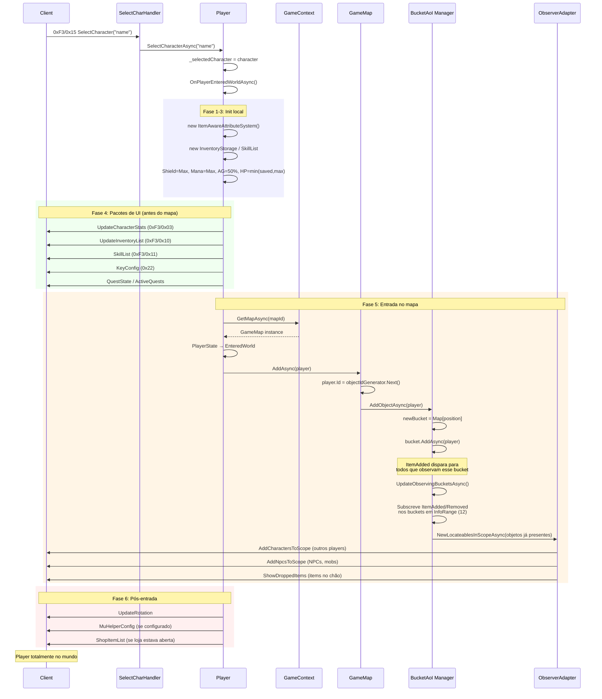
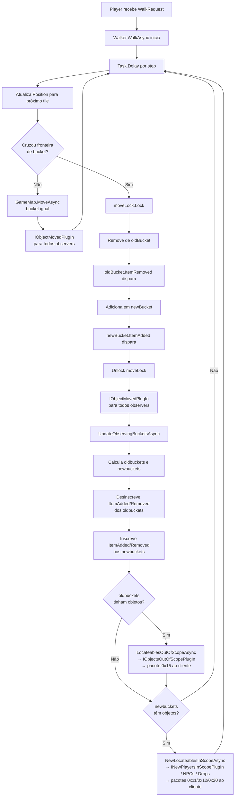

# 06 — Sincronização de Mundo (World Sync / AoI)

## Sumário

1. [Estrutura Espacial — BucketMap](#1-estrutura-espacial--bucketmap)
2. [Area of Interest (AoI)](#2-area-of-interest-aoi)
3. [Entrada no Mundo](#3-entrada-no-mundo)
4. [NewPlayersInScope / ObjectsOutOfScope](#4-newplayersinscope--objectsoutoofscope)
5. [Sincronização de Estado](#5-sincronização-de-estado)
6. [NPCs e Mobs](#6-npcs-e-mobs)
7. [Items no Chão](#7-items-no-chão)
8. [Timers e "Tick Rate"](#8-timers-e-tick-rate)
9. [Diagramas](#9-diagramas)
10. [Gargalos de Performance](#10-gargalos-de-performance)
11. [Limitações para Movimento Fluido](#11-limitações-para-movimento-fluido)
12. [Tick Rate Atual vs Necessário](#12-tick-rate-atual-vs-necessário)
13. [Propostas de Modernização](#13-propostas-de-modernização)
14. [Arquitetura Alvo para MOBA](#14-arquitetura-alvo-para-moba)
15. [Tabela de Arquivos](#15-tabela-de-arquivos)

---

## 1. Estrutura Espacial — BucketMap

### Partição do espaço

O mapa do OpenMU é um grid de **256×256 tiles** (coordenadas `byte`). Cada instância de `GameMap` cria um `BucketAreaOfInterestManager` com `chunkSize = 8` (hardcoded em `MapInitializer.cs:39`).

O `BucketAreaOfInterestManager` constrói um `BucketMap<ILocateable>` com os parâmetros:

```csharp
new BucketMap<ILocateable>(
    sideLength:      0x100,        // 256 coordenadas
    createLists:     true,         // pré-aloca todos os buckets
    listCapacity:    chunkSize / 2, // 4 objetos iniciais por bucket
    bucketSideLength: chunkSize    // 8 tiles por lado
)
```

Resultado:
- `SideLength = 256 / 8 = 32` buckets por eixo
- Total: **1.024 buckets** (32 × 32)
- Cada bucket cobre **8×8 tiles**

### Indexação

```csharp
// BucketMap<T>.cs
private int GetListIndex(Point point)
    => (point.X / BucketSideLength) + ((point.Y / BucketSideLength) * SideLength);
```

Array linear: `bucket[4, 3]` está em índice `4 + 3*32 = 100`. Lookup em O(1), sem hash.

### Range query

`GetBucketsInRange(point, range)` faz range query como sweep de buckets:

```csharp
int minX = Math.Max(point.X - range, 0) / BucketSideLength;
int maxX = Math.Min(point.X + range, 248) / BucketSideLength;
// idem Y
for (int i = minX; i <= maxX; i++)
    for (int j = minY; j <= maxY; j++)
        yield return _list[i + j * SideLength];
```

Com `range=12` e `BucketSideLength=8`, um ponto central cobre:
- `(128-12)/8 = 14` a `(128+12)/8 = 17` → **4 buckets por eixo = 16 buckets**
- Cada bucket pode conter N objetos; a filtragem por distância euclidiana ocorre depois, em `GetInRange`.

### Bucket<T>

Cada bucket é `Bucket<T>` — uma `List<T>` protegida por `AsyncReaderWriterLock` com dois eventos async:

```csharp
public event AsyncEventHandler<T>? ItemAdded;
public event AsyncEventHandler<T>? ItemRemoved;
```

O enumerador (`LockingEnumerator`) adquire reader lock durante a iteração. Writes (Add/Remove) adquirem writer lock, depois disparam o evento *fora* do lock para evitar deadlock.

---

## 2. Area of Interest (AoI)

### InfoRange

`InfoRange` é propriedade do `Player` que lê `GameContext.Configuration.InfoRange`. O valor padrão (inicializado em `GameConfigurationInitializerBase.cs`) é **12 tiles**.

Cada jogador que implementa `IBucketMapObserver` mantém:
- `InfoRange` — raio de visão em tiles
- `ObservingBuckets` — lista de buckets atualmente observados (eventos inscritos)

### Subscrição a buckets

Quando um jogador entra no mapa ou cruza uma fronteira de bucket, `UpdateObservingBucketsAsync` é chamado:

```csharp
// BucketAreaOfInterestManager.cs
var curbuckets = Map.GetBucketsInRange(newPoint, player.InfoRange).ToList();
var oldbuckets = player.ObservingBuckets.Except(curbuckets).ToList();
var newbuckets = curbuckets.Except(player.ObservingBuckets).ToList();

oldbuckets.ForEach(b => {
    b.ItemAdded -= player.LocateableAddedAsync;
    b.ItemRemoved -= player.LocateableRemovedAsync;
});
newbuckets.ForEach(b => {
    b.ItemAdded += player.LocateableAddedAsync;
    b.ItemRemoved += player.LocateableRemovedAsync;
});
```

Isso é **event-driven puro**: não há poll. Quando um objeto é adicionado a qualquer bucket observado, o evento `ItemAdded` dispara imediatamente e o `ObserverToWorldViewAdapter` roteia para o view plugin correto.

### Transição de bucket

Só acontece reavaliação de AoI quando o objeto cruza uma fronteira de bucket:

```csharp
var differentBucket =
    obj.Position.X / Map.BucketSideLength != target.X / Map.BucketSideLength
    || obj.Position.Y / Map.BucketSideLength != target.Y / Map.BucketSideLength;
```

Com `BucketSideLength=8`, um jogador pode mover-se até **7 tiles dentro do mesmo bucket** sem acionar nenhuma atualização de AoI. Somente ao cruzar o limite de 8 em qualquer eixo o AoI é recalculado.

### Rastreamento de bucket duplo (OldBucket / NewBucket)

`IHasBucketInformation` adiciona `NewBucket` e `OldBucket`. Durante uma transição:

1. `NewBucket` recebe o novo bucket antes de remover do antigo
2. Quando `LocateableRemovedAsync` dispara no bucket antigo, o adapter verifica se `item.NewBucket` ainda está entre os `ObservingBuckets` — se sim, ignora (objeto apenas se moveu, não saiu do AoI)

Isso evita notificações falsas de "objeto saiu de scope" quando o objeto apenas mudou de bucket mas permanece visível.

---

## 3. Entrada no Mundo

### Sequência completa

```
Client → 0xF3/0x15 SelectCharacter
  → SelectCharacterAction.SelectCharacterAsync(player, name)
      → player.SetSelectedCharacterAsync(character)
          → OnPlayerEnteredWorldAsync()
              [1] Reconstrói sistema de atributos
              [2] Inicializa storages
              [3] Restaura stats
              [4] Envia pacotes de UI
              [5] ClientReadyAfterMapChangeAsync()
                  → CurrentMap = GameContext.GetMapAsync(mapId)
                  → PlayerState → EnteredWorld
                  → CurrentMap.AddAsync(player)
                      → _objectIdGenerator.GenerateId() → player.Id
                      → BucketAreaOfInterestManager.AddObjectAsync(player)
                          → newBucket = Map[player.Position]
                          → bucket.AddAsync(player)          ← ItemAdded dispara para todos observando
                          → UpdateObservingBucketsAsync()    ← subscreve buckets em InfoRange
                              → NewLocateablesInScopeAsync() ← envia NPCs, players, drops já presentes
              [6] Envia UpdateRotation, PetBehavior, MuHelperConfig
          → PlayerEnteredWorld evento
          → AppearanceData.RaiseAppearanceChanged()
```

### Detalhe de cada fase

**Fase 1 — AttributeSystem:**
```csharp
this.Attributes = new ItemAwareAttributeSystem(Account, selectedCharacter, Configuration);
```
`ItemAwareAttributeSystem` computa atributos base da classe + atributos dos itens equipados. Inclui todos os stats derivados (ATK, DEF, HP máximo, etc.).

**Fase 2 — Storages:**
- `Inventory = new InventoryStorage(this, gameContext)` — inventário principal
- `ShopStorage = new ShopStorage(selectedCharacter)` — loja pessoal
- `TemporaryStorage` — armazenamento temporário (20 slots)
- `SkillList = new SkillList(this)` — carrega skills do personagem + skills passivas da classe

**Fase 3 — Restauração de stats (`SetReclaimableAttributesBeforeEnterGame`):**
```csharp
CurrentShield = MaximumShield;           // shield: 100%
CurrentMana   = MaximumMana;             // mana: 100%
CurrentAbility = MaximumAbility / 2;    // AG: 50%
CurrentHealth  = Min(savedHP, MaxHP);   // HP: o menor entre salvo no DB e máximo atual
```

HP **não** é restaurado ao máximo — o valor do banco de dados é preservado. Se o personagem morreu antes de sair e o HP foi salvo como 0 ou muito baixo, o jogador reentra com HP baixo.

**Fase 4 — Pacotes de UI (antes de entrar no mapa):**

| View PlugIn | Pacote (aprox.) | Conteúdo |
|---|---|---|
| `IUpdateCharacterStatsPlugIn` | `0xF3/0x03` | stats completos (HP, MP, STR, AGI, etc.) |
| `IUpdateInventoryListPlugIn` | `0xF3/0x10` | lista de itens no inventário |
| `ISkillListViewPlugIn` | `0xF3/0x11` | lista de skills do personagem |
| `IApplyKeyConfigurationPlugIn` | `0x22` | configuração de hotkeys |
| `IQuestStateResponsePlugIn` | `0xF6/0x0A` | estado de quests (sistema legado) |
| `ICurrentlyActiveQuestsPlugIn` | `0xF6/0x1A` | quests ativas (sistema novo) |

**Fase 5 — Entrada no mapa (`ClientReadyAfterMapChangeAsync`):**

O mapa é obtido ou criado em `GetMapAsync`. Se não existir ainda, `MapInitializer.InitializeStateAsync` popula os NPCs automaticamente (todos os `SpawnTrigger.Automatic`).

Ao chamar `CurrentMap.AddAsync(player)`:
1. `_objectIdGenerator` atribui um ID único ao player (range `[0x8001, 0x7FFF]`)
2. `BucketAreaOfInterestManager.AddObjectAsync` coloca o player no bucket correto
3. O evento `ItemAdded` do bucket dispara para todos os observers daquele bucket
4. `UpdateObservingBucketsAsync` faz a subscrição nos `InfoRange` buckets ao redor
5. Para cada objeto já presente nos buckets recém-subscritos, `NewLocateablesInScopeAsync` envia os pacotes de escopo

**Ordem de pacotes de escopo enviados ao cliente (fase 5+):**

| Tipo de objeto | PlugIn | Pacote |
|---|---|---|
| Outros jogadores | `INewPlayersInScopePlugIn` | `AddCharactersToScope (0x11)` |
| NPCs / mobs | `INewNpcsInScopePlugIn` | `AddNpcsToScope (0x12)` |
| Items no chão | `IShowDroppedItemsPlugIn` | `ShowDroppedItems (0x20)` |
| Dinheiro no chão | `IShowMoneyDropPlugIn` | `ShowMoneyDrop (0xC3)` |

Cada player que já estava no mapa e observa o bucket onde o novo player apareceu recebe `AddCharactersToScope` com a flag `isSpawned=true` (ID com bit `0x8000` setado).

---

## 4. NewPlayersInScope / ObjectsOutOfScope

### Detecção — event-driven, não polling

O sistema **não tem loop periódico** que varre todos os jogadores para checar AoI. A detecção ocorre em dois momentos:

1. **Objeto entra em bucket observado**: `Bucket.ItemAdded` → `ObserverToWorldViewAdapter.LocateableAddedAsync`
2. **Objeto sai de bucket observado**: `Bucket.ItemRemoved` → `ObserverToWorldViewAdapter.LocateableRemovedAsync`

Portanto, a "frequência de verificação" é a frequência do próprio movimento dos objetos: a cada transição de bucket, todos os observers do bucket antigo e do novo bucket são notificados imediatamente.

### Pacote AddCharactersToScope (0x11)

Para cada novo jogador no escopo, `NewPlayersInScopePlugIn` envia:

```
[Header: C3 | size | 0x11]
[CharacterCount: 1 byte]
Per-character block:
  [Id: 2 bytes]         ← bit 0x8000 setado se isSpawned=true
  [CurrentX: 1 byte]
  [CurrentY: 1 byte]
  [Appearance: 18 bytes] ← AppearanceSerializer: raça/classe + itens equipados visíveis
  [Name: 10 bytes]      ← null-terminated
  [TargetX: 1 byte]     ← destino do walk (ou posição atual se parado)
  [TargetY: 1 byte]
  [Rotation: 1 byte]
  [HeroState: 1 byte]   ← Normal, Hero, PK, etc.
  [EffectCount: 1 byte]
  [Effects: N × 1 byte] ← IDs dos magic effects visíveis
```

Se o jogador tem `TransformationSkin != 0`, usa o pacote `AddTransformedCharactersToScope` (formato levemente diferente, adiciona campo `Skin`).

Após o pacote de personagem, são enviados adicionalmente:
- `IShowShopsOfPlayersPlugIn` — se algum player tem loja aberta
- `IAssignPlayersToGuildPlugIn` — se algum player tem guild

### Pacote ObjectsOutOfScope

`ObjectsOutOfScopePlugIn` envia apenas os IDs dos objetos que saíram:

```
[Header: C1 | size | 0x15]
[ObjectCount: 1 byte]
[ObjectId[0]: 2 bytes]
[ObjectId[1]: 2 bytes]
...
```

Para drops que desaparecem (expiram ou são coletados), usa `IDroppedItemsDisappearedPlugIn` com opcode diferente.

### Guard contra falso "saiu de scope"

`ObserverToWorldViewAdapter.ObjectWillBeOutOfScope` verifica antes de notificar:

```csharp
if (locateable is IHasBucketInformation info && info.NewBucket != null)
    return !ObservingBuckets.Contains(info.NewBucket);
```

Se o objeto está se movendo para um bucket que o observer também observa, **não envia** OutOfScope — o objeto apenas mudou de bucket sem sair do AoI.

---

## 5. Sincronização de Estado

### Propriedades sincronizadas de outros jogadores

| Propriedade | Quando sincroniza | Pacote |
|---|---|---|
| Posição (X, Y) | A cada step do Walker | `ObjectMoved (0x11/0xD4)` |
| Destino do walk | No início do walk | `ObjectMoved` |
| HP (barra visual) | Após hit recebido | `ShowHit + UpdateHeroState` |
| Magic effects | Ao adicionar/remover buff | `MagicEffect (0x07)` |
| Aparência (equipamento) | Ao equipar/desequipar item | `NewPlayersInScope` re-enviado |
| Guild/Rank | Ao entrar em scope | `AssignPlayersToGuild` |
| Loja aberta | Ao entrar em scope | `ShowShopsOfPlayers` |
| Rotação | Ao mover | `ObjectMoved` |
| HeroState | Ao matar/ser morto | hero state update |

### O que NÃO é sincronizado em tempo real

- HP exato numérico de outros players (apenas barra proporcional via hit packets)
- Mana / Shield de outros players
- Status de stats (STR, AGI, etc.) de outros players
- Inventário de outros players (exceto aparência dos itens equipados via AppearanceSerializer)
- Skills em cooldown de outros players

### Frequência de updates de posição

Não há delta periódico de posição. O servidor envia `ObjectMoved` exatamente uma vez por **step do Walker**. O step delay depende do atributo de velocidade de movimento do personagem — para personagens padrão, é ~500ms por step (dependente da configuração `MoveDelay` do `MonsterDefinition` para NPCs, ou do speed attribute para players).

A posição é atualizada **tile a tile**: coordenadas inteiras `byte X, byte Y`. Não há interpolação server-side.

---

## 6. NPCs e Mobs

### Hierarquia de classes

```
NonPlayerCharacter  (IObservable, ILocateable, IHasBucketInformation)
  └── AttackableNpcBase  (IAttackable)
        └── Monster  (ISupportWalk, IAttacker, IMovable, ISummonable)
              ├── Trap
              ├── Destructible
              └── SoccerBall
  └── MerchantNpc
```

### Spawn

Em `MapInitializer.InitializeStateAsync`:
1. Filtra `MonsterSpawnArea` com `SpawnTrigger.Automatic`
2. Para cada área, cria `Quantity` instâncias
3. `npc.Initialize()`: escolhe posição dentro da área (100 tentativas máx para áreas, 1 para pontos)
4. `createdMap.AddAsync(npc)`: atribui ID e entra no BucketMap
5. `npc.OnSpawn()`: inicia `INpcIntelligence.Start()`

### Respawn

`NonPlayerCharacter` tem `RespawnDelay` definido no `MonsterDefinition`. Ao morrer:
1. HP → 0, `IsAlive = false`
2. `CurrentMap.InitRespawnAsync(npc)` remove do BucketMap (mantém no `_objectsInMap`)
3. Timer de respawn dispara após `RespawnDelay`
4. `CurrentMap.RespawnAsync(npc)` re-adiciona ao BucketMap na posição de spawn

### AI — BasicMonsterIntelligence

Cada monster tem seu próprio `System.Threading.Timer` cadenciado a `MonsterDefinition.AttackDelay`. **Não há game loop central.**

```csharp
// BasicMonsterIntelligence.cs
void Start()
{
    var startDelay = Npc.Definition.AttackDelay + TimeSpan.FromMilliseconds(Rand.NextInt(0, 100));
    _aiTimer = new Timer(_ => SafeTick(), null, startDelay, Npc.Definition.AttackDelay);
}
```

O jitter de até 100ms no `startDelay` evita que todos os monsters de um mapa disparem simultaneamente ao inicializar.

**TickAsync** — lógica por tick:

```
1. IsAlive?  → não: limpa target, retorna
2. IsWalking? → sim: retorna (aguarda o walk terminar)
3. Stunned/Asleep? → sim: retorna
4. CanAttack()? → não: retorna
5. ResolveTarget():
   - CurrentTarget ainda válido (vivo, não invisível, não teleportando, não em safezone, em ViewRange)?
     → mantém
   - Senão: SearchNextTarget() — busca em Observers o atacável mais próximo
6. Target em AttackRange e não em safezone?
   → Monster.AttackAsync(target)
7. Target em ViewRange+1 mas não em AttackRange?
   → WalkToAsync(posição aleatória próxima ao target dentro de AttackRange)
8. Nenhum target?
   → TickWithoutTarget():
       se IsObservedByAttacker(): RandomMoveAsync()
```

### Pathfinding

`Monster.WalkToAsync` usa `IObjectPool<PathFinder>` para calcular o caminho até o destino. O `PathFinder` opera sobre `GameMapTerrain.AIgrid[x, y]` (valor 1 = andável). Os passos calculados são passados ao `Walker`.

### Aggro

Não há sistema de "aggro table" numérico. O target é simplesmente o `IAttackable` mais próximo (por `GetDistanceTo`) entre os `Observers` do monster que:
- Está vivo
- Não é invisível
- Não está em safezone
- Não está teleportando

Ao receber um hit (`RegisterHit`), o atacante se torna `CurrentTarget` se não havia target anterior.

---

## 7. Items no Chão

### Drop

Quando um monster morre, `DropGenerator` calcula os drops e cria instâncias de `DroppedItem` ou `DroppedMoney`. Cada instância é adicionada ao mapa via `CurrentMap.AddAsync(drop)`:

1. `_dropIdGenerator.GenerateId()` atribui ID no range `[0, 0x7FFF]`
2. Drop entra no bucket pela posição
3. `ItemAdded` notifica todos os observers → `IShowDroppedItemsPlugIn` ou `IShowMoneyDropPlugIn`

### Visibilidade por AoI

Drops seguem exatamente o mesmo sistema de AoI que jogadores e NPCs: qualquer player que observe o bucket onde o drop caiu recebe a notificação imediatamente. Drops que caem fora do `InfoRange` de um player não são enviados até que ele se aproxime.

### Tempo de despawn

`GameConfiguration.ItemDropDuration = TimeSpan.FromSeconds(60)` (padrão). Cada `DroppedItem`/`DroppedMoney` cria seu próprio `System.Threading.Timer`:

```csharp
// DroppedItem.cs
_disposeTimer = new Timer(
    _ => this.DisposeAsync(),
    null,
    this.Map.ItemDropDuration,
    Timeout.InfiniteTimeSpan  // não repete
);
```

Ao expirar: `DisposeAsync` → `CurrentMap.RemoveAsync(this)` → `ItemRemoved` no bucket → observers recebem `IDroppedItemsDisappearedPlugIn`.

### Proteção de coleta (pickup delay)

Nos primeiros **10 segundos** (`TimeUntilDropIsFree`), apenas o player que causou o drop pode coletar. Depois, qualquer player em range pode coletar.

```csharp
public bool IsFreeForAll =>
    DateTime.UtcNow - _dropTime >= TimeUntilDropIsFree
    || !_owners.Any();
```

`AsyncLock _pickupLock` previne coleta simultânea por dois players.

---

## 8. Timers e "Tick Rate"

O OpenMU **não tem game loop central** (sem `while(true) { update(); sleep(tickRate); }`). Em vez disso, usa múltiplos timers independentes:

| Timer | Frequência | Localização | Responsabilidade |
|---|---|---|---|
| `_recoverTimer` (GameContext) | 3.000 ms | `GameContext.cs:84` | Regeneração de HP/MP/Shield/AG de todos os players |
| `_tasksTimer` (GameContext) | 1.000 ms | `GameContext.cs:85` | Executa `IPeriodicTaskPlugIn` (eventos, boss spawn, etc.) |
| AI Timer (por monster) | `MonsterDefinition.AttackDelay` | `BasicMonsterIntelligence.cs:59` | AI tick de cada monster individualmente |
| Walker (por walker ativo) | `stepDelay` dinâmico | `Walker.cs` (Task.Delay) | Move objeto 1 tile por step, sem timer fixo |
| Drop Despawn (por drop) | `ItemDropDuration` (60s) | `DroppedItem.cs` | Expiração do item no chão |
| MagicEffect (por efeito) | Duração do efeito | `MagicEffect.cs` | Expiração de buffs/debuffs |
| Monster Respawn (por monster) | `MonsterDefinition.RespawnDelay` | `Monster.cs` | Respawn individual |

### Walker em detalhe

O Walker não usa `System.Threading.Timer`. Usa `Task.Delay` em loop assíncrono por walk:

```csharp
// Walker.cs — pseudocódigo simplificado
while (steps.Any() && !cancelled)
{
    var delay = StepDelay() - compensationOffset;
    await Task.Delay(delay, cancellationToken);
    var step = steps.Dequeue();
    Position = step.Target;  // atualiza coordenada
    // notifica observers via ObjectMoved
}
```

O `compensationOffset` acumula o overshoot de cada `Task.Delay` (que é impreciso) para manter a velocidade de movimento correta ao longo de várias steps. A linha base é `StepDelay - 50ms` para compensar overhead do scheduler.

### Implicação arquitetural

Com esse modelo, não existe "tick rate" do servidor como conceito único. A granularidade de tempo para eventos é:
- **Movimentos de player**: sub-segundo, determinado pelo atributo de velocidade
- **AI de monster**: dependente de `AttackDelay` (tipicamente 1.000–2.000 ms)
- **Regeneração**: 3.000 ms
- **Tarefas periódicas**: 1.000 ms
- **AoI updates**: assíncrono, sem latência além do overhead do evento

---

## 9. Diagramas

### Fluxo de Entrada no Mundo



### Ciclo de AoI Update (Movimento de Jogador)



---

## 10. Gargalos de Performance

| Problema | Impacto no MOBA | Proposta de Solução |
|---|---|---|
| **Coordenadas inteiras `byte`** (0–255) | Impossibilita posicionamento contínuo float. Movimento em 8 direções discretas. | Expandir protocolo para coordenadas `float` ou `ushort` em escala maior (ex: 0–2048 = 256 tiles × 8) |
| **BucketSideLength=8, InfoRange=12** — AoI recalculada a cada 8 tiles | Em combates com muitos jogadores em movimento constante, cada transição de bucket gera subscribe/unsubscribe + varredura de todos os objetos nos newbuckets. O(B×O) por transição, onde B=buckets, O=objetos. | Reduzir BucketSideLength para 4 (mais buckets, menos objetos por bucket, menor custo de varredura por transição) ou aumentar para 16 (menos recálculos, mais objetos por bucket) |
| **Sem lock por player nas notificações** — `ObserverToWorldViewAdapter` usa `AsyncReaderWriterLock` que pode causar contenção em maps muito populares | Em 50+ players no mesmo bucket, cada movimento gera N notificações ao mesmo tempo | Batch notifications: agrupar múltiplos objetos no mesmo pacote (já parcialmente feito com `CharacterCount > 1`, mas não usado no caminho principal de AddAsync) |
| **N×M notificações em transições de bucket** — cada objeto que entra em um bucket notifica todos os K observers desse bucket | Com 30 players em movimento constante em uma área densa, gera O(N²) notificações por segundo | Interest management dinâmico: reduzir InfoRange em áreas densas, aumentar em áreas vazias |
| **Walker usa `Task.Delay` (ThreadPool)** — não tem garantia de timing preciso; sofre de scheduler jitter do OS | Impede alta frequência de updates de posição (mínimo real ~30–60ms por step, mas o scheduler pode atrasar). Para MOBA seria necessário 50–100 updates/s | Substituir por timer de alta resolução (`System.Threading.PeriodicTimer`) ou loop dedicado com `Stopwatch` |
| **Sem compressão de estado** — `ObjectMoved` envia posição completa a cada step | Overhead desnecessário quando cliente já tem posição e precisa apenas de delta | Delta encoding: enviar apenas `dX, dY` como nibbles (4 bits cada) para updates de 1 tile |
| **Operações de AoI bloqueiam no reader lock do `ObserverToWorldViewAdapter`** durante envio de pacotes | Risco de contenção se o envio de pacote for lento (backpressure na conexão) | Desacoplar: AoI apenas enfileira notificações; thread de envio processa fila independentemente |
| **AI por monster usa `System.Threading.Timer`** — em mapas com 200+ monsters, cria 200+ threads de timer simultâneos | Alto custo de contexto de thread para AI, impede escalonamento para instâncias com muitos mobs | Centralizar AI em worker pool: `IPeriodicTaskPlugIn` gerencia grupos de monsters em batches com tick rate configurável |

---

## 11. Limitações para Movimento Fluido

O sistema atual tem as seguintes limitações estruturais que **impedem ou dificultam** posicionamento contínuo estilo MOBA:

### Coordenadas byte (0–255)

`Point` usa `byte X, byte Y`. Todo o stack — BucketMap, pacotes de rede, armazenamento em banco — é baseado em bytes. Mudar para `float` ou `ushort` requer:
- Novo struct `Point` com coordenadas maiores
- Regeneração de todos os pacotes de rede (`*.Packets.ServerToClient`)
- Migração de dados no banco (coluna `PositionX/Y` de `character` table)
- Reescrita do `BucketMap` com novo cálculo de índice

### 8 direções discretas

`Direction` enum: `North, NorthEast, East, SouthEast, South, SouthWest, West, NorthWest`. Não há ângulo contínuo. Para MOBA com rotação livre, seria necessário `float rotation` (ângulo em radianos/graus).

### Walker como estado global

O `Walker` do player é um estado assíncrono persistente. Não há conceito de "velocidade" — apenas posição discretizada por step. Para um MOBA com movimento contínuo, o modelo seria:
- Servidor recebe posição-alvo (não sequência de steps)
- Servidor valida por pathfinding e autoriza o movimento
- Cliente interpola localmente entre posição atual e autorizada
- Servidor periodicamente envia "position correction" se cliente divergir

### Latência de AoI em alta frequência

Com bucket de 8 tiles e InfoRange de 12, um player cruzando buckets em alta velocidade pode gerar 2–4 transições de bucket por segundo. Cada transição requer:
- Lock do bucket antigo (writer) para remover
- Lock do bucket novo (writer) para adicionar
- Iteração sobre oldbuckets e newbuckets para calcular diff
- N invocações async de view plugins

Para 20–64Hz de updates de posição, isso é inviável sem reformulação.

---

## 12. Tick Rate Atual vs Necessário

### Atual

| Subsistema | Rate efetivo |
|---|---|
| Movimento de player | ~2 steps/s (baseado em `MoveDelay` do MonsterDefinition; para players, calculado por atributo) |
| AI de monster | 1 tick por `AttackDelay` (500ms–2000ms, dependente do mob) |
| Regeneração de HP/MP | 1 vez a cada 3.000 ms |
| Tarefas periódicas | 1 vez a cada 1.000 ms |
| AoI updates | Event-driven (0 latência adicional, mas limitado pelo tick do Walker) |

O OpenMU não tem conceito de "tick rate do servidor" — cada subsistema opera em sua própria frequência.

### Necessário para MOBA responsivo

| Subsistema | Rate necessário | Motivo |
|---|---|---|
| Posição de player (autoritative update) | 20–64 Hz (15–50 ms) | Responsividade de movimento, hit detection precisa |
| Posição de projéteis | 30–60 Hz | Skillshots e colisões precisas |
| Estado de combate (HP, efeitos) | 10–20 Hz | Visual responsivo sem spam de rede |
| AI de monsters | 10–20 Hz | Aggro e pathfinding responsivos |
| AoI (entrada/saída de scope) | Event-driven, max 30 Hz | Não precisa ser mais rápido que posição |

### O que precisa mudar para suportar isso

1. **Introduzir tick loop central** — um `PeriodicTimer` (ou `System.Timers.Timer` de alta precisão) cadenciado a 20–64 Hz que processa movimentos, colisões e estados de forma ordenada
2. **Separar física de rede** — o loop físico roda a 60Hz internamente; pacotes de rede são agregados e enviados a 20Hz (3 frames de física por pacote de rede)
3. **Mudar coordenadas** — `short` (escalonado ÷ 8 ou similar) para posição contínua
4. **Modelo de movimento com velocity** — player envia direção/velocidade (não steps discretos); servidor integra posição a cada tick
5. **Dead reckoning no cliente** — cliente prevê posição entre atualizações do servidor, servidor corrige

---

## 13. Propostas de Modernização

### M1 — Separação de tick rates por tipo de dado

Não precisa mudar a arquitetura core. Adiciona `IHighFrequencyUpdatePlugIn` ao `IPeriodicTaskPlugIn` rodando a 50ms (20Hz):

```csharp
// GameContext: adicionar segundo timer
_positionTimer = new Timer(BroadcastPositionUpdates, null, 50, 50);

private void BroadcastPositionUpdates(object? state)
{
    // Envia apenas deltas de posição para players em movimento
    // Evita reenviar posição de quem está parado
}
```

**Impacto**: baixo risco, não quebra compatibilidade. Reduz latência percebida de movimento.

### M2 — Compressão delta de posição

Novo pacote `PositionDelta`:
```
[opcode: 1 byte] [playerId: 2 bytes] [dX: signed nibble] [dY: signed nibble]
```
4 bytes em vez de 6 bytes para `ObjectMoved`. Para 20 players em movimento a 20Hz: `20 × 4 × 20 = 1.600 bytes/s` vs `20 × 6 × 20 = 2.400 bytes/s` por jogador observador.

### M3 — Spatial hashing com quadtree para AoI variável

Substituir `BucketAreaOfInterestManager` por `QuadTreeAreaOfInterestManager` que ajusta dinamicamente a granularidade dos nós. Em áreas densas (>N objetos/área), subdivide mais. Em áreas vazias, consolida.

**Trade-off**: maior complexidade de implementação, melhor performance em instâncias com jogadores agrupados.

### M4 — InfoRange dinâmico por densidade

```csharp
int EffectiveInfoRange => Clamp(
    InfoRange - (bucketsInRange.Sum(b => b.Count) / 10),
    minRange: 6,
    maxRange: InfoRange
);
```
Em combates com 30+ players no mesmo local, reduz InfoRange de 12 para 8, cortando ~55% das notificações.

### M5 — Centralizar AI em worker pool

Substituir os timers individuais por `MonsterAiWorkerPool` gerenciando batches:

```csharp
// Em vez de 200 timers individuais:
_aiTimer = new Timer(TickAllMonstersInBatch, monstersSlice, batchDelay, batchDelay);
```
Divide os monsters em N batches (ex: N=4 com 50ms cada batch), distribuindo a carga do AI uniformemente.

---

## 14. Arquitetura Alvo para MOBA

### Modelo conceitual

```
┌─────────────────────────────────────────────────────────────────────┐
│                        GAME SERVER (instância)                       │
│                                                                       │
│  ┌──────────────┐   ┌──────────────────┐   ┌────────────────────┐   │
│  │  INPUT QUEUE  │   │   GAME TICK LOOP  │   │  OUTPUT SNAPSHOT   │   │
│  │  (per player) │   │  64Hz (15.6ms)    │   │  20Hz (50ms)       │   │
│  │               │   │                  │   │                    │   │
│  │  WalkReq      │──▶│  processInput()  │   │  diffPositions()   │   │
│  │  SkillReq     │   │  runPhysics()    │──▶│  packDeltas()      │──▶│→ network
│  │  AttackReq    │   │  runAI()         │   │  broadcastToAoI()  │   │
│  └──────────────┘   │  updateEffects() │   └────────────────────┘   │
│                      │  checkAoI()      │                             │
│                      └──────────────────┘                             │
└─────────────────────────────────────────────────────────────────────┘
```

### O que aproveitar do código atual

| Componente | Reuso | Observação |
|---|---|---|
| `BucketMap<T>` + `Bucket<T>` | **Manter** | Estrutura sólida. Reduzir BucketSideLength para 4. |
| `BucketAreaOfInterestManager` | **Adaptar** | Substituir event-driven por pull durante o tick loop. |
| `ObserverToWorldViewAdapter` | **Adaptar** | Transformar em "dirty flag" accumulator, não sender imediato. |
| `IViewPlugIn` / `IPacketHandlerPlugIn` | **Manter** | Sistema de plugins é o ponto de extensão certo. |
| `MagicEffect` + `AttributeSystem` | **Manter** | Funciona corretamente para buffs/debuffs. |
| `Monster` + `INpcIntelligence` | **Adaptar** | Remover timers individuais, integrar ao tick loop. |
| `Walker` | **Reescrever** | Substituir por integração de velocidade no tick loop. |
| `PlayerState` state machine | **Manter** | Correta e necessária. |
| Pacotes de rede (`.Packets.ServerToClient`) | **Adicionar** | Novos pacotes `PositionDelta`, `BulkPositionUpdate` sem remover os antigos. |

### O que reescrever

| Componente | Por quê |
|---|---|
| **`Point` struct** (byte → short/float) | Viabilizar coordenadas contínuas |
| **Walker** | Substituir step-by-step por integração de velocidade |
| **Timers de AI por monster** | Consolidar em tick loop central |
| **`GameContext._recoverTimer`** | Integrar ao tick loop como subsistema de regeneração |
| **BucketAreaOfInterestManager.MoveObjectAsync** | Adaptar para ser chamado do tick loop, não event-driven |

### Partes novas necessárias

- **Tick Loop principal** (`GameTickLoop : IHostedService`) — `PeriodicTimer` a 64Hz
- **Input buffer por player** — `ConcurrentQueue<IPlayerInput>` processada no início de cada tick
- **Snapshot broadcaster** — compara estado atual com último snapshot enviado, gera deltas
- **Reconciliation** — servidor envia "authoritative position" se divergir do que o cliente previu
- **Coordinate system** — `Vector2` com escala `(tile * 8)` → posições `short` ou `float`

### Instâncias e escalabilidade

Para MOBA com instâncias dedicadas (10×10 players), o modelo de instâncias do OpenMU (GameMap + GameContext por servidor) já é adequado. O gargalo não é a arquitetura de instâncias, mas o modelo de tempo (timers isolados vs tick loop).

Cada instância de partida (10 jogadores) consome em estado atual: ~16 buckets observados por player × 10 players + ~20 monsters × timer próprio. Com tick loop central, isso colapsa para 1 goroutine/task por instância.

---

## 15. Tabela de Arquivos

| Caminho | Classe | Responsabilidade |
|---|---|---|
| `src/GameLogic/BucketMap{T}.cs` | `BucketMap<T>` | Grid 2D de buckets; indexação e range query |
| `src/GameLogic/Bucket{T}.cs` | `Bucket<T>` | Container com AsyncRWLock e eventos ItemAdded/Removed |
| `src/GameLogic/BucketAreaOfInterestManager.cs` | `BucketAreaOfInterestManager` | Gerencia Add/Remove/Move de objetos no BucketMap e calcula AoI |
| `src/GameLogic/ObserverToWorldViewAdapter.cs` | `ObserverToWorldViewAdapter` | Adapta eventos de bucket para invocações de IViewPlugIn |
| `src/GameLogic/IBucketMapObserver.cs` | `IBucketMapObserver` | Interface: InfoRange, ObservingBuckets, callbacks de AoI |
| `src/GameLogic/IWorldObserver.cs` | `IWorldObserver` | Interface: container de IViewPlugIn para um observador de mundo |
| `src/GameLogic/GameMap.cs` | `GameMap` | Registro de objetos, geração de IDs, delegação para AoI manager |
| `src/GameLogic/GameContext.cs` | `GameContext` | Timers de recover (3s) e tarefas periódicas (1s); registry de mapas |
| `src/GameLogic/MapInitializer.cs` | `MapInitializer` | Spawn inicial de NPCs; ChunkSize=8 |
| `src/GameLogic/Player.cs` | `Player` | SetSelectedCharacterAsync, OnPlayerEnteredWorldAsync, ClientReadyAfterMapChangeAsync |
| `src/GameLogic/PlayerActions/Character/SelectCharacterAction.cs` | `SelectCharacterAction` | Ponto de entrada do 0xF3/0x15 |
| `src/GameLogic/Walker.cs` | `Walker` | Movimento step-by-step via Task.Delay com compensation loop |
| `src/GameLogic/NPC/NonPlayerCharacter.cs` | `NonPlayerCharacter` | Base NPC: IObservable, IHasBucketInformation, Initialize, OnSpawn |
| `src/GameLogic/NPC/BasicMonsterIntelligence.cs` | `BasicMonsterIntelligence` | AI com timer por monster; aggro por Observers; pathfinding |
| `src/GameServer/RemoteView/World/NewPlayersInScopePlugIn.cs` | `NewPlayersInScopePlugIn` | Serializa AddCharactersToScope com aparência, effects, walk target |
| `src/GameServer/RemoteView/World/ObjectsOutOfScopePlugIn.cs` | `ObjectsOutOfScopePlugIn` | Serializa MapObjectOutOfScope com IDs |
| `src/Persistence/Initialization/GameConfigurationInitializerBase.cs` | (initializer) | Valores padrão: InfoRange=12, RecoveryInterval=3000ms, ItemDropDuration=60s |
