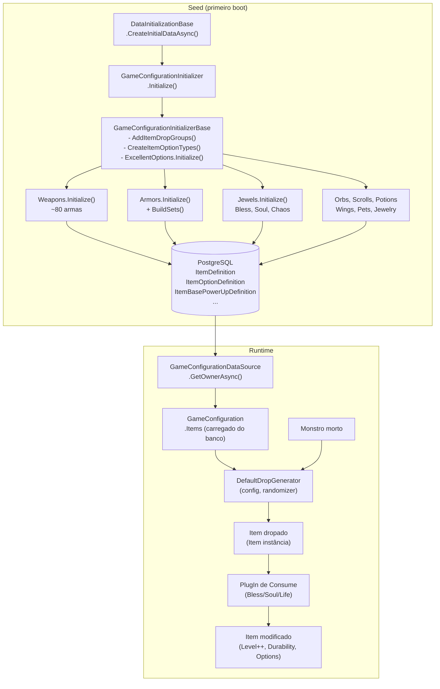

# 07 — Sistema de Itens do OpenMU

## Sumário

1. [Fonte de dados dos itens](#1-fonte-de-dados-dos-itens)
2. [Fluxo de carregamento](#2-fluxo-de-carregamento)
3. [O que define um item](#3-o-que-define-um-item)
4. [Sistema de opções excellent](#4-sistema-de-opções-excellent)
5. [Sistema de joias / upgrade](#5-sistema-de-joias--upgrade)
6. [Dependência do mapa XML / seed](#6-dependência-do-mapa-xml--seed)
7. [Extensibilidade](#7-extensibilidade)
8. [Diagrama geral](#8-diagrama-geral)
9. [Tabela de arquivos principais](#9-tabela-de-arquivos-principais)
10. [Impacto de substituir o sistema de itens](#10-impacto-de-substituir-o-sistema-de-itens)

---

## 1. Fonte de dados dos itens

**Não existe nenhum XML, JSON ou arquivo de configuração externo para itens.** Toda definição está em C# puro, dentro de inicializadores que gravam diretamente no banco de dados (PostgreSQL via Entity Framework) no primeiro boot do servidor.

O padrão se chama *seeding por código*: classes chamadas de `Initializer` criam objetos `ItemDefinition` e os salvam no banco. Após a seed inicial, o banco é a fonte canônica; os inicializadores não são mais executados.

Localização dos inicializadores por versão de jogo:

```
src/Persistence/Initialization/
├── GameConfigurationInitializerBase.cs   ← base: ItemOptionTypes, DropGroups, Luck/Opt definitions
├── Items/
│   ├── ExcellentOptions.cs               ← 3 conjuntos de opções excellent (física, mágica, defesa)
│   ├── ArmorInitializerBase.cs           ← base de armaduras + bonus de set completo
│   ├── ItemHelper.cs                     ← helpers para criar instâncias de Item (não definição)
│   ├── ItemGroups.cs                     ← enum: Swords=0, Axes=1, ..., Misc=14, etc.
│   └── OptionExtensions.cs
├── Version075/Items/
│   ├── Constants.cs                      ← MaximumItemLevel=11, MaximumOptionLevel=4
│   ├── Weapons.cs                        ← ~80 armas
│   ├── Armors.cs                         ← conjuntos de armadura
│   ├── Jewels.cs                         ← Bless, Soul, Chaos
│   ├── Jewelery.cs                       ← anéis e pingentes
│   ├── Orbs.cs / Scrolls.cs             ← consumíveis de skill
│   ├── Potions.cs / Pets.cs / Wings.cs
│   └── SlotTypesInitializer.cs
├── Version095d/Items/                    ← extensões para v0.95d
└── VersionSeasonSix/Items/               ← extensões para Season 6 (Dark Lord, etc.)
```

---

## 2. Fluxo de carregamento

### Seed inicial (primeiro boot)

O entry point é `DataInitializationBase.CreateInitialDataAsync()`:

```
DataInitializationBase.CreateInitialDataAsync()
  └─ GameConfigurationInitializer.Initialize()          ← versão-específico (v075, v095d, S6)
       └─ GameConfigurationInitializerBase.Initialize()
            ├─ AddItemDropGroups()    ← Money, RandomItem, Excellent, Jewel drop groups
            ├─ CreateItemOptionTypes()   ← Luck, Option, Excellent, AncientOption, ...
            ├─ new ExcellentOptions(ctx, cfg).Initialize()
            ├─ new Weapons(ctx, cfg).Initialize()
            ├─ new Armors(ctx, cfg).Initialize()
            ├─ new Jewels(ctx, cfg).Initialize()
            ├─ new Jewelery(ctx, cfg).Initialize()
            ├─ new Orbs / Scrolls / Potions / Wings / Pets ...
            └─ Context.SaveChangesAsync()   ← grava tudo no PostgreSQL
```

### Runtime (após seed)

```
GameConfigurationDataSource.GetOwnerAsync()
  └─ carrega GameConfiguration do banco (EF)
       └─ inclui GameConfiguration.Items  ← ICollection<ItemDefinition>

DefaultDropGenerator(config, randomizer)
  └─ filtra config.Items onde DropsFromMonsters == true
  └─ usa nas lógicas de drop sem acessar arquivos
```

O banco é completamente independente após a seed. Os arquivos C# de initialização **não são mais lidos em runtime**.

---

## 3. O que define um item

### Modelo `ItemDefinition`

`src/DataModel/Configuration/Items/ItemDefinition.cs`

| Propriedade | Tipo | Descrição |
|---|---|---|
| `Group` | `byte` | Grupo de item (0–15). Ex.: 0=Swords, 14=Misc/Jewels |
| `Number` | `short` | Sub-ID único dentro do grupo |
| `Name` | `LocalizedString` | Nome. Suporta variantes por nível via `;` (ex.: "Kris;Kris+1") |
| `Width` / `Height` | `byte` | Dimensões no inventário |
| `Durability` | `byte` | Durabilidade máxima no nível 0 |
| `MaximumItemLevel` | `byte` | Nível máximo de upgrade (11 em v0.75, 15 em S6) |
| `DropLevel` | `byte` | Nível mínimo do monstro para dropar este item |
| `MaximumDropLevel` | `byte?` | Nível máximo do monstro (sem limite se null) |
| `DropsFromMonsters` | `bool` | Se pode ser dropado por monstros |
| `Value` | `int` | Valor em zen |
| `MaximumSockets` | `int` | Máximo de sockets (0 = sem socket) |
| `IsBoundToCharacter` | `bool` | Bind: não pode ser trocado |
| `StorageLimitPerCharacter` | `int` | Limite de estoque por personagem (0 = sem limite) |
| `IsAmmunition` | `bool` | É munição para outra arma equipada |
| `Skill` | `Skill?` | Skill equipada ou aprendida ao consumir |
| `ConsumeEffect` | `MagicEffectDefinition?` | Efeito ao consumir (ex.: poção) |
| `PetExperienceFormula` | `string?` | Fórmula de XP para pets treináveis |
| `ItemSlot` | `ItemSlotType?` | Slot de equip (null para consumíveis) |
| `QualifiedCharacters` | `ICollection<CharacterClass>` | Classes que podem equipar |
| `PossibleItemOptions` | `ICollection<ItemOptionDefinition>` | Opções disponíveis (Luck, Option, Excellent) |
| `BasePowerUpAttributes` | `ICollection<ItemBasePowerUpDefinition>` | Atributos base (dano, defesa) + tabela de bônus por nível |
| `Requirements` | `ICollection<AttributeRequirement>` | Requisitos de atributo para equipar |
| `PossibleItemSetGroups` | `ICollection<ItemSetGroup>` | Pertença a sets (antigos, bônus de set completo) |
| `DropItems` | `ICollection<ItemDropItemGroup>` | Grupos de drop por nível ao dropar pelo jogador |

### Modelo `Item` (instância em runtime)

`src/DataModel/Entities/Item.cs`

| Propriedade | Tipo | Descrição |
|---|---|---|
| `Definition` | `ItemDefinition?` | Referência à definição |
| `Level` | `byte` | Nível de upgrade atual |
| `Durability` | `double` | Durabilidade atual |
| `HasSkill` | `bool` | Se a instância tem skill ativa |
| `SocketCount` | `int` | Número de sockets abertos |
| `ItemOptions` | `ICollection<ItemOptionLink>` | Opções ativas nesta instância |
| `ItemSetGroups` | `ICollection<ItemOfItemSet>` | Sets antigos ativados |
| `PetExperience` | `int` | XP do pet |
| `StorePrice` | `int?` | Preço na loja pessoal |

### Exemplo real: definição de uma arma

`src/Persistence/Initialization/Version075/Items/Weapons.cs:89`

```csharp
this.CreateWeapon(0, 0, 0, 0, 1, 2, true, "Kris",
//               grp#  num# slot dropLvl w  h  hasDmgOpt
    minDmg: 6, maxDmg: 11, durability: 50,
    dropLevel: 20, value: 0, staffRise: 0,
    reqStr: 40, reqAgi: 40, reqEnergy: 0, reqVit: 0,
    qualDarkWizard: 1, qualDarkKnight: 1, qualFairyElf: 1);
```

O método `CreateWeapon` no `ArmorInitializerBase` / `Weapons` cria:
- Um `ItemDefinition` (Group=0, Number=0, Name="Kris")
- `BasePowerUpAttributes` com `PhysicalBaseDmg` base=6..11 e `BonusPerLevelTable` apontando para a tabela de dano por nível
- `Requirements` com `Strength ≥ 40`, `Agility ≥ 40`
- `PossibleItemOptions`: Luck + PhysicalDamageOption + ExcellentPhysicalAttack options

---

## 4. Sistema de opções excellent

### Definição (seed)

`src/Persistence/Initialization/Items/ExcellentOptions.cs`

Três `ItemOptionDefinition` são criados:

| Nome | Usado em | `AddChance` | `MaximumOptionsPerItem` |
|---|---|---|---|
| `Excellent Defense Options` | Armaduras, Escudos | 0.001 (0.1%) | 2 |
| `Excellent Physical Attack Options` | Armas físicas | 0.001 (0.1%) | 2 |
| `Excellent Wizardry Attack Options` | Staffs, bastões mágicos | 0.001 (0.1%) | 2 |

Cada definição contém 6 `IncreasableItemOption`, cada um mapeando para um `PowerUpDefinition`:

**Opções de defesa:**
```
1. MoneyAmountRate      × 1.4    (multiplica zen dropado)
2. DefenseRatePvm       × 1.1    (defesa contra monstros)
3. DamageReflection     + 0.05   (5% de reflecção)
4. ArmorDamageDecrease  + 0.04   (reduz dano recebido)
5. MaximumMana          × 1.04
6. MaximumHealth        × 1.04
```

**Opções de ataque físico:**
```
1. ManaAfterMonsterKillMultiplier  + 1/8  (mana por kill)
2. HealthAfterMonsterKillMultiplier + 1/8 (hp por kill)
3. AttackSpeedAny       + 7
4. PhysicalBaseDmgIncrease × 1.02
5. PhysicalBaseDmg      + TotalLevel/20   (escala com nível)
6. ExcellentDamageChance + 0.1 (10% chance de dano excelente)
```

**Opções de ataque mágico:** mesma estrutura, trocando `Physical` → `Wizardry`.

### Geração no drop

`src/GameLogic/DefaultDropGenerator.cs:460` — método `AddRandomExcOptions(Item item)`:

```
1. Busca o ItemOptionDefinition de excellent do item
2. Para i = 0 até MaximumOptionsPerItem (2):
   - i == 0: SEMPRE adiciona 1 opção (escolha aleatória entre as 6)
   - i >= 1: rola NextRandomBool(AddChance=0.001)
             → se true: adiciona mais 1 opção aleatória (sem repetir)
```

Todo excellent item dropado tem **pelo menos 1 opção garantida**. A segunda opção tem **0.1% de chance**.

O nível de item de um excellent é calculado por:
```csharp
// DefaultDropGenerator.cs:223
byte level = Math.Min((monsterLevel - itemDefinition.DropLevel) / 3, itemDefinition.MaximumItemLevel);
```

Excellents só dropam de monstros cujo nível ≥ `ExcellentItemDropLevelDelta` (padrão: 25).

---

## 5. Sistema de joias / upgrade

O sistema de joias é **completamente desacoplado das definições de item**. As joias são itens normais (ItemDefinition no banco), e sua lógica de upgrade é implementada por **PlugIns** de consume.

### Arquitetura de PlugIn

```
ItemConsumeActions/
├── UpgradeItemLevelJewelConsumeHandlerPlugIn.cs  ← base para Bless/Soul
├── UpgradeItemLevelConfiguration.cs              ← config: MaxLevel, SuccessRate, etc.
├── BlessJewelConsumeHandlerPlugIn.cs             ← Jewel of Bless
├── BlessJewelConsumeHandlerPlugInConfiguration.cs
├── SoulJewelConsumeHandlerPlugIn.cs              ← Jewel of Soul
├── LifeJewelConsumeHandlerPlugIn.cs              ← Jewel of Life
└── ItemUpgradeConsumeHandlerPlugIn.cs            ← base para Life/Harmony
```

### Jewel of Bless

`BlessJewelConsumeHandlerPlugIn.cs:29`

```
MaximumLevel = 5         → upgrade de 0 a +5
MinimumLevel = 0
SuccessRatePercentage = 100   → 100% de sucesso
SuccessRateBonusWithLuck = 0
ResetToLevel0WhenFail = 0     → não há falha
```

Comportamento extra: se o item for Fenrir (group=13, number=37) com durabilidade baixa, repara em vez de uppar.

### Jewel of Soul

`SoulJewelConsumeHandlerPlugIn.cs:41`

```
MaximumLevel = 8         → upgrade até +9
MinimumLevel = 0
SuccessRatePercentage = 50    → 50% de sucesso base
SuccessRateBonusWithLuck = 25 → 75% com Luck
ResetToLevel0WhenFailMinLevel = 7  → falha em +7/+8/+9 → reset para +0
```

Lógica de falha (`UpgradeItemLevelJewelConsumeHandlerPlugIn.cs:90`):
```csharp
if (item.Level >= ResetToLevel0WhenFailMinLevel)
    item.Level = 0;
else
    item.Level = Math.Max(item.Level - 1, 0);
```

### Jewel of Life

`LifeJewelConsumeHandlerPlugIn.cs:25`

```csharp
new ItemUpgradeConfiguration(
    optionType: ItemOptionTypes.Option,
    addIfMissing: true,
    increaseExistingIfPresent: true,
    successRate: 0.5,
    failResult: ItemFailResult.RemoveOption)
```

Adiciona ou incrementa o nível da opção `Option` (ex.: +4 defesa base → +8 → +12 → +16 para armaduras). Falha → remove a opção completamente.

### Jewel of Chaos

Definido como ItemDefinition (group=12, number=15) mas seu consumo é tratado por um sistema separado de *mix/chaos machine* (não o sistema de upgrade linear).

### Desacoplamento

A lógica de upgrade **não lê nem depende de arquivos de configuração**. A configuração do PlugIn (MaximumLevel, SuccessRate) é armazenada como JSON em `PlugInConfiguration.CustomConfiguration` no banco — editável em runtime via admin panel.

---

## 6. Dependência do mapa XML / seed

**Não há arquivos XML de itens no OpenMU.** O termo "mapa XML" do MU original não se aplica aqui.

### O que acontece se você reinicializar o banco?

| Situação | Consequência |
|---|---|
| Banco zerado + rodar seed novamente | Todos os itens são recriados identicamente pelos initializers C# |
| Banco existente | Os initializers NÃO são chamados; o banco é autoritativo |
| Modificar um initializer C# com banco existente | Nenhum efeito automático; é necessário criar um `IUpdatePlugIn` |
| Deletar todas as linhas de ItemDefinition no banco | O servidor não consegue carregar a GameConfiguration |

### Updates incrementais

Para aplicar mudanças a um banco existente, o OpenMU usa o padrão `IUpdatePlugIn`:

```
src/Persistence/Initialization/Updates/
├── AddCrestOfMonarchDropGroupUpdateSeason6.cs
├── AddHarmonyOptionWeightsUpdateSeason6.cs
└── ...
```

Cada update tem uma versão e é executado exatamente uma vez no startup quando detectado que ainda não foi aplicado.

---

## 7. Extensibilidade

### Adicionar um novo item do zero

**Passo 1 — Criar o initializer:**

```csharp
// Em src/Persistence/Initialization/Version075/Items/MinhasArmas.cs (novo arquivo)
public class MinhasArmas : InitializerBase
{
    public override void Initialize()
    {
        var item = this.Context.CreateNew<ItemDefinition>();
        item.SetGuid(item.Group, item.Number); // GUID determinístico
        item.Group = 0;          // Swords
        item.Number = 100;       // Sub-ID único no grupo
        item.Name = "Minha Espada Customizada";
        item.Width = 1;
        item.Height = 3;
        item.Durability = 80;
        item.MaximumItemLevel = 15;
        item.DropLevel = 60;
        item.DropsFromMonsters = true;
        item.Value = 5000;

        // Atributo base de dano físico
        var dmgAttr = this.Context.CreateNew<ItemBasePowerUpDefinition>();
        dmgAttr.TargetAttribute = Stats.PhysicalBaseDmg.GetPersistent(this.GameConfiguration);
        dmgAttr.BaseValue = 80f;
        dmgAttr.BonusPerLevelTable = /* tabela de bônus por nível */;
        item.BasePowerUpAttributes.Add(dmgAttr);

        // Requisitos
        var strReq = this.Context.CreateNew<AttributeRequirement>();
        strReq.Attribute = Stats.TotalStrength.GetPersistent(this.GameConfiguration);
        strReq.MinimumValue = 200;
        item.Requirements.Add(strReq);

        // Opções disponíveis
        item.PossibleItemOptions.Add(this.GameConfiguration.ItemOptions.First(o =>
            o.PossibleOptions.Any(p => p.OptionType == ItemOptionTypes.Luck)));
        item.PossibleItemOptions.Add(/* PhysicalDamageOption */);
        item.PossibleItemOptions.Add(/* ExcellentPhysicalAttack */);

        // Classes qualificadas
        item.QualifiedCharacters.Add(/* DarkKnight */);

        this.GameConfiguration.Items.Add(item);
    }
}
```

**Passo 2 — Registrar no GameConfigurationInitializer da versão:**

```csharp
// Em Version075/GameConfigurationInitializer.cs
new MinhasArmas(this.Context, this.GameConfiguration).Initialize();
```

**Passo 3 — Se o banco já existir, criar um UpdatePlugIn:**

```csharp
[Guid("...")]
public class AddMinhasArmasUpdatePlugIn : IUpdatePlugIn
{
    public string Key => "add-minhas-armas-v1";
    public async Task ApplyUpdateAsync(...)
    {
        new MinhasArmas(context, gameConfiguration).Initialize();
        await context.SaveChangesAsync();
    }
}
```

### O que é necessário do zero (resumo)

| Necessidade | Complexidade |
|---|---|
| Novo item simples (consumível, poção) | Baixa — criar ItemDefinition + registrar |
| Nova arma/armadura com dano/defesa | Média — criar ItemBasePowerUpDefinition + tabela de bônus por nível |
| Novo tipo de opção excellent | Média — criar ItemOptionDefinition + IncreasableItemOption |
| Novo mecanismo de upgrade (nova joia) | Média — implementar PlugIn de consume |
| Novo grupo de item (além de 0–15) | Alta — o protocolo de rede usa 4 bits para o grupo |
| Novo tipo de opção de item | Alta — integração com AttributeSystem + possível mudança de protocolo |

---

## 8. Diagrama geral



---

## 9. Tabela de arquivos principais

| Caminho | Responsabilidade |
|---|---|
| `src/DataModel/Configuration/Items/ItemDefinition.cs` | Modelo de definição de item |
| `src/DataModel/Configuration/Items/ItemOptionDefinition.cs` | Definição de conjunto de opções (Luck, Excellent, etc.) |
| `src/DataModel/Configuration/Items/ItemBasePowerUpDefinition.cs` | Bônus de atributo base + tabela por nível |
| `src/DataModel/Configuration/Items/IncreasableItemOption.cs` | Opção individual com PowerUpDefinition |
| `src/DataModel/Entities/Item.cs` | Instância de item em runtime |
| `src/DataModel/Entities/ItemOptionLink.cs` | Vínculo entre instância e opção ativa |
| `src/GameLogic/DefaultDropGenerator.cs` | Lógica de geração de drops (random, excellent, ancient) |
| `src/Persistence/Initialization/GameConfigurationInitializerBase.cs` | Base de seed: ItemOptionTypes, DropGroups, Luck/Option defs |
| `src/Persistence/Initialization/DataInitializationBase.cs` | Orquestração da seed completa |
| `src/Persistence/Initialization/Items/ExcellentOptions.cs` | Seed das 3 categorias de opções excellent |
| `src/Persistence/Initialization/Items/ArmorInitializerBase.cs` | Base para armaduras + set bonus logic |
| `src/Persistence/Initialization/Items/ItemHelper.cs` | Helpers para criar instâncias de Item |
| `src/Persistence/Initialization/Items/ItemGroups.cs` | Enum de grupos de item |
| `src/Persistence/Initialization/Version075/Items/Weapons.cs` | Seed das armas v0.75 |
| `src/Persistence/Initialization/Version075/Items/Armors.cs` | Seed das armaduras v0.75 |
| `src/Persistence/Initialization/Version075/Items/Jewels.cs` | Seed das joias v0.75 (Bless, Soul, Chaos) |
| `src/Persistence/Initialization/Version075/Items/Constants.cs` | Constantes por versão (MaxItemLevel=11) |
| `src/GameLogic/PlayerActions/ItemConsumeActions/BlessJewelConsumeHandlerPlugIn.cs` | PlugIn Jewel of Bless |
| `src/GameLogic/PlayerActions/ItemConsumeActions/SoulJewelConsumeHandlerPlugIn.cs` | PlugIn Jewel of Soul |
| `src/GameLogic/PlayerActions/ItemConsumeActions/LifeJewelConsumeHandlerPlugIn.cs` | PlugIn Jewel of Life |
| `src/GameLogic/PlayerActions/ItemConsumeActions/UpgradeItemLevelJewelConsumeHandlerPlugIn.cs` | Base de upgrade por nível |

---

## 10. Impacto de substituir o sistema de itens

### O que pode ser mantido

| Componente | Situação |
|---|---|
| `ItemDefinition` / `Item` / `ItemOptionLink` (modelos EF) | Podem ser mantidos — são agnósticos à fonte de dados |
| `DefaultDropGenerator` | Pode ser mantido — usa apenas `ItemDefinition` do banco |
| PlugIns de consume (Bless, Soul, Life) | Podem ser mantidos — lógica pura, não acoplada à seed |
| `AttributeSystem` (PowerUpDefinition, etc.) | Deve ser mantido — é a cola entre itens e stats de personagem |
| Sistema de PlugIn para novos consumes | Pode ser mantido — é o mecanismo correto de extensão |

### O que seria reescrito

| Componente | Escopo de reescrita |
|---|---|
| Initializers C# de itens (`Weapons.cs`, `Armors.cs`, etc.) | Substituir por uma nova fonte (ex.: JSON, YAML, CSV) + loader genérico |
| Lógica de seed no `DataInitializationBase` | Adaptar para chamar o novo loader |
| `ExcellentOptions.cs` | Externalizar os valores para arquivo se quiser configurabilidade |
| Updates incrementais (`IUpdatePlugIn`) | Criar novos updates para migrar dados existentes |

### Estimativa de complexidade para fonte de dados externa (ex.: JSON)

| Tarefa | Complexidade |
|---|---|
| Criar schema JSON que mapeia para `ItemDefinition` | Baixa |
| Escrever loader genérico JSON → `ItemDefinition` EF | Média |
| Tratar `BasePowerUpAttributes` + `ItemLevelBonusTable` no JSON | Média-Alta (estrutura relacional aninhada) |
| Tratar `PossibleItemOptions` + referências cruzadas entre objetos | Alta (referências por GUID precisam ser resolvidas) |
| Manter compatibilidade de GUID determinístico (`SetGuid`) | Média (crítico para updates incrementais) |
| Adaptar o admin panel (Blazor) para exibir os novos dados | Baixa (já usa `IDataModelRepository<ItemDefinition>`) |

**Estimativa total: 2–4 semanas** para um desenvolvedor familiarizado com o codebase, garantindo cobertura de testes de integração e compatibilidade com o banco existente.

O maior risco é a resolução de referências cruzadas: `ItemOptionDefinition` é compartilhado entre múltiplos itens, e `ItemLevelBonusTable` também. Qualquer nova fonte de dados precisa de um mecanismo de referência similar ao GUID determinístico atual.
