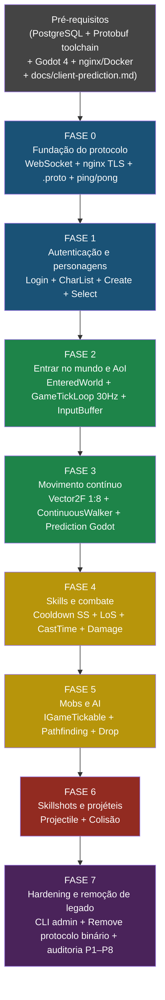

# 09 — Plano de Implementação da Refatoração

> Plano normativo derivado dos documentos 01–08. Toda tarefa referencia um arquivo real do projeto.  
> Regras P1–P8 de `08-refactoring-rules.md` são invioláveis. Interfaces sagradas não podem ser quebradas.

**Idioma:** Português  
**Horizonte:** 8 fases sequenciais com checkpoints validáveis por client Godot 4 (C#)

---

## Sumário

- [Pré-requisitos](#pré-requisitos)
- [Sequenciamento entre fases](#sequenciamento-entre-fases)
- [Fase 0 — Fundação do protocolo](#fase-0--fundação-do-protocolo)
- [Fase 1 — Autenticação e personagens](#fase-1--autenticação-e-personagens)
- [Fase 2 — Entrar no mundo e AoI básico](#fase-2--entrar-no-mundo-e-aoi-básico)
- [Fase 3 — Movimento contínuo](#fase-3--movimento-contínuo)
- [Fase 4 — Skills e combate](#fase-4--skills-e-combate)
- [Fase 5 — Mobs e AI](#fase-5--mobs-e-ai)
- [Fase 6 — Skillshots e projéteis](#fase-6--skillshots-e-projéteis)
- [Fase 7 — Hardening e remoção de legado](#fase-7--hardening-e-remoção-de-legado)
- [Decisões em aberto](#decisões-em-aberto)

---

## Pré-requisitos

O que deve estar configurado e funcional **antes** de iniciar a Fase 0.

### Infraestrutura de desenvolvimento

| Pré-requisito | Detalhe | Como verificar |
|---|---|---|
| Docker + Docker Compose | Versão Docker ≥ 24.x; Compose V2 | `docker compose version` |
| PostgreSQL via Docker | Serviço `openmu-db` no `docker-compose.yml` na porta 5432 | `dotnet ef database update` sem erros |
| nginx como reverse proxy WebSocket | Serviço `nginx` no `docker-compose.yml`; upstream apontando para o GameServer | `curl -k https://localhost/ws` retorna 101 Switching Protocols |
| mkcert para TLS local | Certificado auto-assinado instalado no trust store do OS/browser; nginx usa o cert | `mkcert -install && mkcert localhost` |
| Banco seedado | `DataInitializationBase.CreateInitialDataAsync()` executado ao menos uma vez | Tabela `ItemDefinition` com > 0 registros |
| .NET 8 SDK | Versão mínima 8.0.x | `dotnet --version` |
| `protoc` instalado | Versão ≥ 25.x com plugin `grpc_csharp_plugin` | `protoc --version` |
| NuGet `Google.Protobuf` + `Grpc.Tools` | Adicionado ao projeto `src/Network/` | `dotnet build src/Network/` |
| Godot 4.x com suporte a C# | .NET 8 como runtime; exportação C# habilitada | Projeto Godot compila script C# sem erros |
| `Google.Protobuf` dll no Godot | `.dll` copiada para `res://addons/Protobuf/` | Script C# compila com `using Google.Protobuf` |
| CI Pipeline | GitHub Actions com `dotnet build` + `dotnet test` | Push na branch aciona o pipeline |

### Estrutura de diretórios a criar antes da Fase 0

```
src/
├── Network/
│   └── Protobuf/          ← arquivos .proto + código C# gerado
│       ├── common.proto
│       ├── auth.proto
│       ├── world.proto
│       ├── movement.proto
│       ├── skills.proto
│       ├── items.proto
│       └── chat.proto
├── GameLogic/
│   ├── Inputs/            ← IPlayerInput + implementações
│   └── (Vector2F.cs será criado na Fase 3)
├── GameServer/
│   ├── MessageHandler/
│   │   └── Protobuf/      ← handlers C2S para o novo protocolo
│   └── RemoteView/
│       └── Protobuf/      ← ViewPlugIns S2C para o novo protocolo
└── Tools/
    └── AdminCli/          ← CLI mínimo de gestão (criado na Fase 7 antes de remover o AdminPanel)

docker/
├── nginx.conf             ← upstream WebSocket para o GameServer; terminação TLS
└── docker-compose.yml     ← serviços: postgres, gameserver, nginx

docs/custom/
└── client-prediction.md  ← arquitetura de prediction do Godot (criar ANTES de qualquer código Godot)
```

### Nota sobre escala de coordenadas (D2 — fechada)

O espaço contínuo usa escala **1 tile = 8 unidades**. Posições `Vector2F` variam de `0.0` a `2040.0` em mapas de 255×255 tiles. As conversões canônicas são:

```csharp
// src/GameLogic/Vector2F.cs
ToTile()        → new Point((byte)(X / 8f), (byte)(Y / 8f))
FromTile(Point) → new Vector2F(p.X * 8f + 4f, p.Y * 8f + 4f)  // centro do tile
```

O servidor **nunca** arredonda posição para tile durante movimento — apenas para colisão contra `WalkMap` e para lookup de bucket no `BucketMap`. Performance: `float32` é nativo em CPU moderna, sem impacto relevante.

### Nota sobre client-side prediction (requisito transversal)

Antes de qualquer código Godot, criar `docs/custom/client-prediction.md` com a arquitetura completa de prediction. Modelo de referência: League of Legends (input imediato no client, servidor autoritativo, correção suave sem rubber-band visível).

Regras fixadas:
- **Sem turn rate** — personagem muda de direção imediatamente ao receber input, sem animação de rotação bloqueante.
- **Input buffering** — Godot aceita o próximo comando enquanto a animação atual ainda executa; o input é enfileirado e executado ao concluir o estado atual.
- **Sequence numbers** — todo `C2SMove` carrega `sequence` incremental; todo `S2CEntityMoved` carrega `acked_sequence`; Godot reconcilia ao receber o ack.

---

## Sequenciamento entre fases



---

## Fase 0 — Fundação do protocolo

### Objetivo

Estabelecer a camada de transporte completa: WebSocket com TLS terminado no nginx, protocolo Protobuf compilado e funcional, e a primeira troca de mensagens verificável entre o client Godot e o servidor.

Nenhuma lógica de jogo é alterada. O servidor legado continua funcionando em paralelo enquanto o novo listener é adicionado numa porta separada. O nginx roteará `wss://` → `ws://gameserver:55910` internamente.

### Tarefas

| # | Tarefa | Arquivo(s) afetado(s) | Complexidade | Depende de |
|---|---|---|---|---|
| 0.1 | Criar `docker/docker-compose.yml` com serviços `postgres`, `gameserver` e `nginx`; criar `docker/nginx.conf` com upstream WebSocket e terminação TLS via mkcert | `docker/docker-compose.yml` (novo), `docker/nginx.conf` (novo) | Média | Pré-requisitos |
| 0.2 | Criar estrutura de diretórios `src/Network/Protobuf/` e arquivos `.proto` esqueléticos para todos os domínios | `src/Network/Protobuf/*.proto` (novos) | Média | Pré-requisitos |
| 0.3 | Configurar geração automática de código C# a partir dos `.proto` no MSBuild (`Grpc.Tools`) | `src/Network/Network.csproj` | Baixa | 0.2 |
| 0.4 | Definir envelope de protocolo (`ClientEnvelope`, `ServerEnvelope`, `oneof payload`, `protocol_version`, `sequence`) em `common.proto` | `src/Network/Protobuf/common.proto` | Média | 0.2 |
| 0.5 | Definir `C2SPing` e `S2CPong` como primeiras mensagens de teste em `common.proto` | `src/Network/Protobuf/common.proto` | Baixa | 0.4 |
| 0.6 | Implementar `WebSocketConnection : IConnection` — framing 4-byte length prefix (LE), `PipeWriter Output`, `PacketReceived`, `OutputLock`; aceita WS plain (TLS fica no nginx) | `src/Network/WebSocketConnection.cs` (novo) | Alta | 0.3 |
| 0.7 | Implementar `WebSocketGameServerListener` — aceita conexões WS na porta 55910 (sem TLS, nginx faz o offload); análogo ao `DefaultTcpGameServerListener` | `src/Network/WebSocketGameServerListener.cs` (novo) | Média | 0.6 |
| 0.8 | Implementar `ProtobufPacketDispatcher` — desserializa `ClientEnvelope`, valida `protocol_version`, despacha para handler por tipo de `oneof` | `src/GameServer/MessageHandler/Protobuf/ProtobufPacketDispatcher.cs` (novo) | Média | 0.6 |
| 0.9 | Implementar `PingHandlerPlugIn` — responde `C2SPing` com `S2CPong` contendo timestamp de resposta | `src/GameServer/MessageHandler/Protobuf/PingHandlerPlugIn.cs` (novo) | Baixa | 0.8 |
| 0.10 | Implementar `RateLimiter` por conexão (token bucket básico: 60 msg/s) | `src/Network/RateLimiter.cs` (novo) | Média | 0.6 |
| 0.11 | Registrar o novo listener no startup ao lado do listener legado (porta 55910 WS vs 55901 TCP legado) | `src/GameServer/GameServer.cs` ou startup | Baixa | 0.7 |
| 0.12 | Criar `docs/custom/client-prediction.md` — arquitetura de prediction: sem turn rate, input buffering, sequence numbers, modelo de reconciliação | `docs/custom/client-prediction.md` (novo) | Média | Pré-requisitos |
| 0.13 | **Godot:** conectar via `wss://localhost` (nginx), serializar `ClientEnvelope{C2SPing}`, receber e validar `ServerEnvelope{S2CPong}`; RTT impresso no log | `res://Scripts/Network/WebSocketClient.cs` (Godot) | Média | 0.9 |

### Dependências de entrada

- PostgreSQL com banco seedado (o servidor precisa do banco para subir, mas não é acessado nesta fase)
- Protobuf toolchain instalado
- Docker Compose com nginx configurado; certificado mkcert instalado no trust store local

### Checkpoint de validação

> **Critério de aprovação:** Godot conecta em `wss://localhost` (porta 443 nginx → 55910 GameServer), envia `ClientEnvelope{C2SPing}`, recebe `ServerEnvelope{S2CPong}` com timestamp. O RTT aparece no log do Godot. O servidor legado continua aceitando conexões TCP na porta 55901 sem interrupção. `docker compose up` sobe todos os serviços sem erros.

### Riscos

| Risco | Probabilidade | Mitigação |
|---|---|---|
| Godot + mkcert: certificado não confiado pelo `System.Net.WebSockets` do .NET | Alta | Usar `mkcert -install` para instalar a CA no trust store do OS; .NET respeita o trust store do sistema |
| nginx não fazer upgrade correto de HTTP → WebSocket | Média | Verificar `proxy_http_version 1.1`, `Upgrade $http_upgrade`, `Connection "upgrade"` no `nginx.conf`; testar com `websocat` antes do Godot |
| Framing Protobuf com length prefix divergir entre C# (servidor) e C# (Godot) | Média | Escrever teste de roundtrip puro em C# no servidor antes de envolver o Godot |
| MSBuild + `Grpc.Tools` não gerar código automaticamente no VS/Rider | Média | Adicionar target explícito no `.csproj` e documentar o passo manual de regeneração |

---

## Fase 1 — Autenticação e personagens

### Objetivo

Fluxo completo de autenticação e gerenciamento de personagem via protocolo Protobuf. O jogador consegue criar conta (via seed), logar, ver lista de personagens, criar, selecionar e deletar personagem. `ILoginServer` permanece in-memory com interface preparada para troca futura.

### Tarefas

| # | Tarefa | Arquivo(s) afetado(s) | Complexidade | Depende de |
|---|---|---|---|---|
| 1.1 | Definir mensagens de autenticação: `C2SLoginRequest`, `S2CLoginResult` em `auth.proto` | `src/Network/Protobuf/auth.proto` | Baixa | F0 concluída |
| 1.2 | Definir mensagens de personagem: `C2SCharacterListRequest`, `S2CCharacterList`, `C2SCreateCharacter`, `S2CCreateCharacterResult`, `C2SSelectCharacter`, `S2CSelectCharacterResult`, `C2SDeleteCharacter`, `S2CDeleteCharacterResult` | `src/Network/Protobuf/characters.proto` (novo) | Média | 1.1 |
| 1.3 | Implementar `ProtobufLogInHandlerPlugIn` — lê `C2SLoginRequest`, chama `LoginAction.LoginAsync`, respeita `ILoginServer` exclusivamente | `src/GameServer/MessageHandler/Protobuf/ProtobufLogInHandlerPlugIn.cs` (novo) | Média | 1.1 |
| 1.4 | Implementar `ProtobufShowLoginResultPlugIn : IShowLoginResultPlugIn` — serializa `S2CLoginResult` | `src/GameServer/RemoteView/Protobuf/Auth/ProtobufShowLoginResultPlugIn.cs` (novo) | Baixa | 1.1 |
| 1.5 | Implementar `ProtobufCharacterListRequestHandlerPlugIn` — chama ação existente de listar personagens | `src/GameServer/MessageHandler/Protobuf/ProtobufCharacterListHandlerPlugIn.cs` (novo) | Baixa | 1.2 |
| 1.6 | Implementar `ProtobufShowCharacterListPlugIn : IShowCharacterListPlugIn` | `src/GameServer/RemoteView/Protobuf/Characters/ProtobufShowCharacterListPlugIn.cs` (novo) | Média | 1.2 |
| 1.7 | Implementar `ProtobufCreateCharacterHandlerPlugIn` — chama `CreateCharacterAction` | `src/GameServer/MessageHandler/Protobuf/ProtobufCreateCharacterHandlerPlugIn.cs` (novo) | Média | 1.2 |
| 1.8 | Implementar `ProtobufSelectCharacterHandlerPlugIn` — chama `CharacterFocusAction` + `EnterGameAction` | `src/GameServer/MessageHandler/Protobuf/ProtobufSelectCharacterHandlerPlugIn.cs` (novo) | Média | 1.2 |
| 1.9 | Adicionar campo `DeletedAt DateTime?` em `Character` + migration EF | `src/DataModel/Entities/Character.cs`, `src/Persistence/EntityFramework/Migrations/` | Média | F0 concluída |
| 1.10 | Implementar soft-delete em `DeleteCharacterAction` — setar `DeletedAt`, nunca `_context.Remove()` | `src/GameLogic/PlayerActions/Character/DeleteCharacterAction.cs` | Baixa | 1.9 |
| 1.11 | Filtrar personagens com `DeletedAt != null` em `CharacterListRequestAction` | `src/GameLogic/PlayerActions/Character/CharacterListRequestAction.cs` | Baixa | 1.9 |
| 1.12 | Implementar `ProtobufDeleteCharacterHandlerPlugIn` usando ação com soft-delete | `src/GameServer/MessageHandler/Protobuf/ProtobufDeleteCharacterHandlerPlugIn.cs` (novo) | Baixa | 1.10 |
| 1.13 | Substituir hashing do SecurityCode por Argon2id — migration + `ICharacterSecurityCodeVerifier` | `src/GameLogic/PlayerActions/Character/ICharacterSecurityCodeVerifier.cs` (novo), migration EF | Alta | 1.9 |
| 1.14 | Rate limiting de login: 60 tentativas/min por IP no `WebSocketGameServerListener` | `src/Network/WebSocketGameServerListener.cs`, `src/Network/RateLimiter.cs` | Média | F0 concluída |
| 1.15 | Garantir que toda verificação de "conta online" usa exclusivamente `ILoginServer`; auditar `LoginAction` e handlers | `src/GameLogic/PlayerActions/LoginAction.cs` | Baixa | 1.3 |
| 1.16 | **Godot:** telas de login, lista de personagens, criação, seleção e deleção | `res://Scripts/UI/` (Godot) | Alta | 1.8 |

### Dependências de entrada

- Fase 0 concluída e checkpoint validado
- Banco seedado com ao menos uma conta de teste

### Checkpoint de validação

> **Critério de aprovação:**
> 1. Client Godot conecta, envia `C2SLoginRequest` com credenciais válidas, recebe `S2CLoginResult{OK}`.
> 2. Client envia `C2SCharacterListRequest`, recebe `S2CCharacterList` com personagens da conta.
> 3. Client cria novo personagem, recebe `S2CCreateCharacterResult{OK}`, personagem aparece na lista.
> 4. Client seleciona personagem, recebe `S2CSelectCharacterResult{OK}` com estado (level, classe, stats base).
> 5. Client deleta personagem, personagem some da lista; no banco, `DeletedAt` está preenchido (não foi excluído).
> 6. Login com conta já logada retorna `S2CLoginResult{ALREADY_LOGGED_IN}`.
> 7. 61ª tentativa de login no mesmo minuto pelo mesmo IP é rejeitada com conexão encerrada.

### Riscos

| Risco | Probabilidade | Mitigação |
|---|---|---|
| Migration EF conflita com schema existente | Média | Gerar migration em ambiente isolado e revisar SQL gerado antes de aplicar |
| Argon2id incompatível com hashes existentes no banco | Alta | Implementar migração progressiva: ao logar com hash antigo (BCrypt), rehashar com Argon2id e salvar |
| `PlayerState` não transitando corretamente para `Authenticated` no novo handler | Média | Reutilizar `LoginAction` existente sem modificação; apenas o handler Protobuf é novo |

---

## Fase 2 — Entrar no mundo e AoI básico

### Objetivo

Personagem selecionado entra no mundo, aparece no mapa correto. O `GameTickLoop` está funcionando a **30Hz** (33ms por tick). Jogadores veem uns aos outros aparecer e desaparecer conforme se movem (movimento ainda tile-based, substituído na Fase 3). O input buffer está conectado. O `BucketMap` usa chunks de **4 tiles**.

### Tarefas

| # | Tarefa | Arquivo(s) afetado(s) | Complexidade | Depende de |
|---|---|---|---|---|
| 2.1 | Definir mensagens: `S2CEnteredWorld`, `S2CEntitiesInScope`, `S2CEntitiesOutOfScope`, `EntityState` (id, x, y, class, name, level) | `src/Network/Protobuf/world.proto` | Média | F1 concluída |
| 2.2 | Implementar `IGameTickable` interface | `src/GameLogic/IGameTickable.cs` (novo) | Baixa | F1 concluída |
| 2.3 | Implementar `GameTickLoop : IHostedService` — **30Hz** (33ms/tick), 3 fases: ProcessInputs → TickEntities → BroadcastSnapshots; overshoots > 20ms são logados como warning | `src/GameLogic/GameTickLoop.cs` (novo) | Alta | 2.2 |
| 2.4 | Criar `ConcurrentQueue<IPlayerInput>` por player com cap 32; definir `IPlayerInput` | `src/GameLogic/Inputs/IPlayerInput.cs` (novo), `src/GameLogic/Player.cs` | Média | 2.3 |
| 2.5 | Registrar `GameTickLoop` ao criar cada `GameMap`; configurar tick rate via `GameMapDefinition.TickRateHz` (padrão 30) | `src/GameLogic/GameMap.cs`, startup | Média | 2.3 |
| 2.6 | Reduzir `BucketSideLength` de 8 para **4 tiles** no `BucketAreaOfInterestManager` — resultado: 64×64 = 4096 buckets por mapa; AoI mais preciso com chunk menor | `src/GameLogic/BucketAreaOfInterestManager.cs` | Média | F1 concluída |
| 2.7 | Implementar `ProtobufEnteredWorldPlugIn` — envia `S2CEnteredWorld` com posição de spawn (em tile, convertida para unidades na Fase 3), mapa, stats base | `src/GameServer/RemoteView/Protobuf/World/ProtobufEnteredWorldPlugIn.cs` (novo) | Média | 2.1 |
| 2.8 | Implementar `ProtobufNewPlayersInScopePlugIn : INewPlayersInScopePlugIn` — serializa `S2CEntitiesInScope` | `src/GameServer/RemoteView/Protobuf/World/ProtobufNewPlayersInScopePlugIn.cs` (novo) | Média | 2.1 |
| 2.9 | Implementar `ProtobufObjectsOutOfScopePlugIn : IObjectsOutOfScopePlugIn` — serializa `S2CEntitiesOutOfScope` | `src/GameServer/RemoteView/Protobuf/World/ProtobufObjectsOutOfScopePlugIn.cs` (novo) | Baixa | 2.1 |
| 2.10 | Mover disparo de AoI (`ForEachWorldObserverAsync`) para dentro de `GameTickLoop.BroadcastSnapshotsAsync()` em vez de event-driven puro | `src/GameLogic/BucketAreaOfInterestManager.cs`, `GameTickLoop.cs` | Alta | 2.5 |
| 2.11 | Implementar `SnapshotBroadcaster` (sem delta ainda) — itera entidades com estado sujo e enfileira envios | `src/GameLogic/SnapshotBroadcaster.cs` (novo) | Média | 2.5 |
| 2.12 | Implementar `S2CSnapshot` ViewPlugIn básico (posição ainda em tile, float virá na Fase 3) | `src/GameServer/RemoteView/Protobuf/World/ProtobufSnapshotPlugIn.cs` (novo) | Média | 2.11 |
| 2.13 | **Godot:** cena de jogo, renderizar tile map, spawnar avatar no ponto correto, ver outros jogadores aparecer/desaparecer | `res://Scripts/World/` (Godot) | Alta | 2.12 |

### Dependências de entrada

- Fase 1 concluída e checkpoint validado
- `EnterGameAction` existente (`src/GameLogic/PlayerActions/Character/EnterGameAction.cs`) não modificada — apenas novos handlers Protobuf a chamam

### Checkpoint de validação

> **Critério de aprovação:**
> 1. Personagem selecionado recebe `S2CEnteredWorld` com coordenadas de spawn e ID do mapa.
> 2. Ao entrar no mundo, outros jogadores já online na mesma área chegam via `S2CEntitiesInScope`.
> 3. Ao sair da área de um jogador (movimento de teste via editor), `S2CEntitiesOutOfScope` é recebido.
> 4. `GameTickLoop` gera log a cada tick; overshoots > 20ms são logados como warning (tick de 33ms, headroom de 60%).
> 5. Dois clientes Godot simultâneos veem um ao outro.
> 6. `BucketMap` com `BucketSideLength = 4` compila e AoI funciona corretamente.

### Riscos

| Risco | Probabilidade | Mitigação |
|---|---|---|
| Mover AoI para tick loop quebra notificações event-driven existentes | Alta | Manter o sistema event-driven intacto em paralelo; migrar gradualmente, fase a fase |
| `IHostedService` por `GameMap` causar proliferação desnecessária de tasks | Média | Usar `Task.Delay` com `CancellationToken` — todas as tasks rodam no thread pool, não em threads dedicadas |
| Reduzir `BucketSideLength` de 8 para 4 aumentar custo de AoI por ter mais buckets | Baixa | 64×64 = 4096 buckets ainda é O(1) para lookup; o custo de range query aumenta levemente mas permanece aceitável até 500 entidades |
| `BucketMap` não thread-safe com acesso simultâneo do tick loop e dos handlers | Alta | Confirmar que `AsyncReaderWriterLock` de `Bucket<T>` protege os acessos; se não, serializar via tick loop |

---

## Fase 3 — Movimento contínuo

### Objetivo

Movimento fluido com posição float em escala 1:8, delta time e reconciliação server-side. Dois clientes veem o movimento um do outro em tempo real com interpolação. O servidor é autoritativo: se o cliente divergir, recebe correção suave. O Godot implementa client-side prediction desde esta fase.

### Tarefas

| # | Tarefa | Arquivo(s) afetado(s) | Complexidade | Depende de |
|---|---|---|---|---|
| 3.1 | Implementar `Vector2F` com escala 1:8 — `ToTile() = new Point((byte)(X / 8f), (byte)(Y / 8f))`, `FromTile(p) = new Vector2F(p.X * 8f + 4f, p.Y * 8f + 4f)`, `DistanceTo()` | `src/GameLogic/Vector2F.cs` (novo) | Baixa | F2 concluída |
| 3.2 | Atualizar `ILocateable` com representação dual: `Vector2F Position` (primária, 0–2040) e `Point TilePosition` (derivado via `ToTile()`) | `src/GameLogic/ILocateable.cs` | Alta | 3.1 |
| 3.3 | Atualizar todas as implementações de `ILocateable` (`Player`, `Monster`, `DroppedItem`, etc.) para armazenar `Vector2F`; `Point` derivado | `src/GameLogic/Player.cs`, `src/GameLogic/NPC/Monster.cs`, `src/GameLogic/DroppedItem.cs` | Alta | 3.2 |
| 3.4 | Confirmar que `BucketMap` e `BucketAreaOfInterestManager` já usam `TilePosition` (Point) para lookup — ajustar se necessário após a mudança de tipo | `src/GameLogic/BucketAreaOfInterestManager.cs`, `src/GameLogic/BucketMap.cs` | Média | 3.3 |
| 3.5 | Implementar `ContinuousWalker : IGameTickable` — integração de velocidade em unidades/s (1 tile/s = 8 unidades/s), waypoints, sem `Task.Delay` | `src/GameLogic/ContinuousWalker.cs` (novo) | Alta | 3.1, 2.3 |
| 3.6 | Substituir `Walker` por `ContinuousWalker` em `Player`; registrar no `GameTickLoop` | `src/GameLogic/Player.cs` | Média | 3.5 |
| 3.7 | Implementar `LineOfSight.HasLineOfSight()` via Bresenham sobre `WalkMap[,]`; entrada e saída em `Point` (tile), conversão com `ToTile()` internamente | `src/GameLogic/LineOfSight.cs` (novo) | Média | F2 concluída |
| 3.8 | Substituir validação de destino em `WalkToAsync` por ray cast via `LineOfSight` ao longo de toda a trajetória | `src/GameLogic/Player.cs` — método `WalkToAsync` | Média | 3.7 |
| 3.9 | Definir mensagens de movimento: `C2SMove` (`sequence`, `target_x`, `target_y` em unidades float 0–2040), `S2CEntityMoved` (`acked_sequence`, `x`, `y`, `vel_x`, `vel_y`, `is_correction`) | `src/Network/Protobuf/movement.proto` | Baixa | F2 concluída |
| 3.10 | Implementar `ProtobufMoveHandlerPlugIn` — desserializa `C2SMove`, valida rate limit (5/s), clamp de coordenadas para [0, 2040], enfileira `MoveInput` no `InputQueue` | `src/GameServer/MessageHandler/Protobuf/ProtobufMoveHandlerPlugIn.cs` (novo) | Média | 3.9 |
| 3.11 | Implementar `MoveInputHandler` — processa `MoveInput` dentro do tick, chama `ContinuousWalker.SetTarget()`, valida colisão via `LineOfSight` | `src/GameLogic/Inputs/MoveInputHandler.cs` (novo) | Média | 3.6, 3.10 |
| 3.12 | Implementar `ProtobufObjectMovedPlugIn : IObjectMovedPlugIn` — serializa `S2CEntityMoved` com `float x, y, vel_x, vel_y` em escala 1:8 | `src/GameServer/RemoteView/Protobuf/World/ProtobufObjectMovedPlugIn.cs` (novo) | Média | 3.9 |
| 3.13 | Implementar delta compression no `SnapshotBroadcaster`: só incluir entidade no `S2CSnapshot` se `Position` mudou mais que threshold desde o último snapshot enviado para aquele player | `src/GameLogic/SnapshotBroadcaster.cs` | Alta | 2.11, 3.3 |
| 3.14 | Implementar flag `_dirtyPosition` em `Player` — setado pelo `ContinuousWalker`; limpo após broadcast | `src/GameLogic/Player.cs` | Baixa | 3.6 |
| 3.15 | Implementar reconciliação: ao processar `MoveInput`, servidor verifica divergência > threshold em unidades (escala 1:8) e envia `S2CEntityMoved` com `is_correction = true` | `src/GameLogic/Inputs/MoveInputHandler.cs` | Média | 3.11 |
| 3.16 | Rate limit de movimento: 5 `C2SMove`/s por player no `RateLimiter` | `src/Network/RateLimiter.cs` | Baixa | F0 concluída |
| 3.17 | Clampar `deltaTime` no `GameTickLoop` a `min(dt, 3 × tickInterval)` para evitar "teleporte" em pausas do GC ou pico de CPU | `src/GameLogic/GameTickLoop.cs` | Baixa | 2.3 |
| 3.18 | **Godot:** implementar client-side prediction conforme `docs/custom/client-prediction.md` — mover localmente ao input (sem turn rate), input buffer durante animação, reconciliação suave ao receber `acked_sequence`; interpolar posições de outras entidades via `vel_x/vel_y` | `res://Scripts/World/EntityMovement.cs` (Godot) | Alta | 3.12 |

### Dependências de entrada

- Fase 2 concluída e checkpoint validado
- `docs/custom/client-prediction.md` já escrito (pré-requisito da Fase 0)
- `Walker.cs` existente mantido temporariamente; `ContinuousWalker` coexiste até o `Player` ser migrado na tarefa 3.6

### Checkpoint de validação

> **Critério de aprovação:**
> 1. Personagem se move sem tile-locking; posição é float em escala 1:8 (0–2040), movimento é suave no Godot.
> 2. Ao tentar caminhar através de parede, servidor corrige; Godot aplica a correção sem rubber-band visível.
> 3. Dois clientes Godot conectados: mover personagem A, ver o movimento em tempo real no cliente B com interpolação.
> 4. Simular 200ms de lag artificial: Godot continua movendo localmente com prediction; ao receber ack, corrige suavemente se necessário.
> 5. Enviar > 5 `C2SMove`/s: servidor descarta excedentes silenciosamente, personagem não acelera.
> 6. Personagem não muda de direção com animação de rotação — gira imediatamente ao receber input.

### Riscos

| Risco | Probabilidade | Mitigação |
|---|---|---|
| Cascata de erros de compilação ao alterar `ILocateable` (200+ usos de `Point`) | Muito Alta | Representação dual: `Vector2F Position` primária; `Point TilePosition => Position.ToTile()` derivada. Código existente que usa `Point` continua compilando via `TilePosition` |
| `ContinuousWalker` a 30Hz com delta time causando movimentos inconsistentes em picos de CPU | Média | Clampar `deltaTime` a `3 × 33ms = 99ms` no tick loop (tarefa 3.17) |
| Sincronização incorreta entre bucket membership (tile) e posição float 1:8 | Alta | Bucket lookup usa `TilePosition` derivado; `TilePosition` é atualizado pelo `ContinuousWalker` apenas quando o tile muda — a lógica de AoI permanece tile-based |
| Godot: reconciliação com rubber-band visível ao aplicar correção do servidor | Média | Interpolar em vez de snap: mover em direção à posição correta em N frames (ex: 5 frames = ~83ms a 60fps) |

---

## Fase 4 — Skills e combate

### Objetivo

Skills funcionais com cooldown server-side, Line of Sight, cast time interrompível e fórmulas de dano existentes integradas ao novo protocolo. O jogador pode atacar monstros (spawn estático, sem AI ativa) e ver o número de dano no Godot.

### Tarefas

| # | Tarefa | Arquivo(s) afetado(s) | Complexidade | Depende de |
|---|---|---|---|---|
| 4.1 | Definir mensagens: `C2SCastSkill` (skill_id, target_id, target_x, target_y em unidades 1:8, sequence), `S2CSkillAnimation`, `S2CDamageResult`, `S2CBuffApplied`, `S2CBuffExpired` | `src/Network/Protobuf/skills.proto` | Média | F3 concluída |
| 4.2 | Adicionar `Dictionary<ushort, DateTime> LastCastTime` por player (ou usar `SkillEntry.LastUsed` existente) | `src/GameLogic/Player.cs` | Baixa | F3 concluída |
| 4.3 | Implementar verificação de cooldown server-side em `AttackAreaAction` e `TargetedAttackAction` **antes** de qualquer `IViewPlugIn` ser chamado | `src/GameLogic/PlayerActions/Skills/AttackAreaAction.cs`, `TargetedAttackAction.cs` | Média | 4.2 |
| 4.4 | Integrar `LineOfSight.HasLineOfSight()` em `HitAction` para skills com `range > 1` — rejeita hit se LoS bloqueado; entrada em `Point` via `ToTile()` | `src/GameLogic/PlayerActions/Skills/HitAction.cs`, `src/GameLogic/LineOfSight.cs` | Média | 3.7 |
| 4.5 | Implementar `SkillCastQueue : IGameTickable` — fila de cast por player com cast time, interrupção por dano e cancel explícito; granularidade de 33ms a 30Hz é suficiente para cast times ≥ 100ms | `src/GameLogic/PlayerActions/Skills/SkillCastQueue.cs` (novo) | Alta | 2.3, 4.1 |
| 4.6 | Integrar `SkillCastQueue` no `GameTickLoop.TickEntities()` | `src/GameLogic/GameTickLoop.cs` | Média | 4.5 |
| 4.7 | Implementar `SkillInput` que enfileira no `InputQueue` do player | `src/GameLogic/Inputs/SkillInput.cs` (novo) | Baixa | 2.4 |
| 4.8 | Implementar `SkillInputHandler` — valida cooldown, enfileira na `SkillCastQueue` ou executa instant skill | `src/GameLogic/Inputs/SkillInputHandler.cs` (novo) | Média | 4.3, 4.7 |
| 4.9 | Implementar `ProtobufCastSkillHandlerPlugIn` — desserializa `C2SCastSkill`, valida rate limit (1/100ms), enfileira `SkillInput` | `src/GameServer/MessageHandler/Protobuf/ProtobufCastSkillHandlerPlugIn.cs` (novo) | Média | 4.1 |
| 4.10 | Implementar `ProtobufShowSkillAnimationPlugIn : IShowSkillAnimationPlugIn` | `src/GameServer/RemoteView/Protobuf/Skills/ProtobufShowSkillAnimationPlugIn.cs` (novo) | Baixa | 4.1 |
| 4.11 | Implementar `ProtobufObjectHitPlugIn : IObjectHitPlugIn` — serializa `S2CDamageResult` com damage, crit flag, excellent flag | `src/GameServer/RemoteView/Protobuf/Skills/ProtobufObjectHitPlugIn.cs` (novo) | Média | 4.1 |
| 4.12 | Implementar `ProtobufMagicEffectPlugIn` — serializa `S2CBuffApplied` / `S2CBuffExpired` | `src/GameServer/RemoteView/Protobuf/Skills/ProtobufMagicEffectPlugIn.cs` (novo) | Média | 4.1 |
| 4.13 | Integrar verificação de interrupção de cast em `HitAction`: se player está castando, chamar `SkillCastQueue.Interrupt()` | `src/GameLogic/PlayerActions/Skills/HitAction.cs` | Baixa | 4.5 |
| 4.14 | Rate limit de skill: 1 `C2SCastSkill` por 100ms no `RateLimiter` | `src/Network/RateLimiter.cs` | Baixa | F0 concluída |
| 4.15 | **Godot:** botões de skill com cooldown visual, animação de cast, número de dano floating, ícones de buff/debuff | `res://Scripts/Skills/` (Godot) | Alta | 4.11 |

### Dependências de entrada

- Fase 3 concluída e checkpoint validado
- Monstros com spawn estático (sem AI) já presentes no mapa via banco seedado
- `HitAction`, `AttackAreaAction`, `MagicEffectActions` existentes **não modificados** — apenas novos handlers e ViewPlugIns os chamam

### Checkpoint de validação

> **Critério de aprovação:**
> 1. Jogador usa skill direcionada num monstro: servidor calcula dano (fórmulas existentes), retorna `S2CDamageResult`, número de dano aparece no Godot.
> 2. Reenviar a mesma skill antes do cooldown: servidor rejeita silenciosamente. Cooldown no Godot não é burlável.
> 3. Skill ranged com LoS bloqueado por parede: servidor rejeita o hit, nenhum dano é aplicado.
> 4. Skill com cast time 2s: ao levar dano durante o cast, cast é cancelado. Nenhum dano é aplicado.
> 5. Buff de speed aplicado: `S2CBuffApplied` recebido, personagem anda mais rápido. Buff expira no tempo correto: `S2CBuffExpired` recebido.

### Riscos

| Risco | Probabilidade | Mitigação |
|---|---|---|
| `HitAction` tem efeitos colaterais (atualiza HP, verifica morte) — integrar LoS sem quebrar | Média | Adicionar verificação de LoS **antes** de chamar `HitAction`, não dentro dela |
| `SkillCastQueue` com cast time e 30Hz causando latência perceptível | Baixa | Granularidade de 33ms a 30Hz é suficiente para cast times ≥ 100ms; cast times menores são processados no primeiro tick após o request |
| Cooldown dict por player crescendo sem limite | Baixa | Limitar a 256 entradas com LRU simples; `ushort skillId` como chave |

---

## Fase 5 — Mobs e AI

### Objetivo

Monstros vivos: spawnados pelo servidor, perseguem jogadores, atacam, morrem e dropam itens coletáveis. Toda AI roda dentro do `GameTickLoop` a 30Hz — sem timers individuais.

### Tarefas

| # | Tarefa | Arquivo(s) afetado(s) | Complexidade | Depende de |
|---|---|---|---|---|
| 5.1 | Definir mensagens: `S2CEntityDied`, `S2CItemDropped`, `C2SPickUpItem`, `S2CPickUpResult`, `S2CNpcInfo` (para monstros no AoI; posição em unidades 1:8) | `src/Network/Protobuf/world.proto`, `items.proto` | Média | F4 concluída |
| 5.2 | Converter `BasicMonsterIntelligence` para implementar `IGameTickable` — remover `System.Threading.Timer _aiTimer` | `src/GameLogic/NPC/BasicMonsterIntelligence.cs` | Alta | 2.2 |
| 5.3 | Registrar cada monstro (`NonPlayerCharacter`) como `IGameTickable` no `GameTickLoop` ao spawnar | `src/GameLogic/GameMap.cs`, `src/GameLogic/GameTickLoop.cs` | Média | 5.2 |
| 5.4 | Cachear resultado de pathfinding A* por N ticks configurável (padrão: 10 ticks = **333ms** a 30Hz) para evitar recálculo a cada tick | `src/GameLogic/NPC/BasicMonsterIntelligence.cs`, `src/Pathfinding/PathFinder.cs` | Média | 5.2 |
| 5.5 | Implementar aggro range e de-aggro range no `BasicMonsterIntelligence.TickAsync()` usando `BucketMap.GetInRange()` com chunks de 4 tiles | `src/GameLogic/NPC/BasicMonsterIntelligence.cs` | Média | 5.3 |
| 5.6 | Integrar morte de monstro ao tick loop: ao HP ≤ 0, chamar `MonsterDeathAction`, enfileirar `S2CEntityDied` | `src/GameLogic/PlayerActions/Skills/HitAction.cs`, `src/GameLogic/GameTickLoop.cs` | Média | 5.3 |
| 5.7 | Implementar `ProtobufNewNpcsInScopePlugIn : INewNpcsInScopePlugIn` — serializa `S2CNpcInfo` com posição em unidades 1:8, id, tipo, HP atual | `src/GameServer/RemoteView/Protobuf/World/ProtobufNewNpcsInScopePlugIn.cs` (novo) | Média | 5.1 |
| 5.8 | Implementar `ProtobufEntityDiedPlugIn` — serializa `S2CEntityDied` | `src/GameServer/RemoteView/Protobuf/World/ProtobufEntityDiedPlugIn.cs` (novo) | Baixa | 5.1 |
| 5.9 | Integrar `DefaultDropGenerator` ao `MonsterDeathAction` — gerar drops, criar `DroppedItem` no mapa com posição `Vector2F` | `src/GameLogic/PlayerActions/Skills/MonsterDeathAction.cs` | Média | F4 concluída |
| 5.10 | Implementar `ProtobufItemDropPlugIn : IShowDroppedItemsPlugIn` — serializa `S2CItemDropped` com posição em unidades 1:8, item data | `src/GameServer/RemoteView/Protobuf/Items/ProtobufItemDropPlugIn.cs` (novo) | Média | 5.1 |
| 5.11 | Implementar `ProtobufPickUpItemHandlerPlugIn` — desserializa `C2SPickUpItem`, enfileira `PickUpInput` | `src/GameServer/MessageHandler/Protobuf/ProtobufPickUpItemHandlerPlugIn.cs` (novo) | Média | 5.1 |
| 5.12 | Implementar `PickUpInputHandler` — valida range (em unidades 1:8), chama `PickupItemAction` existente | `src/GameLogic/Inputs/PickUpInputHandler.cs` (novo) | Baixa | 2.4 |
| 5.13 | Implementar `ProtobufPickUpResultPlugIn : IPickUpItemPlugIn` — serializa `S2CPickUpResult` | `src/GameServer/RemoteView/Protobuf/Items/ProtobufPickUpResultPlugIn.cs` (novo) | Baixa | 5.1 |
| 5.14 | Implementar expiração de drops no tick loop (itens expiram em `GameConfiguration.ItemDropDuration`) | `src/GameLogic/GameTickLoop.cs`, `src/GameLogic/DroppedItem.cs` | Média | 2.3 |
| 5.15 | Escalonar spawns iniciais ao iniciar o mapa: distribuir ao longo dos primeiros 5s para evitar pico | `src/GameLogic/GameMap.cs` | Baixa | 5.3 |
| 5.16 | **Godot:** renderizar monstros, animações de idle/walk/attack/death, itens no chão com ícone, UI de inventário básica | `res://Scripts/NPC/`, `res://Scripts/Inventory/` (Godot) | Alta | 5.10 |

### Dependências de entrada

- Fase 4 concluída e checkpoint validado
- `DefaultDropGenerator` existente **não modificado** — apenas `MonsterDeathAction` o chama
- `PickupItemAction` existente **não modificado** — apenas o handler Protobuf o chama

### Checkpoint de validação

> **Critério de aprovação:**
> 1. Monstros aparecem no mundo visíveis pelo client Godot.
> 2. Ao aproximar-se, monstro detecta o jogador (aggro) e persegue usando pathfinding.
> 3. Monstro ataca o jogador ao alcançar range; jogador recebe dano via `S2CDamageResult`.
> 4. Jogador mata o monstro: animação de morte, `S2CEntityDied`, item(ns) dropado(s) visíveis no chão (posição em unidades 1:8).
> 5. Jogador coleta o item: item some do chão, aparece no inventário.
> 6. Item não coletado expira em 60s: `S2CEntitiesOutOfScope` recebido.
> 7. **Zero** `System.Threading.Timer` ativos para monstros em runtime (verificação via profiler).

### Riscos

| Risco | Probabilidade | Mitigação |
|---|---|---|
| `GameTickLoop` sobrecarregado com 200+ monstros recalculando A* a cada 333ms | Alta | Cache de pathfinding (tarefa 5.4); A* apenas quando target mudou ou caminho bloqueado; limitar monstros por mapa via `GameMapDefinition.MaxMonsterCount` |
| `BasicMonsterIntelligence` com estado mutable em acesso concorrente | Média | Todo acesso acontece dentro do tick loop — sem concorrência se o tick for single-threaded por instância de mapa |
| `BucketMap.GetInRange()` com chunks de 4 tiles retornando mais buckets para mesma query | Baixa | Range query processa ~9 buckets a mais que com chunks de 8; custo marginal é insignificante |

---

## Fase 6 — Skillshots e projéteis

### Objetivo

Skills de projétil (skillshots) viajam fisicamente pelo mundo em espaço contínuo 1:8, colidem com obstáculos e alvos. A física de projétil roda inteiramente no servidor dentro do tick loop a 30Hz.

### Tarefas

| # | Tarefa | Arquivo(s) afetado(s) | Complexidade | Depende de |
|---|---|---|---|---|
| 6.1 | Definir mensagens: `S2CProjectileSpawned` (id, origin_x, origin_y, vel_x, vel_y em unidades 1:8, skill_id, owner_id), `S2CProjectileHit` (projectile_id, target_id, result), `S2CProjectileExpired` | `src/Network/Protobuf/skills.proto` | Baixa | F5 concluída |
| 6.2 | Implementar `Projectile : ILocateable, IGameTickable` — posição `Vector2F` em escala 1:8, velocidade, lifetime, owner, skill | `src/GameLogic/Projectile.cs` (novo) | Alta | 3.1, 2.2 |
| 6.3 | Implementar `Projectile.TickAsync(dt)` — move posição por `velocity * dt`, verifica lifetime; a 30Hz o projétil avança no máximo `velocidade × 33ms` por tick | `src/GameLogic/Projectile.cs` | Alta | 6.2 |
| 6.4 | Implementar colisão de projétil com `WalkMap` — a cada tick, verificar tile atual via `position.ToTile()` | `src/GameLogic/Projectile.cs`, `src/GameLogic/GameMapTerrain.cs` | Média | 6.3 |
| 6.5 | Implementar colisão de projétil com entidades — verificar `BucketMap.GetInRange(position.ToTile(), 1)` nos buckets de 4 tiles | `src/GameLogic/Projectile.cs`, `src/GameLogic/BucketMap.cs` | Alta | 6.3 |
| 6.6 | Ao colidir, chamar `HitAction` existente com o owner do projétil como atacante | `src/GameLogic/Projectile.cs`, `src/GameLogic/PlayerActions/Skills/HitAction.cs` | Média | 6.5 |
| 6.7 | Registrar `Projectile` como `IGameTickable` no `GameTickLoop` ao spawnar; remover ao expirar/colidir | `src/GameLogic/GameTickLoop.cs`, `src/GameLogic/GameMap.cs` | Média | 2.3, 6.2 |
| 6.8 | Adicionar projétil ao `BucketMap` para que apareça no AoI de jogadores (chunks de 4 tiles) | `src/GameLogic/GameMap.cs`, `src/GameLogic/BucketAreaOfInterestManager.cs` | Média | 6.7 |
| 6.9 | Implementar `ProtobufProjectileSpawnedPlugIn` — serializa `S2CProjectileSpawned` ao criar projétil | `src/GameServer/RemoteView/Protobuf/Skills/ProtobufProjectileSpawnedPlugIn.cs` (novo) | Baixa | 6.1 |
| 6.10 | Implementar `ProtobufProjectileHitPlugIn` — serializa `S2CProjectileHit` ao colidir | `src/GameServer/RemoteView/Protobuf/Skills/ProtobufProjectileHitPlugIn.cs` (novo) | Baixa | 6.1 |
| 6.11 | Adicionar campo `HasProjectile bool` em `SkillDefinition` + migration EF; conectar à lógica de spawn de `Projectile` | `src/DataModel/Configuration/Skill.cs`, migration EF | Média | F4 concluída |
| 6.12 | **Godot:** spawnar projétil ao receber `S2CProjectileSpawned`, mover localmente via `vel_x/vel_y` (prediction), destruir ao receber `S2CProjectileHit` ou `S2CProjectileExpired` | `res://Scripts/Skills/Projectile.cs` (Godot) | Alta | 6.9 |

### Dependências de entrada

- Fase 5 concluída e checkpoint validado
- `HitAction` imutável — projétil apenas a chama com os parâmetros corretos

### Checkpoint de validação

> **Critério de aprovação:**
> 1. Skill de projétil lançada: objeto visível viaja no Godot com física correta (velocidade 1:8).
> 2. Projétil colide com parede (tile não-walkable): destruído antes de atingir o outro lado.
> 3. Projétil colide com monstro: `S2CProjectileHit` recebido, dano aplicado, projétil destruído.
> 4. Projétil não colidido expira por lifetime: `S2CProjectileExpired` recebido.
> 5. Dois projéteis simultâneos de dois jogadores diferentes se comportam independentemente.

### Riscos

| Risco | Probabilidade | Mitigação |
|---|---|---|
| Projétil rápido atravessa entidade sem colidir a 30Hz (tunneling) | Média | Limitar velocidade máxima: `v_max = 4 unidades/tick = 4 tiles/s`; com chunks de 4 tiles o projétil nunca pula um bucket inteiro por tick |
| Muitos projéteis simultâneos sobrecarregando o tick loop | Média | Limitar por mapa via `GameMapDefinition.MaxProjectilesPerMap`; projéteis expiram em máx 3s |
| `BucketMap` com projéteis causando falsos positivos de AoI | Baixa | Reutiliza lógica existente de AoI com chunks de 4 tiles — comportamento bem definido |

---

## Fase 7 — Hardening e remoção de legado

### Objetivo

Código base limpo: zero referências ao protocolo binário legado, CLI de gestão de contas criado antes das remoções, auditoria completa contra P1–P8, anti-multi-client robusto. O servidor não compila mais nenhum código de protocolo antigo.

### Tarefas

| # | Tarefa | Arquivo(s) afetado(s) | Complexidade | Depende de |
|---|---|---|---|---|
| 7.0 | **Criar CLI mínimo de gestão** antes de remover o AdminPanel: `dotnet run -- --create-admin --username x --password y`; suporta criar conta, resetar senha e listar contas | `src/Tools/AdminCli/Program.cs` (novo projeto) | Média | F6 concluída |
| 7.1 | Remover `src/Network/SimpleModulus/` inteiro | Diretório completo (15+ arquivos) | Baixa | 7.0 |
| 7.2 | Remover `src/Network/PacketTwister/` inteiro | Diretório completo (20+ arquivos) | Baixa | 7.0 |
| 7.3 | Remover `src/Network/Xor/` inteiro | `PipelinedXor32Decryptor.cs`, `Xor3Decryptor.cs`, etc. | Baixa | 7.0 |
| 7.4 | Remover `src/Network/Packets/` (structs geradas de pacotes legados C→S e S→C) | `ClientToServerPackets.cs`, `ServerToClientPackets.cs`, etc. | Baixa | 7.0 |
| 7.5 | Remover `DefaultTcpGameServerListener` e todos os `INetworkEncryptionFactoryPlugIn` legados | `src/GameServer/DefaultTcpGameServerListener.cs`, `src/Network/PlugIns/` | Baixa | 7.0 |
| 7.6 | Remover `src/AdminPanel/` (Blazor) inteiro — CLI em 7.0 já cobre as operações essenciais | Projeto `AdminPanel` | Média | 7.0 |
| 7.7 | Remover sistema de frutas (`CharacterStatFruitAction`, seeds relacionadas, referências em CharacterClass) | `src/GameLogic/PlayerActions/Character/CharacterStatFruitAction.cs` | Média | 7.1–7.5 |
| 7.8 | Remover sistema de reset de personagem (`CharacterResetAction` e UpdatePlugIns relacionados) | `src/GameLogic/PlayerActions/Character/CharacterResetAction.cs` (se existir) | Baixa | 7.1–7.5 |
| 7.9 | Remover `ClientVersionResolver` e todo código de seleção de PlugIn por versão legada | `src/GameServer/ClientVersionResolver.cs` | Baixa | 7.1–7.5 |
| 7.10 | Remover handlers legados (`CharacterWalkHandlerPlugIn`, `CharacterWalkHandlerPlugIn075`, `LogInHandlerPlugIn`, etc.) | `src/GameServer/MessageHandler/CharacterWalk*`, `LogIn*`, etc. | Média | 7.1–7.5 |
| 7.11 | Remover RemoteView PlugIns legados (`ObjectMovedPlugIn`, `ObjectMovedPlugIn075`, etc.) | `src/GameServer/RemoteView/World/ObjectMovedPlugIn*.cs`, etc. | Média | 7.1–7.5 |
| 7.12 | Implementar anti-multi-client por fingerprint de hardware: `C2SHandshake` com `device_fingerprint` (hash via `OS.GetUniqueId()` do Godot); `ILoginServer` rastreia por conta | `src/Network/Protobuf/auth.proto`, `src/GameServer/LoginServer.cs`, `src/Interfaces/ILoginServer.cs` | Alta | 7.1–7.5 |
| 7.13 | Adicionar Roslyn analyzer de dependência de camada — qualquer `using MUnique.OpenMU.Network` em `src/GameLogic/` gera erro de build | `.editorconfig`, `src/GameLogic/GameLogic.csproj` | Média | 7.1–7.5 |
| 7.14 | Auditoria P1: `grep -r "using MUnique.OpenMU.Network" src/GameLogic/` deve retornar zero | CI script | Baixa | 7.13 |
| 7.15 | Auditoria P5: `grep -r "new Timer\|new System.Threading.Timer" src/GameLogic/` deve retornar zero | CI script | Baixa | 7.2 |
| 7.16 | Auditoria P8: verificar que todas as deleções de `Character` passam por soft-delete | Teste de integração em `src/GameLogic.Tests/` | Baixa | 7.13 |
| 7.17 | Revisar e atualizar todos os testes unitários e de integração para o novo protocolo | `src/GameLogic.Tests/`, `src/GameServer.Tests/` | Alta | 7.1–7.11 |
| 7.18 | Executar load test: 100 conexões simultâneas, **30Hz** tick, medir P95 de latência do tick loop — critério: < 20ms | Script de load test (ex: k6 ou custom) | Média | 7.17 |
| 7.19 | Documentar as 9 interfaces sagradas com `/// <remarks>SAGRADA — ver 08-refactoring-rules.md</remarks>` | `IConnection.cs`, `IViewPlugIn.cs`, `ILocateable.cs`, etc. | Baixa | 7.17 |

### Dependências de entrada

- Fase 6 concluída e checkpoint validado
- **Nenhum cliente** conectando via protocolo legado em produção
- CLI em 7.0 **obrigatoriamente** concluída e testada antes de qualquer remoção (7.1+)

### Checkpoint de validação

> **Critério de aprovação:**
> 1. `dotnet build` sem nenhuma referência a `SimpleModulus`, `PacketTwister`, `Xor3`, `ClientToServerPackets` — verificado via CI.
> 2. CLI admin funciona: `dotnet run -- --create-admin --username admin --password secret` cria a conta no banco.
> 3. Roslyn analyzer de camada ativado: qualquer `using MUnique.OpenMU.Network` em `src/GameLogic/` quebra o build.
> 4. `dotnet test` com todos os testes passando, incluindo integração com banco real.
> 5. Load test: 100 jogadores simultâneos, P95 do tick loop < **20ms** a 30Hz.
> 6. Anti-multi-client: mesma conta logando de dois clientes Godot simultâneos — o segundo recebe `ALREADY_LOGGED_IN`.
> 7. Fingerprint diferente na mesma conta: log de alerta gerado (monitoramento, sem bloqueio imediato).

### Riscos

| Risco | Probabilidade | Mitigação |
|---|---|---|
| Remoção do AdminPanel antes de ter o CLI causa perda de acesso administrativo | Muito Alta | Tarefa 7.0 é obrigatória e bloqueante — todas as remoções (7.1+) dependem de 7.0 |
| Testes existentes testando comportamentos de protocolo legado | Alta | Marcar como `[Skip("Protocolo legado removido")]` na primeira passagem; reescrever os relevantes em seguida |
| Load test a 30Hz revelar gargalo no `GameTickLoop` | Média | Instrumentar `GameTickLoop` com `Activity` e OpenTelemetry desde a Fase 2; ter dados de profiling antes da Fase 7 |

---

## Decisões em aberto

Pontos que ainda precisam de decisão antes ou durante a implementação.

| # | Decisão | Impacto | Fase mais afetada | Opções |
|---|---|---|---|---|
| D4 | **Threshold de delta compression** — quanto a posição precisa mudar (em unidades 1:8) para ser incluída no snapshot? Com escala 1:8, 1 tile = 8 unidades; thresholds precisam ser revistos nessa escala | Afeta largura de banda e suavidade da interpolação | F3 | 0.08 unidades (~1% de um tile), 0.8 unidades (~10% de um tile), configurável por `GameMapDefinition` |
| D8 | **Particionamento de mapas** — manter 256×256 tiles ou expandir para mundo aberto maior? Com Vector2F em escala 1:8, 256×256 tiles = **2048×2048 unidades** — suficiente por ora. Expansão futura requer mudar `Point(byte, byte)` para `Point(short, short)` e atualizar toda a lógica de bucket | Mundo aberto MOBA pode precisar de área maior; `byte` limita a 255 tiles por eixo | F3 (planejamento) | Manter 256×256 agora; planejar `Point(short)` pós-Fase 7 como trabalho futuro |
| D9 | **Cache de pathfinding de mobs** — a cada quantos ticks recalcular? Padrão proposto: 10 ticks = **333ms** a 30Hz | Trade-off: AI mais reativa vs custo de CPU | F5 | Configurável por `MonsterDefinition.PathRecalculationInterval`; definir valor padrão antes da Fase 5 |
| D10 | **Hardware fingerprint no anti-multi-client** — hash de quais campos do cliente Godot? No Godot, `OS.GetUniqueId()` retorna ID único da máquina (não falsificável via script) | Precisa ser definido antes de implementar `C2SHandshake` | F7 | `SHA-256(OS.GetUniqueId() + OS.GetName() + Engine.GetVersionInfo())`. Evitar MAC address (falsificável) |
| D11 | **Skill com projétil — campo `HasProjectile` na `SkillDefinition`** — booleano simples ou tipo rico com `ProjectileDefinition`? | Define se cada skill pode ter velocidade, raio de colisão e comportamento próprios | F6 | Começar com `bool HasProjectile + float ProjectileSpeed`; expandir com `ProjectileDefinition` separado se necessário |
| D12 | **Soft-delete de `Item`** — `IsDeleted bool` inline ou tabela de auditoria separada? | Tabela separada é mais limpa mas requer queries extras; bool inline é mais simples | F1 | Campo `IsDeleted bool` em `Item` (inline, mais simples); não é breaking change de schema |
